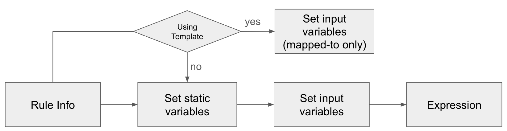

Data Quality Rules
==================

## Actian Data Observability Data Correctness Rules 

One of the key metrics tracked by Actian Data Observability is the “**Correctness**” metric. It is defined as the percentage of records which are valid based on a corresponding rule or combination of rules. Correctness is - For example, for a table with 1M rows; if 50,000 records are invalid, correctness is then 95%.

The row validity checks (data expectations) are defined by users via **Correctness Rules.**

## Correctness Rules 

Correctness Rules are evaluated at row level. A single rule may validate one or more attribute values (plain or nested object) against a condition.

Rules are created following SQL-like syntax that uses variables and functions to perform the validation. The main key features for rules:

* Eases the process of applying the same rule against multiple tables through templating
* Rules DSL (domain specific language) allows for version control and management in a simple human-readable format
* Optimized algorithms for unlimited number of rules for faster and more efficient processing

### Building a Correctness Rule 

Creating a correctness rule requires performing the following steps:

1. Define variables that will be used in the rule
   * Variables can be assigned to static lists of values, range, entered manually or uploaded, from files; etc.
2. Map variables to attributes used in the expression
3. Write rule expression

#### Define and Map Variables 

Users can define variables to be used in their rule. Supported variable types:

* Array of strings
* Constant string value
* Range (date-time or integer)
* Reference to an attribute

Example:

We can define the following two variables (`accepted_country_list, var_1)`:

* `accepted_country_list = [USA, Canada]`
* `var_1 = country_name`

User can then write a rule like following

**`VALIDATE`**` ``var_1`

**`EXPECT`**` ``value`` `**`IN`**` ``accepted_country_list`

This rule checks if a value from the attribute _country\_name_ is in the list of accepted values. First it defines an expression _var\_1_, which is a trivial expression, which doesn’t add any transformation to the original value. And after that it sets an expectation that the value of the expression should be in the list to which the previously defined variable is assigned.

#### Writing Rule Expression 

A correctness rule consists of three parts:

| **Component** | **Description** |
|---------------|-----------------|
| **`WITH <transformation>`** | **Variable transformation:** <br/>Optional section. It allows the user to create a transformation of one or more attributes to be validated and reused within the expression multiple times<br/><br/>Example:<br/>**`WITH`** `concat(country, '\|', state)` **`AS`** ` loc`<br/><br/>This creates a new variable “loc” that can be used in validation |
| **`VALIDATE`**<br/>**`<evaluated_expression>`** | **Validated expression:**<br/><br/>This could be simply validating an attribute as is, or adding transformation or case clause.<br/><br/>Example:<br/><br/>**`VALIDATE`**<br/> **`case`**<br/>`    ` **`when`** ` loc = 'US\|CA' ` **`then`** ` country ` **`IN`** ` ('Alameda', 'Contra-Costa')`<br/>`   ` **`when`** ` loc = 'UAE\|Dubai' ` **`then`** ` country ` **`IS NULL`**<br/>` ` **`else`** ` false //default output`<br/>**`End`** |
| **`EXPECT`**<br/>**`<expectation>`** | **Expected results**<br/><br/>Expectation for the expression above. After the “EXPECT” keyword, the validation begins.<br/><br/>Example:<br/>**`EXPECT`** ` is_true`<br/><br/>this means the value of validated expression is expected to be true, and anything else is a violation) |

### How to get alerted for rule violation? 

Once a rule is created, users can assign the rule to a policy and specify the threshold for alerting.

## Variables transformation 

This step allows defining variables from combining existing attributes to be used at a later step of validation. This can simplify writing the evaluated expression specially in case when multiple checks are applied.

To define a transformation, you can follow the following syntax:

`WITH <transformation> AS <new_variable_name>`

Actian Data Observability uses standard Spark SQL syntax for those transformations.

## Evaluated expression

This is a Spark SQL expression. It allows users to define what will be evaluated, and exposes a wide range of SQL functions to allow for conditional checks.

### Scenario 1: Validate attribute value as is, without transformations 

```
VALIDATE my_column// Some code
```

This validates “`my_column`” without any transformation

### Scenario 2: Apply standard functions to attribute value

```sql
VALIDATE foo(my_column)
```

This validates “`my_column`” after applying the “`foo`” function to it.

### Scenario 3: Cases

```sql
VALIDATE case when my_colA <> 0 then my_colB else my_colC end
```

This validates the rule by using `my_colB` when `my_colA` is not 0; otherwise, it uses `my_colC`

## Expectation

Expectation is defined through the context and the expected value.

```
EXPECT <context> [<operator>] <expected_value>
```

### Expectation context

The expectation context (`<context>`) is how the value gets evaluated. It can be any of the following:

| **Context** | **Description** |
|---|---|
| `COMPRESSED_PATTERN` | Compressed pattern of the expression value |
| `DATE_TIME_VALUE` | Expression value as Datetime. Refer [here](https://learn.microsoft.com/en-us/sql/t-sql/functions/date-and-time-data-types-and-functions-transact-sql?view=sql-server-ver16#date-and-time-data-types) for datetime patterns |
| `EXPANDED_PATTERN` | Expanded pattern of the expression value |
| `FREQUENCY` | Frequency of the expression value |
| `LENGTH` | String length of the expression value |
| `NUMERIC_VALUE` | Expression value as number |
| `SPACE_COUNT` | Count of spaces in the expression value |
| `SPEC_CHAR_COUNT` | Spec characters count of the expression value |
| `VALUE` | String representation of the expression value |

### Expectation operator

The expectation operator (`<operator>`) is an optional field. It’s the condition operator for the context and the expected value. It can be from the following list:

| **Operator**   | **Description**                                                                     |
| -------------- | ----------------------------------------------------------------------------------- |
| `IN`           | <p>Value is in the list. </p><p>Expected value must be in the list.</p>             |
| `IN_RANGE`     | <p>Value in range including boundaries.<br/>Expected value must be in the range.</p> |
| `NOT`          | Boolean negation operator                                                           |
| `NOT_IN`       | <p>Value is not in the list</p><p>Expected value must not be in the list.</p>       |
| `OUT_OF_RANGE` | <p>Value out of range</p><p>Expected value must be outside of the range.</p>        |

### Expected value

Expected value (\<expected\_value>) can be set using a static value or the boolean-functions belo

| **Static value** | **Example**       |
| ---------------- | ----------------- |
| List             | `["a", "b", "c"]` |
| Range            | `(0,100)`         |
| String           | `"abcd"`          |
| Variable         | `var_1`           |


| **Boolean function** | **Description** |
|---|---|
| `CONTAINS_PII` | True if expression contains PII data |
| `CONTAINS_PII_CREDIT_CARD` | True if expression contains credit card number pattern |
| `CONTAINS_PII_IP_ADDRESS` | True if expression contains IP address |
| `CONTAINS_PII_PHONE_NUMBER` | True if expression contains phone number pattern |
| `CONTAINS_PII_SSN` | True if expression contains social security number pattern |
| `IS_ALPHA` | Value is only from alphabetic characters |
| `IS_DATE` | Value is UTC date pattern |
| `IS_DATE_TIME` | Value is UTC date-time pattern |
| `IS_EMAIL` | Value is email |
| `IS_FALSE` | Value is false (case insensitive string comparison, and not boolean) |
| `IS_NUMBER` | Value is numeric value |
| `IS_TRIMMED_STRING` | Value is a trimmed string |
| `IS_TRUE` | Value is true (case insensitive string comparison, and not boolean) |
| `REGEX(pattern)` | Value satisfy regex pattern |

Examples:

```sql
VALIDATE Var_1 expect is_date  
# Check if Var_1 is a valid date.

VALIDATE Var_1 expect contains_pii  
# Check if Var_1 contains Personally Identifiable Information (PII)  

VALIDATE Var_1 expect numeric_value in_range (1, 20)  
# Ensure Var_1 is a number within range 1 to 20  

VALIDATE Var_1 expect numeric_value out_of_range (50, 60)  
# Ensure Var_1’s numeric value is outside a length range  

VALIDATE Var_1 expect expanded_pattern IN ['D', 'DD']  
# Validate Var_1 using an expanded pattern 

VALIDATE Var_1 expect compressed_pattern in ['D', 'L']  
# Validate Var_1 using a compressed pattern  

VALIDATE Var_1 expect value IN ['USA', 'Germany', 'India']  
# Check if Var_1 value is in the accepted country list  

VALIDATE Var_1 expect value='Telm'  
# Ensure Var_1 exactly matches the value Telm

VALIDATE concat(Var_1, '.', Var_2) expect value='Telm.ai'  
# Validate full name format as Telm.ai, where Var_1=Telm and Var_2=ai

VALIDATE Var_1 expect length<>5  
# Ensure Var_1 value is of length not equal to 5  

VALIDATE Var_1 expect frequency=1  
# Ensure Var_1 has exactly one occurrence  

VALIDATE Var_1 expect regex('^[a-zA-Z]+$')  
# Validate Var_1 contains only letters (no numbers/special characters) 
```

### Combining Expectations 

User is able to combine multiple expectations using AND/OR operator:

```
EXPECT <expectation_1> AND <expectation_2> OR <expectation_3>
```

Examples:

```robotframework
VALIDATE case when Status='Active' and LastLogin < current_date - 30 then 'Inactive' else 'Valid' end expect value='Valid'  
# Mark users as inactive if they haven't logged in for 30+ days, otherwise expect 'Valid'  

with concat(Country1, ' | ', Country2) AS loc VALIDATE loc expect length<20  
# Ensure concatenated location (Country1 | Country2) has a length less than 20  

VALIDATE Password expect spec_char_count>=1 AND space_count=0 AND length>=8  
# Ensure Password has at least 1 special character, no spaces, and is at least 8 characters long  

VALIDATE Password expect (spec_char_count>=1 AND space_count=0) OR length>=20  
# Ensure Password has at least 1 special character and no spaces, or is at least 20 characters long  
```

## Rule Templates

Rule Templates is a predefined rule where the expectation is defined, then applied to 1 or more attributes. Users are recommended to use rule templates when the same check is applied on multiple tables. This centralizes the definition of the rule, and allows managing the rule from a single place.

To use a rule template, the user only maps attributes within their table to variables within the rules.

## Creating a Rule

The following flow diagram describes the steps to create a new rule or rule template:

1. Define rule info:
   * Rule name
   * Rule description
   * \[Optional] Template being used (this is only if creating a rule)
2. Set static variables:
   * These are variables that are validated against, and are not dynamic in nature; ex: list of allowed countries
3. Set input variables:
   * These are variables that are mapped to attributes in the table
   * In case this is a rule, user will need to map the attributes to variables
4. Write expression
   
!!! note
    In case user is using an existing template, only input variables need to be mapped to variables in the table

### Alerting Policies

Automatically, all created rules are monitored via an out-of-box policy “Correctness Rules Violation”. Users can add new policies and pick the desired rules and threshold to be alerted.