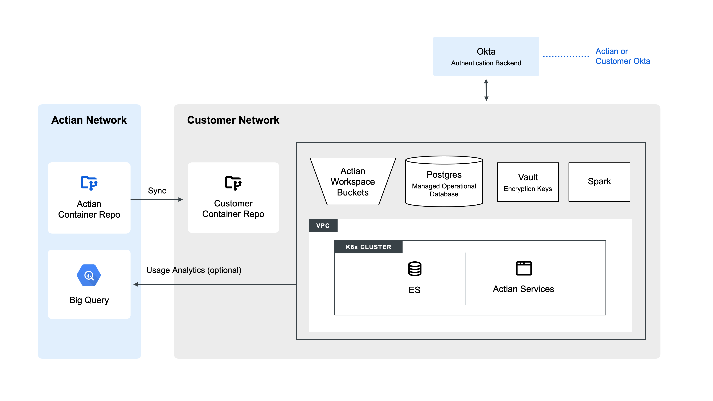

Virtual Private Cloud (VPC) deployment
======================================

The Actian Data Observability Platform’s Virtual Private Cloud (VPC) deployment ensures that all services are hosted securely within your own cloud environment. The architecture integrates seamlessly with your existing infrastructure, enabling data-in-place monitoring while maintaining compliance with your organization’s security, governance, and privacy policies.

 

## Key Architectural Components

A typical VPC deployment includes the following cloud-native components, which are selected for their scalability, reliability, and portability across major cloud providers.

| Component                | Purpose and Function                                                                                                                    | Cloud Service Examples                                                                                  |
| ------------------------ | --------------------------------------------------------------------------------------------------------------------------------------- | ------------------------------------------------------------------------------------------------------- |
| Kubernetes (K8s) Cluster | Hosts Data Observability Platform services. Allows for scaling based on usage, simplified operations (auto-recovery), and ease of upgrades with no downtime. | Azure Kubernetes Service (AKS), Google Kubernetes Engine (GKE), Amazon Elastic Kubernetes Service (EKS) |
| Elastic Search (ES)      | Stores data profiling data. Enables fast data retrieval via API and UI.                                                                 | Managed or hosted ES on K8s                                                                             |
| Spark Engine             | Handles the analysis of large datasets at scale with optimized cost and performance. Used to run Data Observability Platform data scan jobs.                 | Azure DataBricks, Databricks or Dataproc (GCP), Databricks or EMR (AWS)                                 |
| Postgres                 | Stores results and configurations.                                                                                                      | Azure Database, Cloud SQL (GCP), AWS RDS                                                                |
| Key Vault                | Used to store encryption keys.                                                                                                          | Azure Key Vault, Secret Manager (GCP/AWS)                                                               |
| Container Repository     | Stores Data Observability Platform binaries. Used for deploying Data Observability Platform images.                                                                               | Azure Container, GCP Artifact Registry, AWS ECR                                                         |
| Authentication Backend   | Manages authentication, often utilizing existing services, i.e Okta.                                                                    | Okta                                                                                                    |

## Deployment Workflow

Actian provides **Helm** and **Terraform** scripts to automate the whole deployment lifecycle.

1. **Infrastructure Setup:** Provision cloud resources (K8s cluster, databases, vaults, etc.) within your VPC.
2. **Setup Validation:** Validate connectivity, component availability, and Kubernetes configuration.
3. **Data Observability Platform Installation:** Deploy Docker images, configure services, and initialize the application.

You can deploy the Data Observability Platform from the Actian registry or from a customer-controlled container repository, depending on your organization’s security policy.

## Data Handling and Retention

Actian handles several categories of data, each subject to specific definitions and guaranteed retention policies. **Actian guarantees safe and complete deletion of data after the required retention period.**

### Data Categories

| Data Type               | Description                                                                                                                                         | Sensitivity                          |
| ----------------------- | --------------------------------------------------------------------------------------------------------------------------------------------------- | ------------------------------------ |
| Customer Data           | Data (sensitive and non-sensitive) that Actian monitors. This may be the original records or data decomposed into individual values for monitoring. | Varies (Sensitive or Non-sensitive)  |
| Derived Data            | Results (numbers) from statistical calculations performed on Customer Data.                                                                         | Non-sensitive                        |
| Data Metrics            | Derivatives used for analyzing trends in data. Examples include percentage of complete records or number of records.                                | Non-sensitive                        |
| Metadata                | Meta information about data, such as data source names, attribute names, and create/update dates.                                                   | Non-sensitive                        |
| Sensitive User Data     | Personally Identifiable Information (PII), such as usernames and passwords.                                                                         | Sensitive                            |
| Non-Sensitive User Data | User identification and roles .                                                                                                                     | Non-sensitive                        |

### Retention Policies

Actian maintains strict, defined periods for the retention of data based on its classification:

| Data Type                                          | Retention Policy                                                                     | Notes                                                                                                                                   |
| -------------------------------------------------- | ------------------------------------------------------------------------------------ | --------------------------------------------------------------------------------------------------------------------------------------- |
| Customer Data                                      | Can be configured to be purged as soon as metrics are calculated (typically 1 hour). | If no explicit retention policy is set by the customer, this data is stored for up to 30 days and then permanently deleted .            |
| Derived Data                                       | Stored for up to 30 days.                                                            | 
 If no explicit retention policy is set by the customer, this data is stored for up to 30 days and then permanently deleted .
 |
| Data Metrics                                       | Stored for up to 360 days.                                                           | Used for long-term trend analysis.                                                                                                      |
| Metadata and User Data (Sensitive & Non-Sensitive) | Stored indefinitely.                                                                 | This data is retained until explicitly requested for deletion.                                                                          |

### SaaS vs VPC Deployments

Functionally, VPC and SaaS deployments are identical. The data handling and retention policies for a VPC model apply to a SaaS model too. The only difference is the data processing boundary. VPC maintains data within the customer's environment, while SaaS processes data in Actian's managed account. PII handling is user driven in both cases. We provide UI-driven controls for you to explicitly select which attributes to monitor on each data asset. There's no automatic PII detection or exclusion, you must configure any attribute inclusion or exclusion.