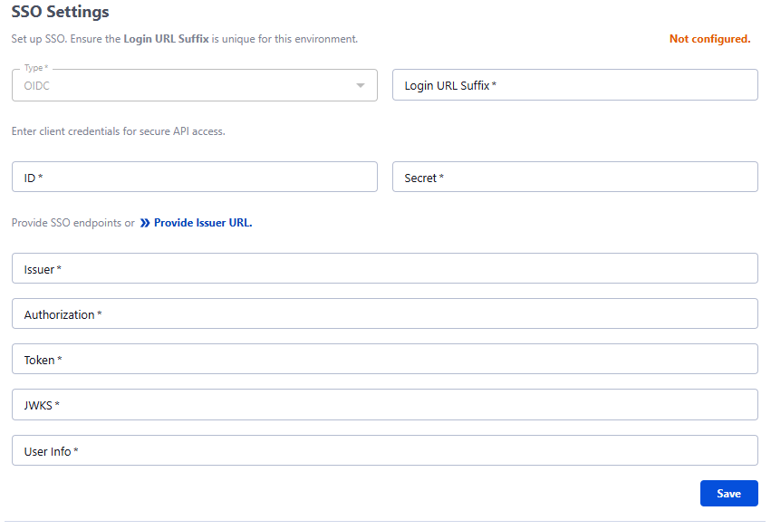
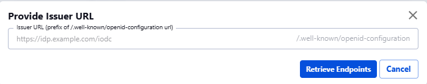
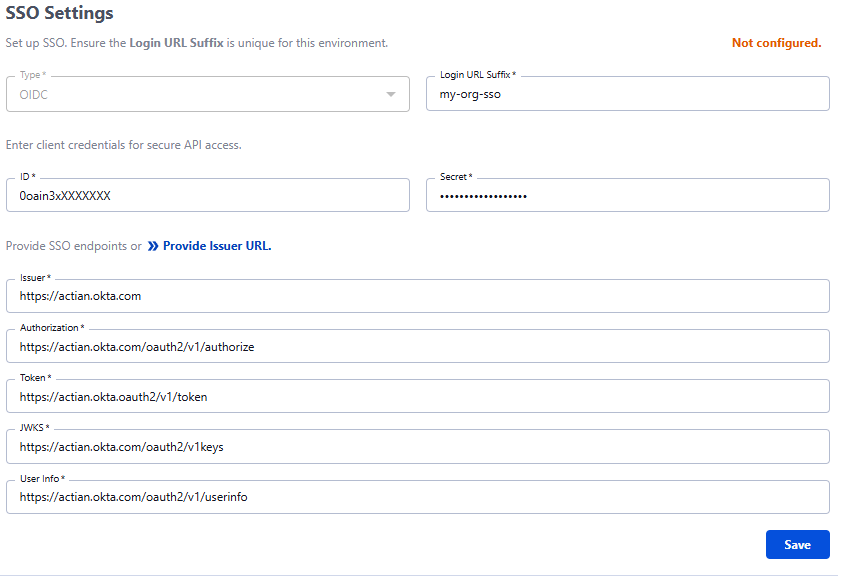

# SSO Configuration

This document provides step-by-step instructions on how to configure Single Sign-On (SSO) on Actian Data Observability. Follow the steps below to set up SSO seamlessly.

## Step 1: Navigate to SSO Settings

1. Log in to the Actian Data Observability.
2. Go to **Administration**.
   
3. Click on **Single Sign-On (SSO) Settings**.
   

## Step 2: Configure SSO Details

1. Enter a unique **Login URL Suffix**
   * For example, if company name is ACME corporation and the environment is stage project instance, then you can use a unique name like acme-stage. And hence the Login URL Suffix will be: **`acme-stage`**, resulting in a login URL similar to: `https://data-observability.actian.com/login/acme-stage`)
2. Provide client credentials:
   * **Client ID**: Enter the ID provided by your IdP.
   * **Client Secret**: Enter the secret key provided by your IdP.
3. Provide SSO endpoints or click **Provide Issuer URL**:
   * You can enter the below details manually:
     1. **Issuer**: Enter the Issuer URL from your IdP.
     2. **Authorization**: Enter the Authorization endpoint.
     3. **Token**: Enter the Token endpoint.
     4. **JWKS**: Enter the JWKS (JSON Web Key Set) URL.
     5. **User Info**: Enter the User Info endpoint.
   * **OR** Click on **Provide Issuer URL** to open a modal dialog.
       1. Enter the **Issuer URL** from your IdP and click **Retrieve Endpoints**.
         
4. Click **Save** to store the configuration.
   
5. You can use the toggle button to Enable/Disable the settings after saving. You can also **update** or **delete** the setting at anytime.

## Step 3: SSO Testing and Verification

1. Navigate to the login page
   * Example: https://data-observability.actian.com/login/**my-org-sso**
2. Click on **Sign in with IDP.**
3. You will be redirected to Issuer URL. Enter the required details and click Sign In.

If authentication is successful, you should be redirected to the Actian Data Observability dashboard.

