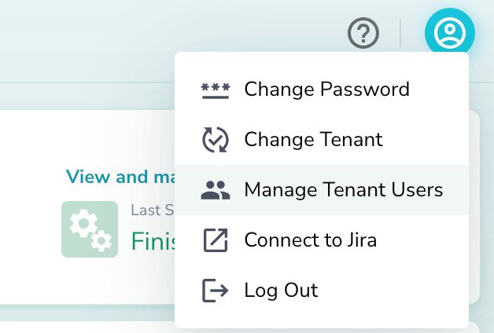
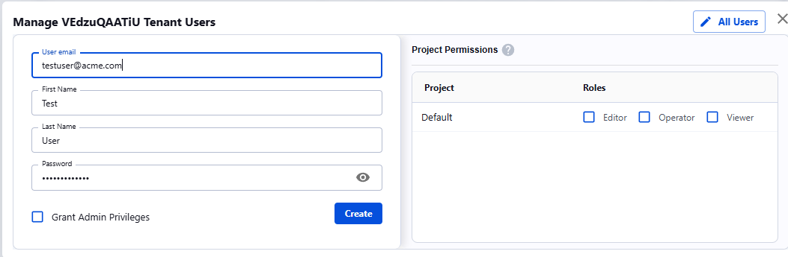
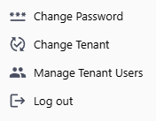

User Management
=================

## Managing Users

Actian Data Observability allows to create, edit, and delete users via the Manage users UI menu:

## Role-based Access 

Actian Data Observability supports project-scoped permissions. Tenant admins are able to modify these permissions accordingly:

| **Role**     | **Add/Modify Users** | **Add, Edit or Delete Source** | **Scan source** **Schedule Scans** | **View scan results** |
| ------------ | -------------------- | ------------------------------ | --------------------------- | --------------------- |
| Tenant Admin | x                    | x                              | x                                                                       | x                     |
| Editor       |                      | x                              | x                                                                       | x                     |
| Operator     |                      |                                | x                                                                       | x                     |
| Viewer       |                      |                                |                                                                         | x                     |

To modify user roles,

1. Click “**Manage Tenant Users**” under the user menu
2. Click on the user you would like to modify permissions for
3. “**Project Permissions**” table with different roles
4. Select appropriate roles
5. Click Save
