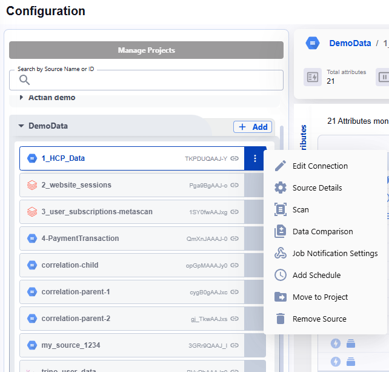
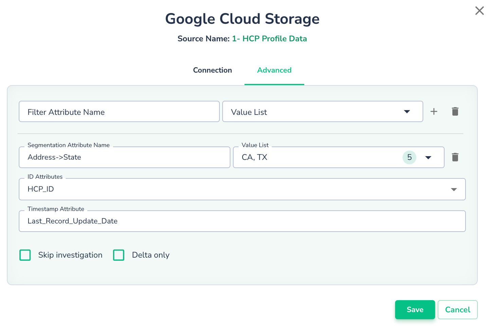

# Configuring a Data Source

After creating a Data Source, you can optionally configure advanced settings to tailor its behavior.

1. Configure advanced parameter attributes such as ID, Filters, Segmentation, and Scan Type.
2. Set the scan schedule according to your requirements.

To access these options, click the 3-dot icon next to the Data Source name:

## Advanced Parameters

1. Click Edit Connection in the context menu
2. Navigate to the **Advanced** tab to begin configuration.

### Filter Attribute

Use this option to monitor only a subset of data that meets specific criteria. Provide the **Filter Attribute Name** and a list of values. Actian Data Observability will analyze only the records whose attribute values match those in the list.

### Segmentation Attribute

Monitor data from different segments independently by specifying a **Segmentation Attribute**. You can list values to define segments. For example, setting segmentation based on `Address.State` might define segments for `CA`, `TX`, and others. In case of null values you can define it as `__null__`. Actian Data Observability will profile data, calculate metrics, and detect anomalies for each segment as well as for the entire dataset.

### Id Attribute

The **ID Attribute** is optional but provides additional insights, including:

1. Tracking the uniqueness of records based on IDs.
2. Displaying record IDs for every anomalous value.
3. Splitting good records from bad ones using the Data Binning feature.

### Timestamp Attribute

The **Timestamp Attribute** is also optional but can be valuable for:

* Determining record-level freshness (e.g., percentage of outdated records).
* Identifying newly added records, enabling Delta-only scans.

When the **Timestamp Attribute** is provided and the **Delta Only** checkbox is checked, Actian Data Observability will fetch and scan only new records. Note that for some sources, like files or Databricks Delta, Delta detection occurs natively and does not require this attribute.
