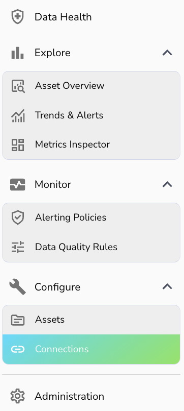
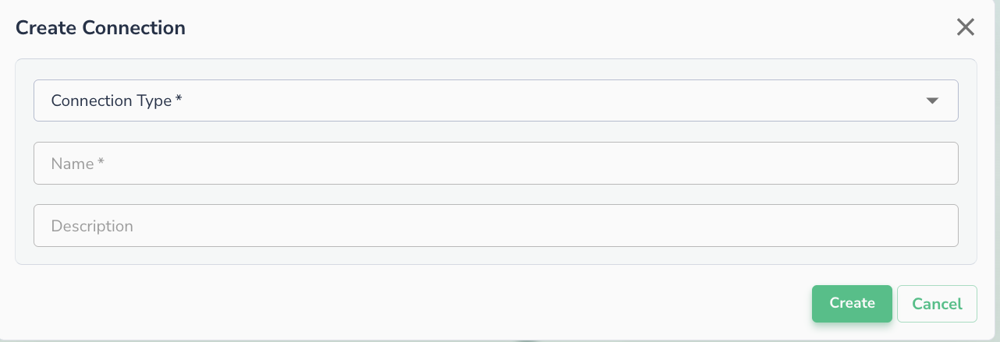

Connect to Data
================

This page and subpages describes how to connect your data to Actian Data Observability.

## Create a Connection

Actian Data Observability provides a wide range of connectors. Some of the connectors are readily available in each tenant (see the list below), while the others can be enabled by contacting Actian Support.

To connect to your data source:

1. Navigate to Connections page using the left-side menu
    
2. Select desired scope:
    1. Global scope: Connection can be reused for any project
    2. Project scope: Connection can only be used for associated project
3. Click **+Add Connection** button
4. You will be prompted to specify the connector type and fill the details
    

!!! note
    Once you have selected the connection type, you will be asked to fill information specified to your connection
    
    Connection can be reused to connect multiple datasets, tables, etc.

## Connect to a data asset

Once a connection is available, you can navigate to "Asset" page, and add your connection. Data assets must belong to a project.

1. Navigate to **Asset** page
2. Select target project, and click **+Add** button
3. Select source type
4. Select a created connection from the dropdown menu
    * You can also create a connection by clicking **+New Connection** button
5. Fill the data asset details, and follow onscreen instructions

## List of connectors enabled by default

* Google Big Query
* Google Cloud Storage
* AWS S3
* AWS Redshift
* AWS Athena
* Azure Blob
* Databricks
* Snowflake
* Salesforce
* SAP Hana
* Apache Iceberg

Actian Data Observability allows to read variety file formats for the data stored in cloud buckets:

* Comma Separated Values (CSV)
* Tab Separated Values (TSV)
* Parquet
* JSON
* Databricks Delta
