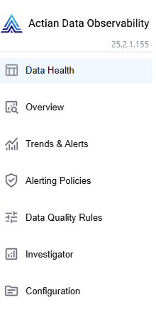
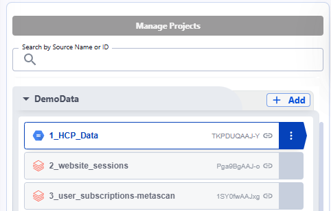
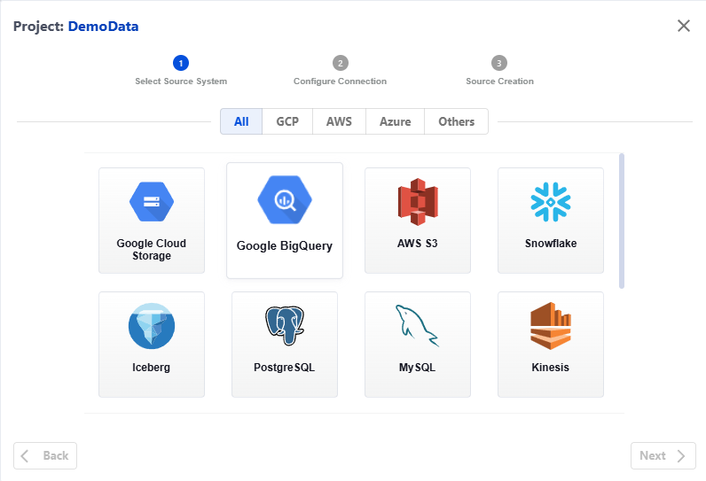

Connect to Data
================

Actian Data Observability provides a wide range of connectors. Some of the connectors are readily available in each tenant (see the list below), while the others can be enabled by contacting Actian Support.

To connect to your data source:

1. Navigate to Configuration Screen using the left-side menu.

   
2.  Click the “+Add“ button next to the Project name.  

   
   
   
3.  Select the type of source you want to connect to.
  
   

## List of connectors enabled by default

* Google Big Query
* Google Cloud Storage
* AWS S3
* AWS Redshift
* AWS Athena
* Azure Blob
* Databricks Delta
* Snowflake
* Salesforce
* SAP Hana

Actian Data Observability allows to read variety file formats for the data stored in cloud buckets:

* Comma Separated Values (CSV)
* Tab Separated Values (TSV)
* Parquet
* Json
* Databricks Delta
* Apache Iceberg
