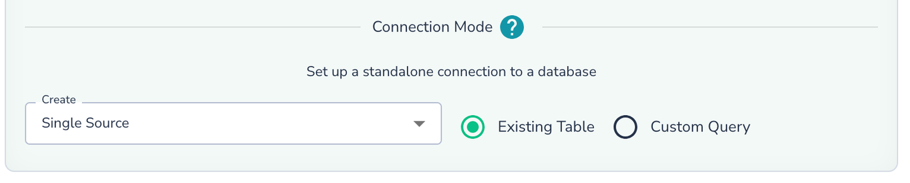
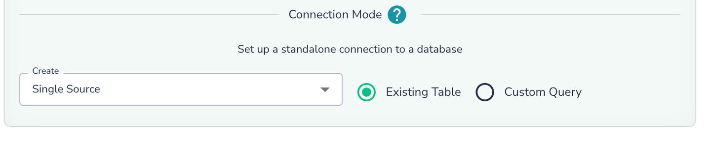
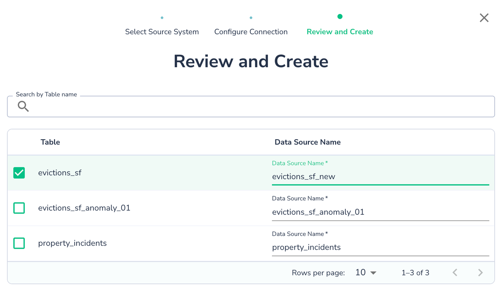
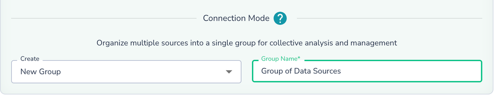
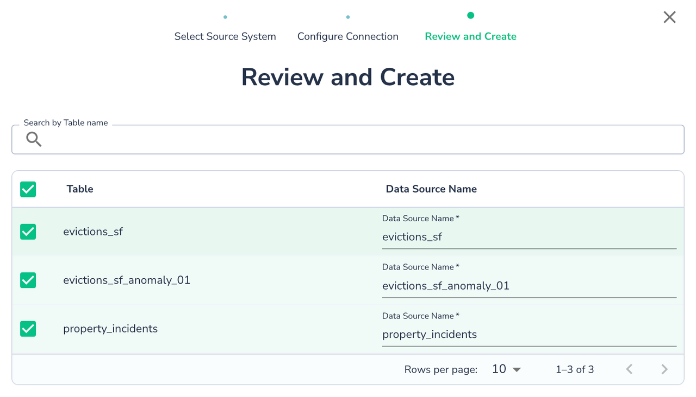
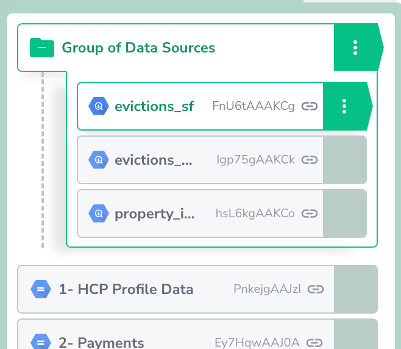
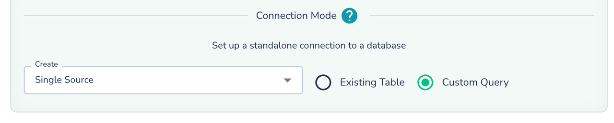
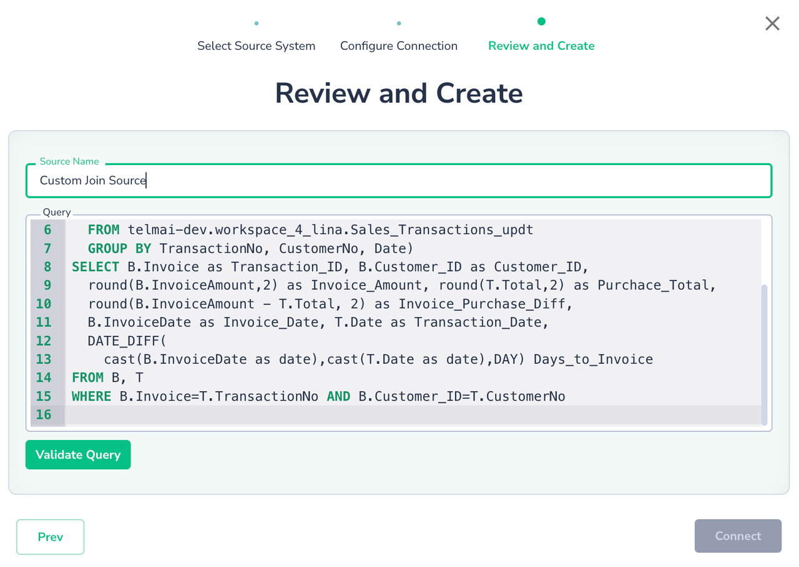

# Connection Modes

In the "Connect to Data" dialog, Actian Data Observability offers several connection modes for SQL-based sources such as [BigQuery](data-connectors/google-bigquery.md), [Redshift](data-connectors/aws-redshift.md), [Snowflake](data-connectors/snowflake.md), and others.

It can either connect to an existing table/view or allow you to define an SQL query and analyze the output.

## Connect to existing Table/View

Select the **“Existing Table“** radio button, and pick an option in the “Create“ dropdown:

* **Single Source:** Configure scans individually with custom schedules and settings, including metadata vs. deep scans.
* **New Group:** Scan multiple tables together for efficiency, using the same Spark cluster and optimized algorithms. However, group sources share the same schedule and scan settings, including metadata vs. deep scan configurations.

### Single Source Connection

Select **Single Source** and click **Next**. 

Choose the table you want to connect to. You can keep the default name or rename the data source as needed.

### New Group Source Connection

Grouping datasets allows you to connect to multiple tables at once, simplifying configuration:

1. Reuse same credential to simplify configuration
2. Enable a shared scan schedule and settings.
3. Optimize scanning for increased throughput, although metadata vs. deep scan settings will apply uniformly across the group.

Select **New Group**, name it, and click **Next**.

Choose tables/views from the same schema/dataset/collection. You can rename the Actian Data Observability data source names if desired. Click **Create** to complete the setup.

Once the Group Source is created. You can now edit properties of the group or some or individual properties of each data source now:  

## Query Based Connection

Instead of connecting to an existing table or view, you can define a data source using an SQL query. This is useful for applying transformations or joining multiple tables to monitor the output.

1.  Select **Custom Query** as the connection mode.
    
2.  Click **Next**, input your query, and click **Validate Query** to ensure it’s correct. Once validated, click **Connect**.
    

A query-based data source functions like any other integration, allowing you to schedule scans, monitor drifts, and apply rules. Note: This option is currently available only for SQL databases like BigQuery, Databricks Delta, etc.

**Best Practices:**

1. **SQL Syntax**: The SQL syntax depends on the underlying system. The queries are pushed to the database. Always refer to the specific database syntax for functions, operators, etc, to ensure they are supported
2. **Full Table/View Names**:Use the full name (e.g., `schema.table`, `project.dataset.table`, `database.schema.table`, or `catalog.database.table`) for all tables in the query
3. **Permissions**: Ensure the service account has permissions for all tables/views used in the query
4. **Named Projections**: Use named projections (e.g., `SELECT column1 + column2 AS total FROM table1`) to capture the schema of the results correctly.
5. **Time Zone**: All queries are executed in the UTC time zone, so adjust any time/date manipulations accordingly.
