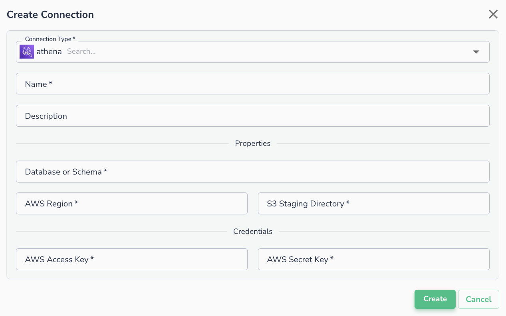
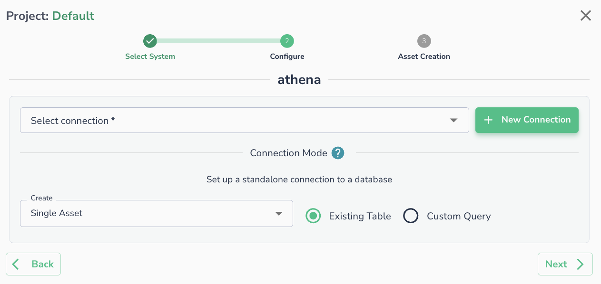

# AWS Athena

## Creating a Connection

Before connecting to AWS Athena, ensure that the IAM user, whose credentials will be used, has the following permissions granted:

### Athena Permissions

```
athena:StartQueryExecution
athena:GetQueryExecution
athena:GetQueryResults
athena:StartQueryExecution
athena:GetWorkGroup
athena:StopQueryExecution
athena:CreatePreparedStatement
athena:UpdatePreparedStatement
athena:GetPreparedStatement
athena:DeletePreparedStatement
s3:ListBucket
s3:GetObject
s3:PutObject
s3:GetBucketLocation
s3:GetObject
s3:ListBucket
s3:PutObject
s3:ListMultipartUploadParts
s3:AbortMultipartUpload
glue:GetDatabase,
glue:GetDatabases,
glue:CreateDatabase
glue:CreateTable
glue:GetTable
glue:GetTables
```

### S3 Permissions

```
s3:ListBucket
s3:GetObject
s3:PutObject
s3:GetBucketLocation
s3:GetObject
s3:ListBucket
s3:PutObject
s3:ListMultipartUploadParts
s3:AbortMultipartUpload
```

### Glue Permissions

```
glue:GetDatabase,
glue:GetDatabases,
glue:CreateDatabase
glue:CreateTable
glue:GetTable
glue:GetTables
```
Once permissions are defined, you can setup the connection by defining:

* **AWS** **Key**
* **AWS** **Secret**
* **Database**
* **Region**
* **S3 Staging Directory**



## Connecting an Asset

Once a connection is defined, you can start using it to create assets. To create assets, you will need to select existing table or run a custom SQL query.

