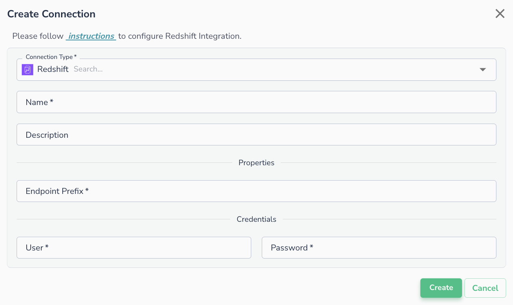
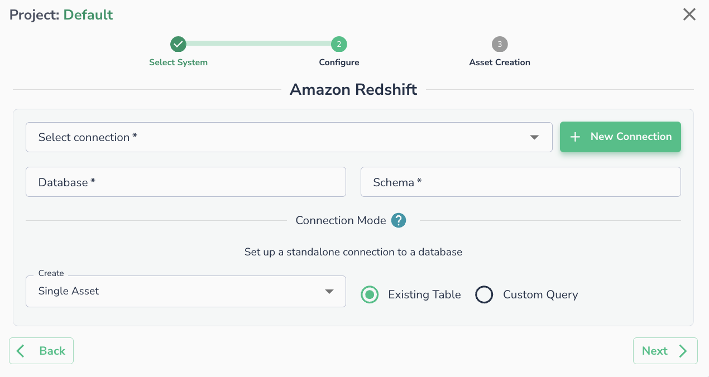

# AWS Redshift

!!! note
    Actian Data Observability only supports connecting to provisioned Redshift clusters. Serverless clusters are not supported

## Creating a Connection

To connect to Redshift provisioned clusters, the following details are required:

* **Endpoint Prefix**:
    * Navigate to **Amazon Redshift Clusters** -> **Cluster Name** -> **General Information** -> **Endpoint**.
    * Retrieve the value, which will be in the format `[endpoint_prefix].redshift.amazonaws.com:[port]/[database]`.
    * Use the value of **\[endpoint\_prefix]** here.
* **User**: The username to use for the connection (must be created in Redshift).
* **Password**: The password to use for the connection (must be created in Redshift).

!!! note
    The username and password need to be created inside the Redshift and it's not the IAM user.

## Connecting an Asset

Once a connection is defined, you can start using it to create assets. To create assets, you will need:

* **Database**:
    * Navigate to **Amazon Redshift Clusters** -> **Cluster Name** -> **General Information** -> **Endpoint**.
    * Use the value of **\[database]** from the endpoint.
* **Schema**: The schema where the tables are located.

Alternatively, you can run a SQL query

