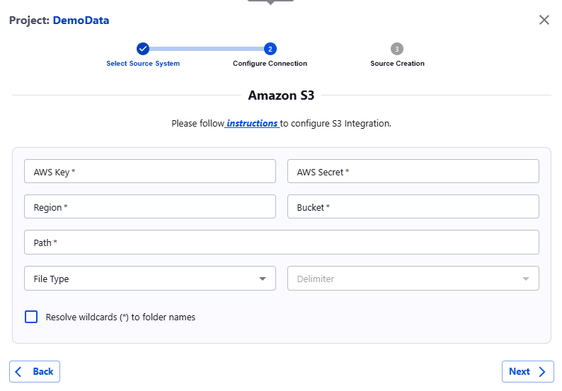

##### AWS S3

Add the following permissions to the S3 bucket for the IAM user whose credentials (key and secret) will be used:

1. s3:GetBucketLocation
2. s3:ListBucket
3. s3:GetObject

Once the permissions are granted, proceed to the Actian Data Observability UI and enter the required information:

* **AWS** **Key:** Your AWS access key.
* **AWS** **Secret:** Your AWS secret access key.
* **Region:** The AWS region where your S3 bucket is located.
* **Bucket**: The name of your S3 bucket.
* **Path:** The full path to the file in the bucket or the full path of the folder containing all files to be scanned. If specifying a folder, ensure all files have the same extension (e.g., .csv, .json, .parquet).
* **Delimiter (Optional):** Choose the delimiter used in your files (e.g., comma, tab, space).

