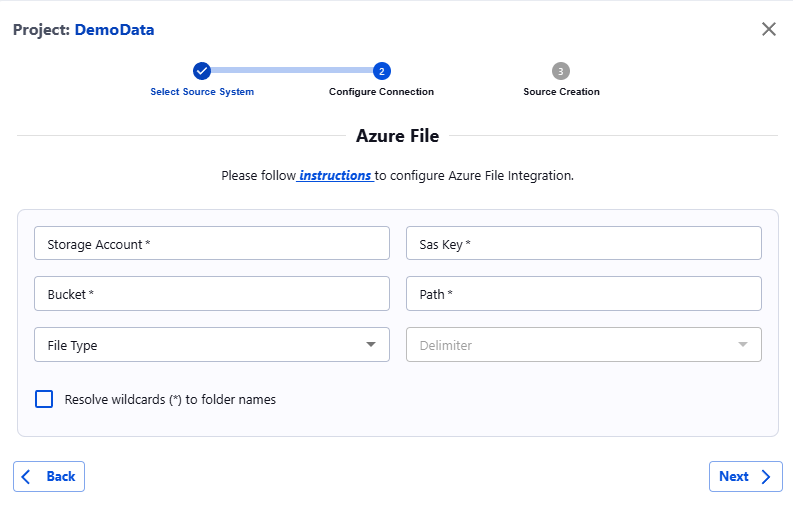

##### Azure Blob

Actian Data Observability connects to Azure Blob Storage (Azure File) using SAS (Shared Access Signature) token authentication. Follow the steps below to set up the connection. To create a SAS token, follow the instructions provided here:[https://learn.microsoft.com/en-us/azure/ai-services/Translator/document-translation/how-to-guides/create-sas-tokens?tabs=Containers](https://learn.microsoft.com/en-us/azure/ai-services/Translator/document-translation/how-to-guides/create-sas-tokens?tabs=Containers)

Once the SAS token is generated, navigate to the Actian Data Observability UI and enter the following details:

* **Storage Account:** Your Azure Storage account name.
* **SAS Key:** The SAS token generated in the previous step.
* **Bucket:** The name of the Azure Blob container.
* **Path:** The path to a specific file or folder within the container.
* **Delimiter (Optional):** Specify the delimiter if the files are in CSV format.

