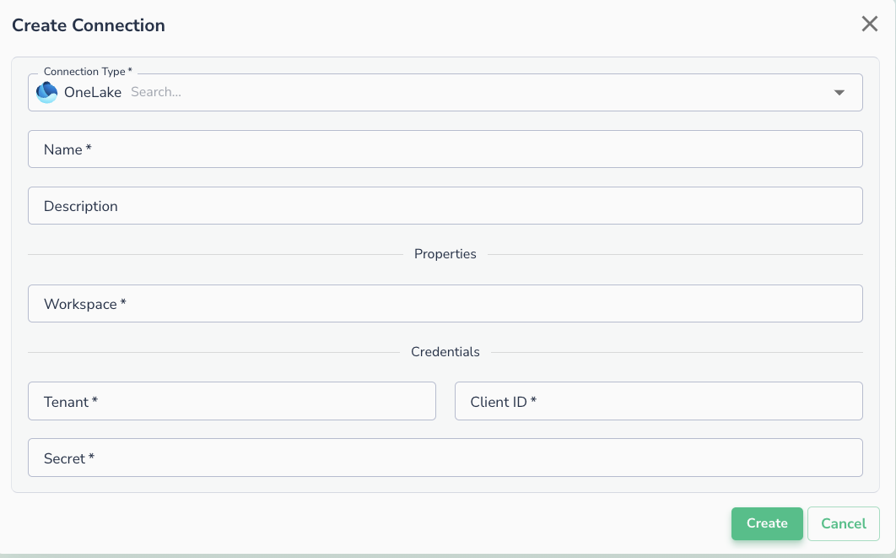
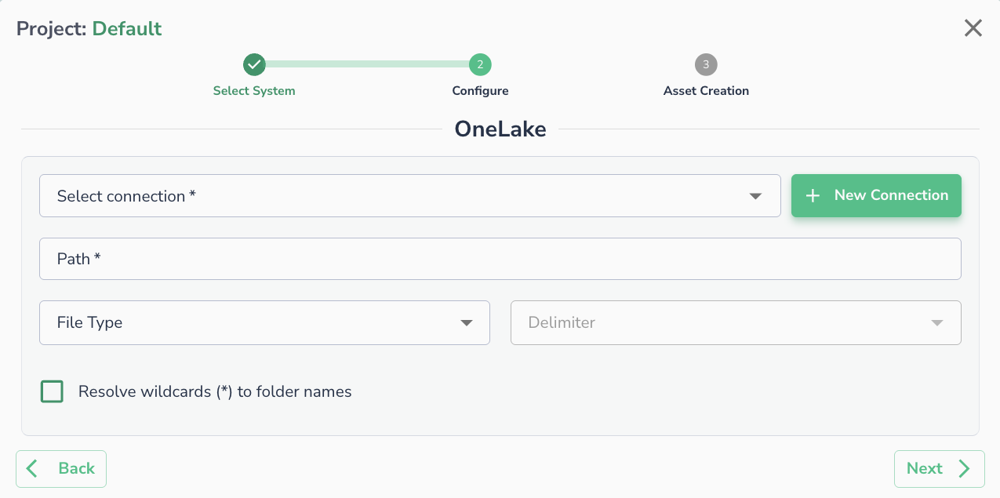

# Azure OneLake

Actian Data Observability connects to Azure [OneLake](https://learn.microsoft.com/en-us/fabric/onelake/onelake-overview) using Client ID and Secret. Follow the steps below to set up the connection.

## Prerequisites

Before creating the connection in Actian Data Observability, register an application in Azure and generate a Client ID and Secret. Follow Microsoft's [Register an application](https://learn.microsoft.com/en-us/entra/identity-platform/quickstart-register-app) guide to complete this step.

You will need to collect the following from Azure:

* **Client ID** — from the registered application's Overview page
* **Client Secret** — generated under **Certificates & secrets**
* **Tenant ID** — your Azure Active Directory tenant ID

## Creating a Connection

Once the client ID and secret are generated, navigate to the Actian Data Observability UI and enter the following details to create a new connection:

* **Workspace:** Fabric workspace id
* **Tenant**: Fabric tenant
* **Client ID**
* **Client Secret**

## Connecting an Asset

Once a connection is defined, you can start using it to create assets. To create assets, you will need:

* **Path:** The path to a specific file or folder within the container.
* **File Type (Optional)**
* **Delimiter (Optional):** Specify the delimiter if the files are in CSV format.

