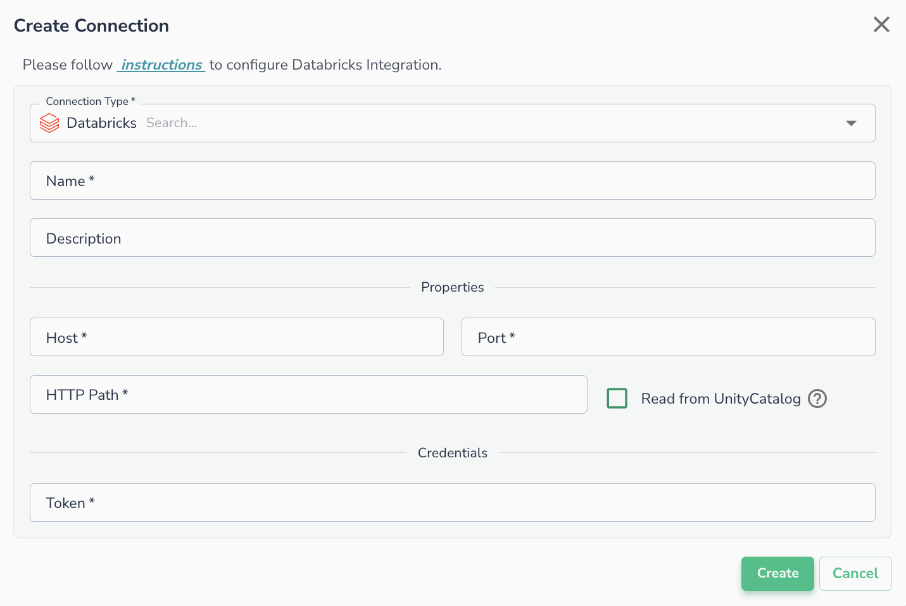
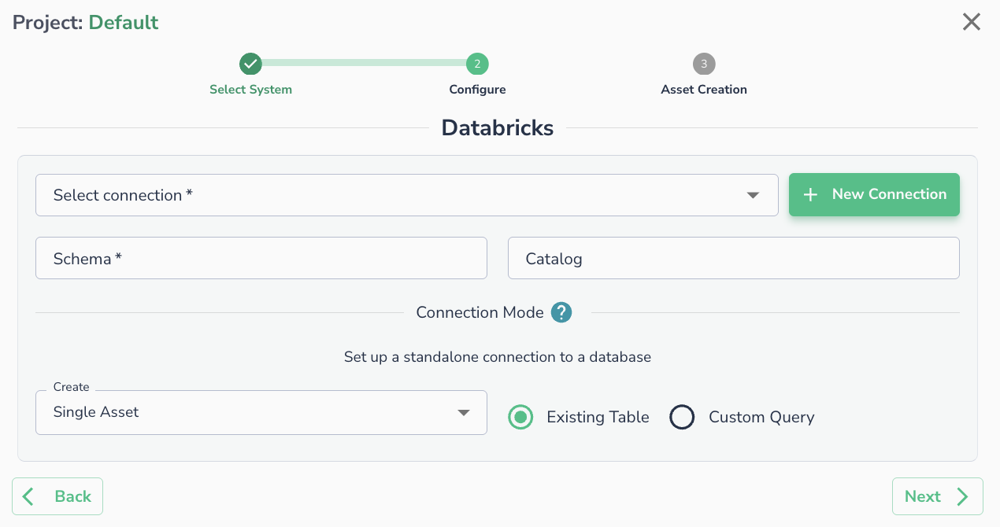

# Databricks

## Creating a Connection

To connect a Databricks table to Actian Data Observability, you'll need to gather specific information from your Databricks instance. Follow the steps below:

### **Capture Connection Details**

You can find the JDBC connectivity details in the Databricks workspace console:

Navigate to **Compute** -> **Cluster** -> **Cluster Name** -> **Configuration** -> **Advanced Options** -> **JDBC/ODBC**.

Capture the following details:

* **Server Hostname**
* **Port**
* **HTTP Path**

For more information, see [Databricks ODBC and JDBC Drivers](https://docs.databricks.com/integrations/bi/jdbc-odbc-bi.html)

### **Generate a Security Token**

A security token is required to connect to the cluster remotely. Create this token from the Databricks workspace console:

* Go to the top right corner and click on your **User Name** -> **User Settings** -> **Access Token** -> **Generate New Token**.
* Capture the token created.

For detailed instructions, see the [Authentication for Databricks tools and APIs](https://docs.databricks.com/dev-tools/api/latest/authentication.html#token-management)

### Create a Connection in Actian Data Observability

Once you have the necessary information, navigate to the "Connections" page, click +New Connection, select databricks, and enter the following properties:

* **Host:** Cluster hostname
* **Port:** Cluster port
* **HTTP path:** HTTP path of the cluster
* **Token:** API token
* **Read from UnityCatalog:** A flag that enables spark job to read from UnityCatalog directly. This option will only work in case of using Databricks for Actian Data Observability-Spark jobs.

!!! warning
    Only use "Read from UnityCatalog" if running Actian Data Observability jobs in Databricks and provide access to Actian Data Observability service account to the data being accessed. Otherwise, data scans will fail.

## Connecting an Asset

Once a connection is defined, you can start using it to create assets. To create assets, you will need:

* **Schema:** Schema name (i.e., database name)
* **Catalog (Optional):** Unity catalog name

Alternatively, you can run a SQL query

