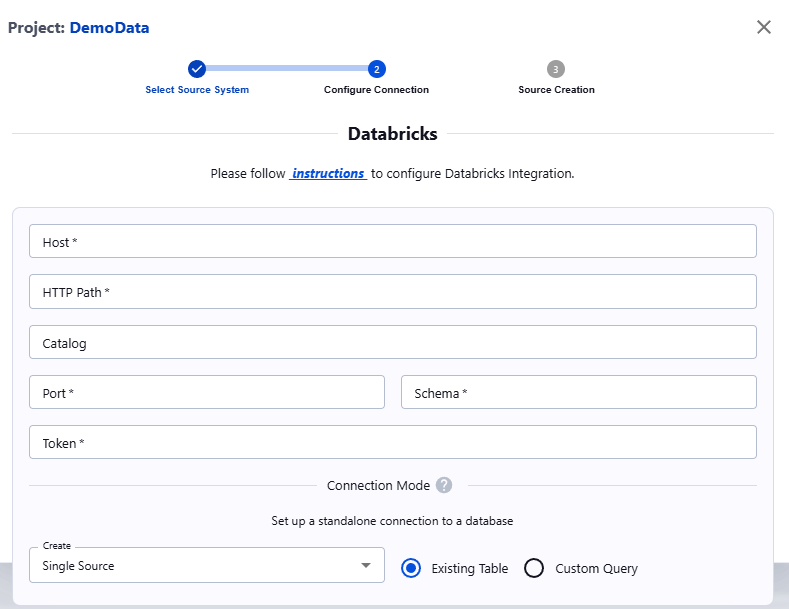

##### Databricks Delta

To connect a Databricks Delta table to Actian Data Observability, you'll need to gather specific information from your Databricks instance. 
Follow the steps below:

1. **Capture Connection Details**
    
    You can find the JDBC connectivity details in the Databricks workspace console:
    Navigate to **Compute** -> **Cluster** -> **Cluster Name** -> **Configuration** -> **Advanced Options** -> **JDBC/ODBC**. Capture the following details:
        
        * **Server Hostname**
        * **Port**
        * **HTTP Path**
    
    For more information, refer to the : [Databricks ODBC and JDBC Drivers](https://docs.databricks.com/integrations/bi/jdbc-odbc-bi.html)

2. **Generate a Security Token**
    
    A security token is required to connect to the cluster remotely. Create this token from the Databricks workspace console:
    
        * Go to the top right corner and click on your **User Name** -> **User Settings** -> **Access Token** -> **Generate New Token**.
        * Capture the token created.
    
    For detailed instructions, see the [Authentication for Databricks tools and APIs](https://docs.databricks.com/dev-tools/api/latest/authentication.html#token-management)

3. **Identify Table Details**
    From the **Data** section in the Databricks workspace, identify the database and table you want to connect.

###### Source in Actian Data Observability

Once you have the necessary information, navigate to the Actian Data Observability UI and enter the following properties:

* **Host:** Cluster hostname
* **Port:** Cluster port
* **Schema:** Schema name (i.e., database name)
* **Catalog (Optional):** Unity catalog name
* **HTTP path:** HTTP path of the cluster
* **Token:** API token

