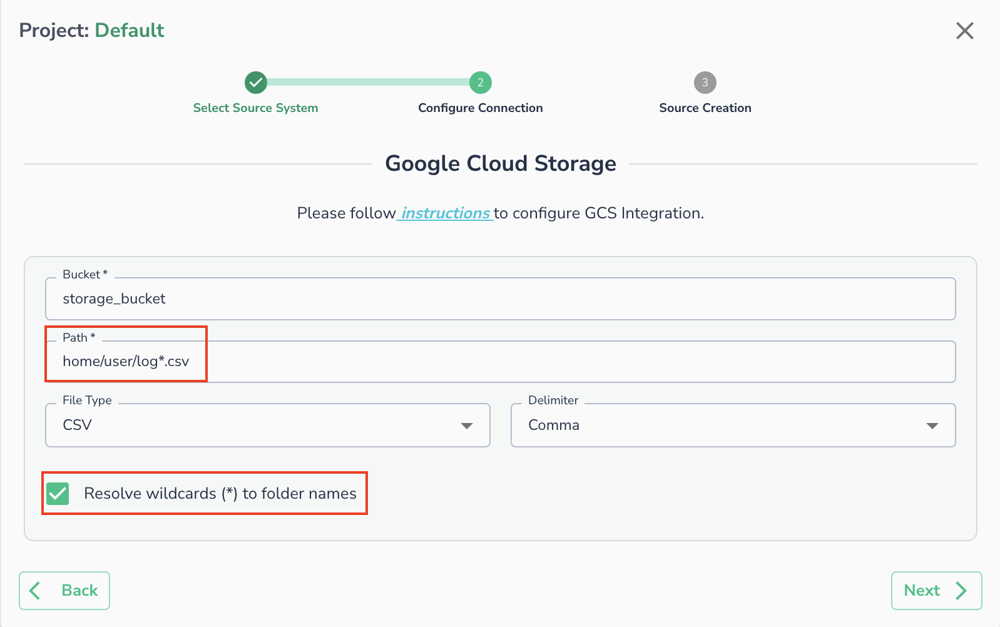

# File Path Options

For GCS and Amazon S3, users can specify either a single file name as input or provide a folder containing multiple files as input.

## Single file

If sending a single file, then specify the full path of a json/csv/parquet file inside the bucket.

Copy

```
path=’<folder1>/file.csv’ 
path=’<folder1>/file.parquet 
path=’file.csv’
```

* Files cannot be compressed
* Files have an extension of csv, json or parquet.
* Csv files should have the header line.

!!! note
>* The JSON file should be in _Newline Delimited JSON_ format - with .json extension.
>* Column Headers in Parquet file should not contain any spaces.

### Folder

If a folder contains multiple files that are to be used as input, then specify the path of the folder inside the bucket, and ensure

* Path does not have a trailing slash
* All files in the folder have the same extension, either csv/json/parquet.
* All csv files should have the same header line

If folder2 contains all input files, then

Copy

```
path=”<folder1>/<folder2>”
```

#### Wildcard Support

You can use a `*` in your file path to match your file path. To enable wildcard you need to select checkbox for "**Resolve wildcards (\*) to folder names**"

For example: `/<folder1>/log*.csv` will match paths like `/home/user/log_1.csv` or `/home/user/logs.csv`.

!!! important
    Currently only **one** `*` is supported in the path.


