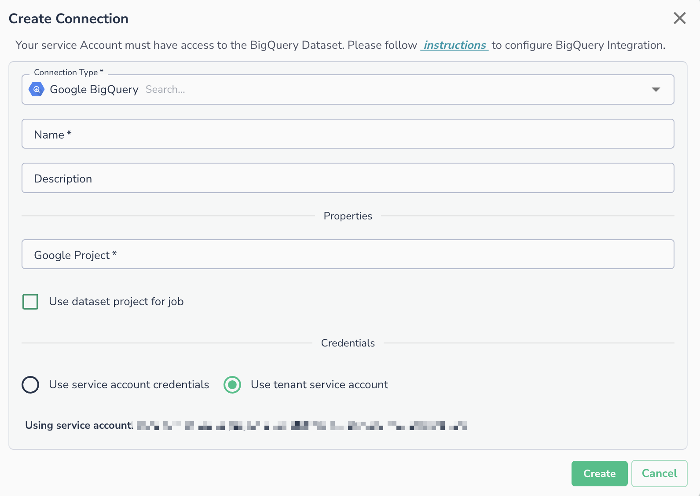
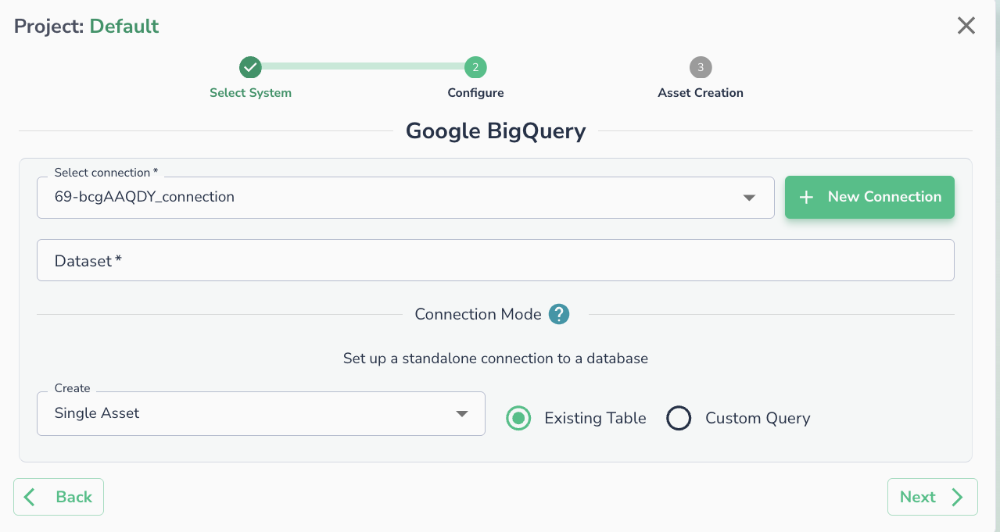

# Google BigQuery

To set up a BigQuery connection, you need to specify the corresponding Google Project name. The Actian Data Observability service account must be granted access to the datasets requiring connections.

## Prerequisites

Before setting up the connection, identify which service account you will use:

* **Tenant service account**: Actian Data Observability's managed (or impersonated) service account. This is only available for GCP deployments. To find your specific tenant service account, open the **Create Connection** dialog and select BigQuery. The service account will be displayed on that page.
* **Your own service account**: if you prefer to provide your own credentials.

This service account must have the right permissions to access and query the data.

### Setting Up Permissions in Google BigQuery

1. Go to Google BigQuery and locate your project: `Google BigQuery / <project> / <dataset>`
2. Click **Share** or **Add Member**.
3. In the **New Member** field, enter the service account identified in the prerequisites above.
4. Assign the roles:
    1. `BigQuery Data Viewer`
    2. `BigQuery Metadata Viewer`
5. Save the settings.

### Setting Up Permissions in GCP Project

The used service account must also be granted `BigQuery Job User` in the GCP project where the query is expected to run.

## Creating the Connection in Actian Data Observability

BigQuery connections can be used to connect multiple data assets in Actian Data Observability using the same connection parameters. To add a BigQuery connection:

1. Navigate to Actian Data Observability connection page and click the **+ Add Connection** button.
2. In the **Create Connection** dialog, select **Google BigQuery** as the Connection Type.
3. Enter a **Name** for the connection (required) and an optional **Description**.
4. Under **Properties**, enter your **Google Project** name.
    * Optionally, check **Use dataset project for job** if you want the job to run under the dataset's project.
5. Under **Credentials**, select one of the following:
    * **Use service account credentials** - provide your own service account key.
    * **Use tenant service account** - uses the Actian Data Observability-managed service account.
6. Click **Create**.

## Connecting an Asset

Once a connection is defined, you can start using it to create assets. To create assets, you will need:

* Dataset name
* \[Optional] Custom SQL

