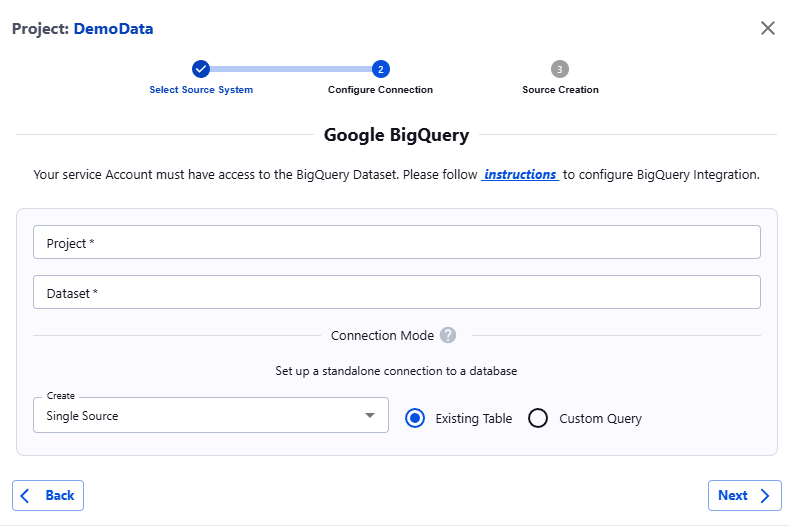

##### Google BigQuery

1. Go to **Google BigQuery** and locate your project: `Google Big Query/<project>/<dataset>`
2. Click on **Share** or **Add Member**.
3. In the **New Member** field, enter the Actian Data Observability-provided service account. Please note each Actian Data Observability tenant has a unique service account, so be sure to follow the _instructions here_ to obtain your specific service account and the necessary permissions it requires.
4. Assign the following roles to the service account:  
   Role: `BigQuery -> BigQuery Data Viewer`  
   Role: `BigQuery -> BigQuery Metadata Viewer`
5. Save the settings.
6. Once the prerequisites are completed, navigate to Actian Data Observability. Click on the **+Add** button, select the **BigQuery** icon, and enter your Project and Dataset information.

