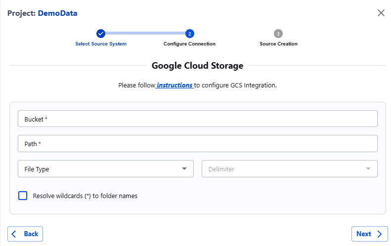

# Google Cloud Storage

Actian Data Observability requires read access to your Google Cloud Storage (GCS) bucket. You can grant this access by assigning specific permissions to the Actian Data Observability service account.

1. Go to **Google Cloud Storage** > **\<bucket>** > **Permissions** > **Members** > **Add**.
2. In the **New Member** field, enter the Actian Data Observability-provided service account. To obtain this account, click the “Instructions” link in the Actian Data Observability UI and copy it from there.
 
3. Add the following roles to the service account:
    * **Storage Legacy Bucket Reader**
    * **Storage Legacy Object Reader**
4. Click **Save** to apply the changes.

Once permissions are granted, complete the setup in Actian Data Observability by entering the required information in the form:

* **Bucket**: Enter only the name of the GCS bucket.
* **Path**: Provide the full path of the file inside the bucket or the full path of the folder containing all files to be sent to Actian Data Observability. If specifying a folder, ensure all files have the same extension. Wildcards are accepted in this field.
* **File Type:** Choose the type of file (CSV, JSON, Delta, Parquet).
* **Delimiter \[Optional]** : For CSV files, specify the delimiter (comma, tab, semicolon, space).

