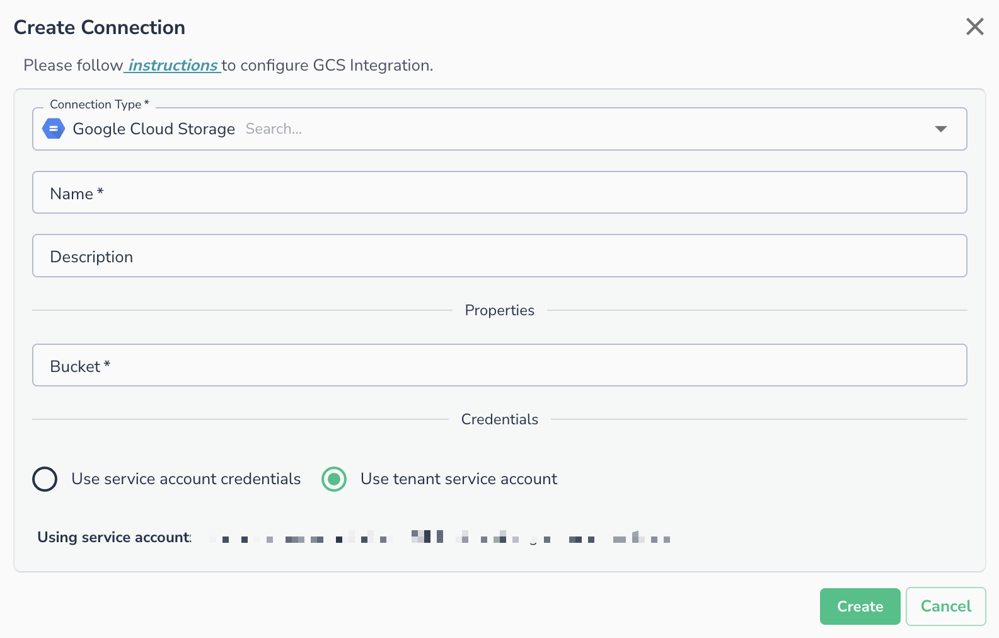
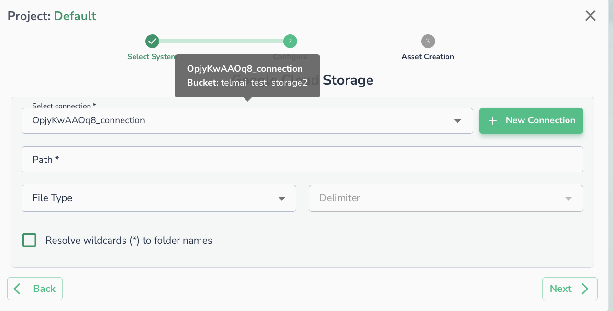

# Google Cloud Storage

To set up a Google Cloud Storage connection, you need to specify the corresponding GCS bucket name. The Actian Data Observability service account must be granted access to the buckets requiring connections.

## Prerequisites

Before setting up the connection, identify which service account you will use:

* **Tenant service account**: Actian Data Observability's managed (or impersonated) service account. This is only available for GCP deployments. To find your specific tenant service account, open the **Create Connection** dialog and select **Google Cloud Storage**. The service account will be displayed on that page.
* **Your own service account**: if you prefer to provide your own credentials.

This service account must have the right permissions to access and read the data.

### Setting Up Permissions in Google Cloud Storage

1. Go to **Google Cloud Storage** and locate your bucket: `Google Cloud Storage / <bucket> / Permissions / Members`
2. Click **Add**.
3. In the **New Member** field, enter the service account identified in the prerequisites above.
4. Assign the following roles:
    1. `Storage Legacy Bucket Reader`
    2. `Storage Legacy Object Reader`
5. Click **Save** to apply the changes.

## Creating the Connection in Actian Data Observability

GCS connections can be used to connect multiple data assets in Actian Data Observability using the same connection parameters. To add a GCS connection:

1. Navigate to the Actian Data Observability connection page and click the **+ Add Connection** button.
2. In the **Create Connection** dialog, select **Google Cloud Storage** as the Connection Type.
3. Enter a **Name** for the connection (required) and an optional **Description**.
4. Under **Properties**, enter the **Bucket** name (name only, not the full path).
5. Under **Credentials**, select one of the following:
    * **Use service account credentials** - provide your own service account key.
    * **Use tenant service account** - uses the Actian Data Observability-managed service account.
6. Click **Create**.

## Connecting an Asset

Once a connection is defined, you can start using it to create assets. To create assets, you will need:

* **Path**: Provide the full path of the file inside the bucket or the full path of the folder containing all files to be sent to Actian Data Observability. If specifying a folder, ensure all files have the same extension. Wildcards are accepted in this field.
* **File Type:** Please refer to [Supported File Types](../supported-file-types.md).
* **Delimiter \[Optional]** : For CSV files, specify the delimiter (comma, tab, semicolon, space).

