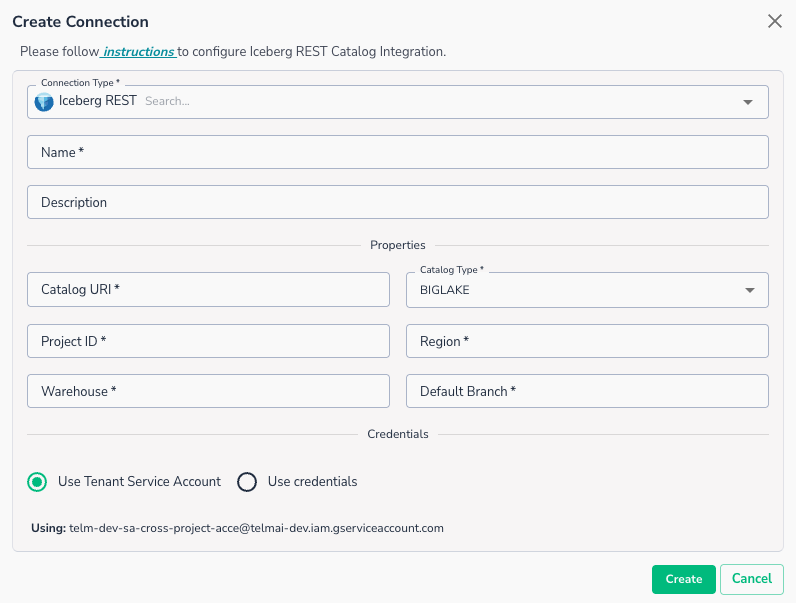
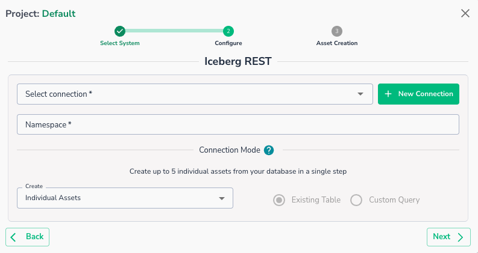

# Iceberg REST

BigLake Metastore via Iceberg REST catalog (GCP only)

Feature only supported for GCP-BigLake

## Creating a Connection

To setup connection to Iceberg REST metastore, you will need to provide

* **Catalog URI**: Enter the REST catalog URI for your BigLake Metastore.
* **Project ID**: GCP Project ID where the metastore exists
* **Region:** GCP region for metastore
* **Warehouse:** Warehouse name
* **Default Branch:** Default table branch name

## Required Permissions

The following permissions are required to enable reading data from BigLake:

On BigLake side, you will need to grant:

* `Big Lake Viewer`
* `Service Usage Consumer`

On the Storage Bucket used by BigLake, you will need to grant:

* `Storage Object Viewer`

## Connecting an Asset

Once a connection is defined, you can start using it to create assets. To create assets, you will need:

* Target Namespace
    * Next step will show you available tables

!!! warning
    Custom SQL Query is not currently supported for Iceberg connections

!!! warning
    Delta scans is not currently supported for Iceberg connections

Once defined, you will be able to see your data asset in Actian Data Observability.
