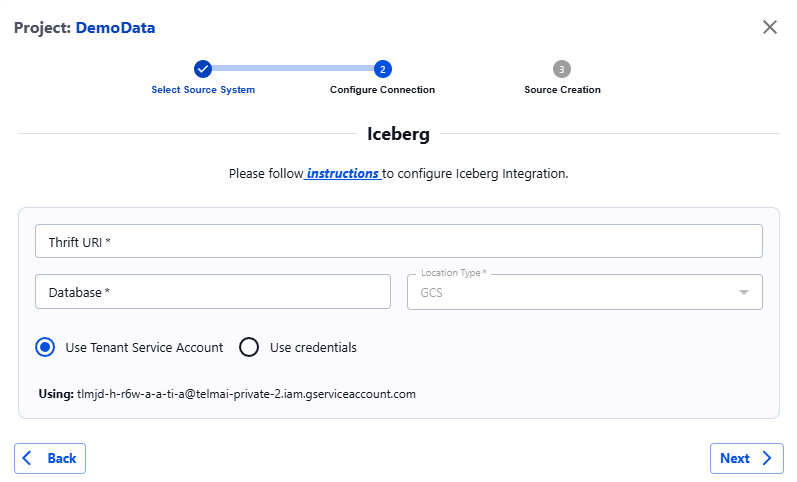

##### Iceberg

Tables hosted in Hive Metastore

!!! note
    Feature only supported for GCP deployments & GCS metastore.

1. **Navigate to the Iceberg Configuration Page**
   * Go to your project's dashboard.
   * Under **Source Systems**, select **Iceberg**.
2.  **Configure Connection Details**

    * Fill in the required fields as follows:
      * **Thrift URI**: Enter the Thrift URI to connect to Hive Metastore using thrift protocol.
      * **Database**: Specify the database where Iceberg table resides.
      * **Location Type**: Choose the type of storage, where physical data files are present. (Currently only GCS supported)
      * For GCS:
        * **Project ID**: Provide your project identifier.
        * **Client ID**: Enter your client identifier.
        * **Email**: Provide your email for authentication.
        * **Private Key ID**: Enter the private key ID.
        * **Private Key:** Enter the private key.
      * For Azure:
        * Not Supported
      * For S3:
        * Not Supported

    _Specified GCS service account credentials should have read-access to Hive Metastore warehouse. Additionally in case of private cloud deployment write-access to Actian Data Observability internal storage bucket should be set to this service account._
3. **Validate Connection**
   * After filling all fields, click **Next**.
   * The system will validate your connection parameters.
   * If successful, you will proceed to Table selection.
4. **Create Source**
   * After table selection, click Confirm to create the data source.

