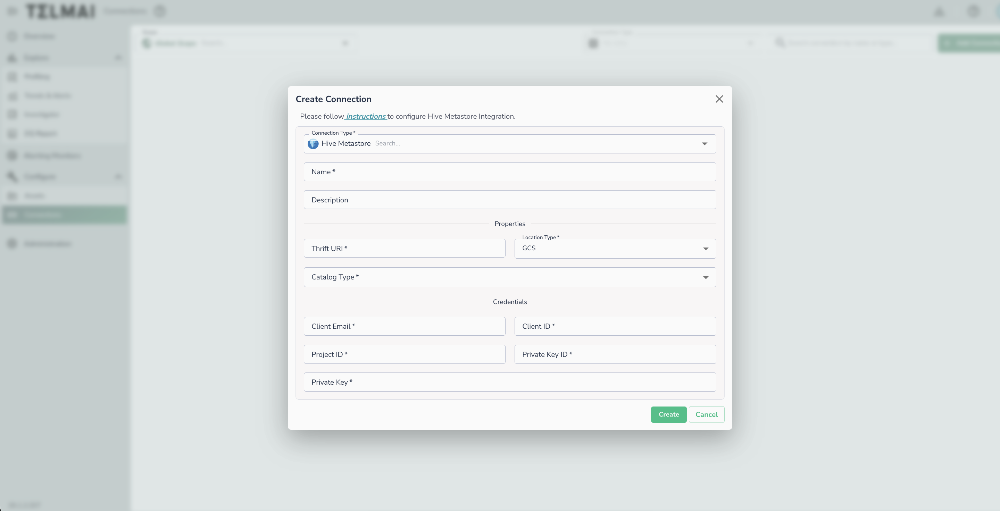
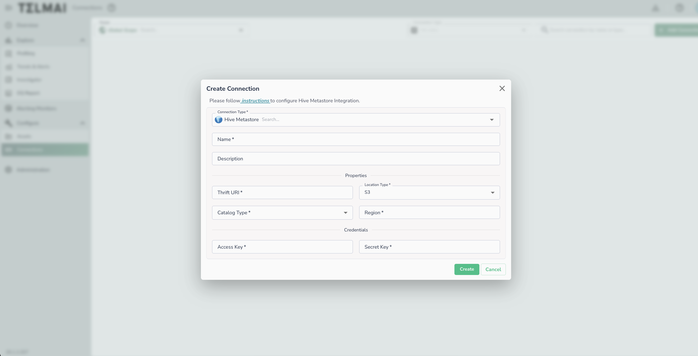

# Hive Metastore

Connect using Hive Metastore with HIVE or ICEBERG catalog type (GCS & S3)

Feature only supported for GCP & AWS deployments (GCS & S3 metastore)

## Creating a Connection

To set up a connection to Hive Metastore, provide the following:

* **Thrift URI**: The Thrift URI used to connect to the Hive Metastore using the Thrift protocol.
* **Location Type**: The type of storage where physical data files are present — **GCS** or **S3**.
* **Catalog Type**: Choose **HIVE** for a standard Hive catalog, or **ICEBERG** for an Iceberg catalog hosted in Hive Metastore.

### GCS Credentials

| Field | Description |
| ----- | ----------- |
| Client Email | Service account email address |
| Client ID | Service account client ID |
| Project ID | GCP project ID |
| Private Key ID | Service account private key ID |
| Private Key | Service account private key |

_The specified GCS service account credentials should have read-access to the Hive Metastore warehouse. In the case of a private cloud deployment, write-access to the Actian Data Observability internal storage bucket must also be granted to this service account._

### S3 Credentials

| Field | Description |
| ----- | ----------- |
| Region | AWS region where the S3 bucket is located |
| Access Key | AWS access key ID |
| Secret Key | AWS secret access key |

## Connecting an Asset

Once a connection is defined, you can start using it to create assets. To create assets, you will need:

* Database name
    * The next step will show you available tables

!!! warning
    Group scans are not supported for Hive Metastore connections.

