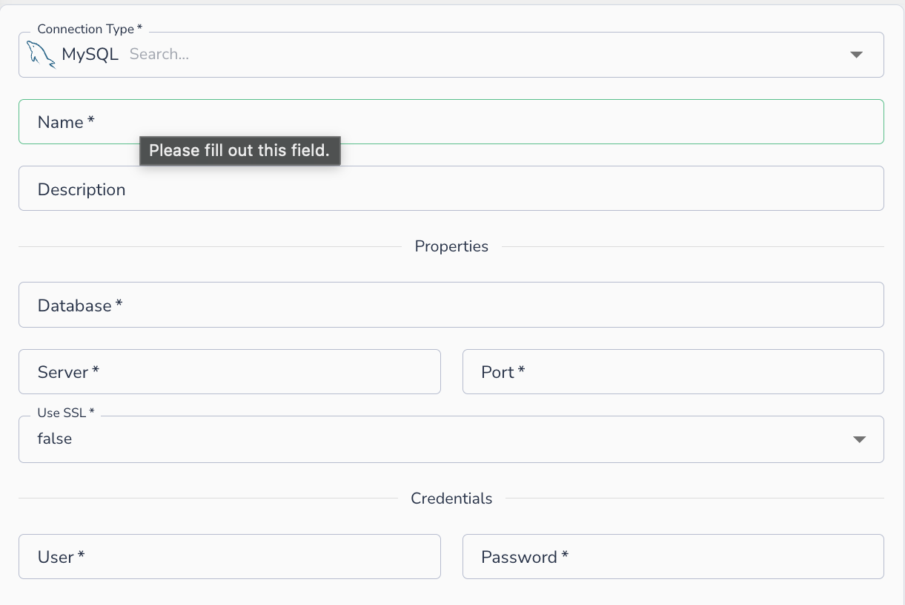
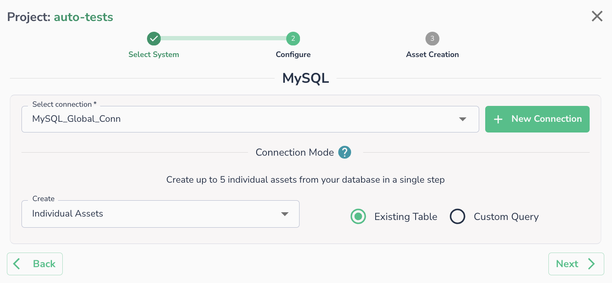

# MySQL

Connect Actian Data Observability to a MySQL database hosted on-prem or in the cloud.

## Creating a Connection

To connect to MySQL, provide the following details:

1. **Name**: A display name for this connection
2. **Description**: Optional description
3. **Database**: The database name to connect to
4. **Server**: The hostname or IP address of the MySQL server
5. **Port**: The port MySQL is listening on (default: `3306`)
6. **Use SSL**: Whether to require an SSL connection (`true` / `false`)
7. **User**: The username
8. **Password**: The password

!!! note
    In order to connect to a privately hosted instance, the customer will need to whitelist the IPs from Actian Data Observability. Please reach out to Actian Data Observability support for the updated list of IPs for whitelisting.

## Connecting an Asset

Once a connection is defined, you can start using it to create assets. Select an existing connection (or create a new one), then choose whether to create assets from an **Existing Table** or a **Custom Query**.

!!! note
    Please ensure that your environment has whitelisted [Actian Data Observability IP list](../../../api-reference/data-observe-apis.md).
