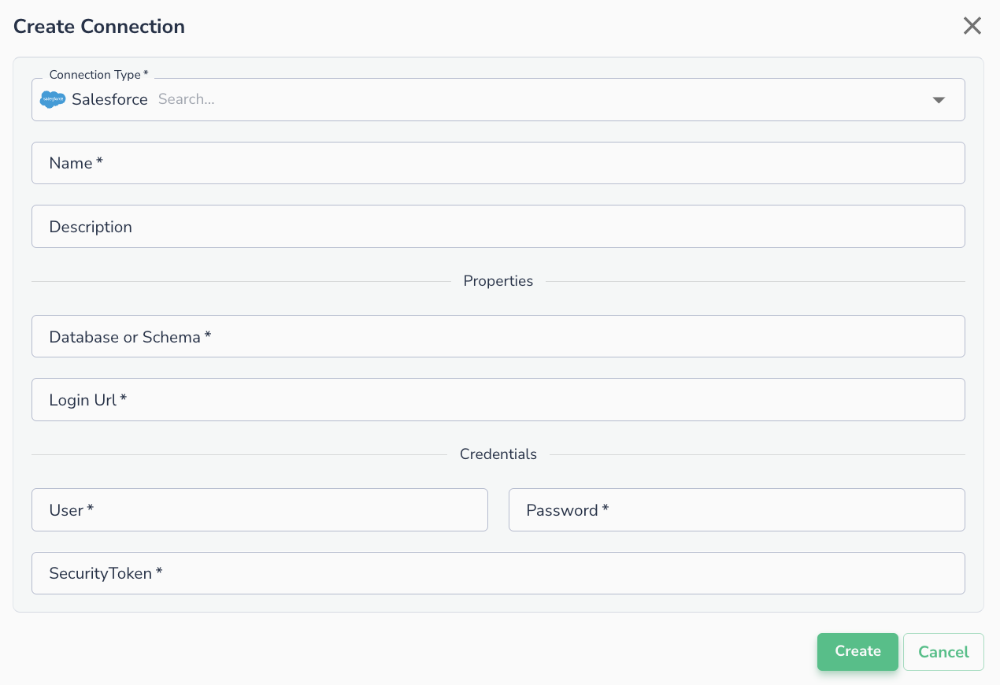
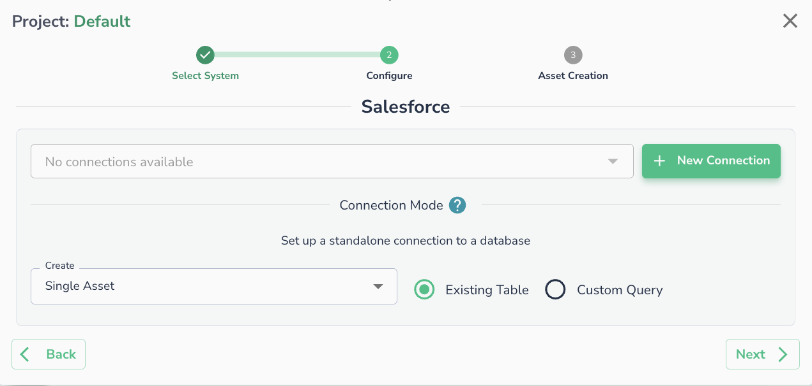

# Salesforce

## Creating a Connection

To create a connection to Salesforce, please enter the required fields in the form below:

* Database
* Login Url
* User name
* Password
* Security Token

## Connecting an Asset

Once a connection is defined, you can start using it to create assets. To create assets, you will need to select existing table, or run a custom SQL query.

