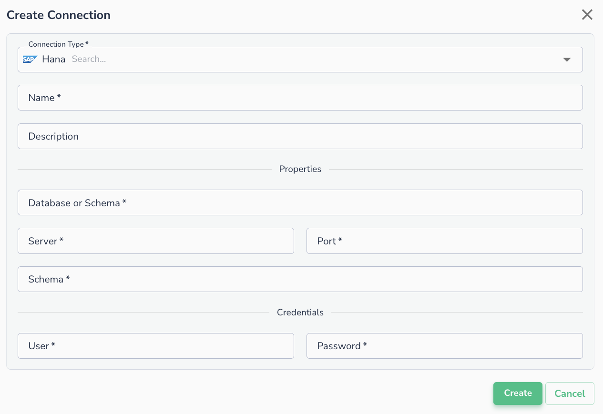
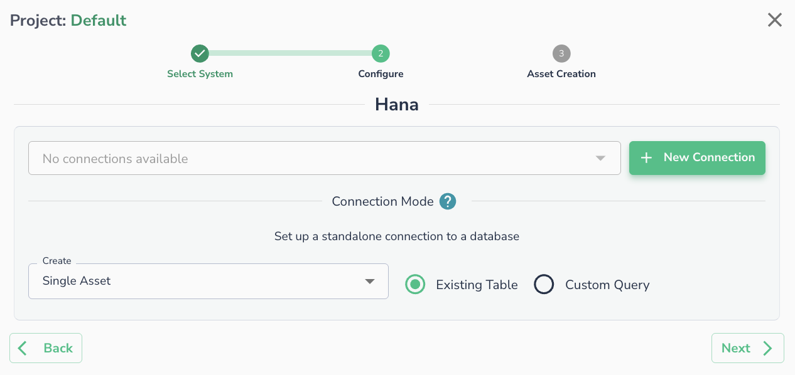

# SAP Hana

## Creating a Connection

To connect to SAP Hana, please fill in the required fields on the form below:

* Database
* Server
* Port
* Schema
* Authentication: User and password

## Connecting an Asset

Once a connection is defined, you can start using it to create assets. To create assets, you will need to select existing table, or run a custom SQL query.

