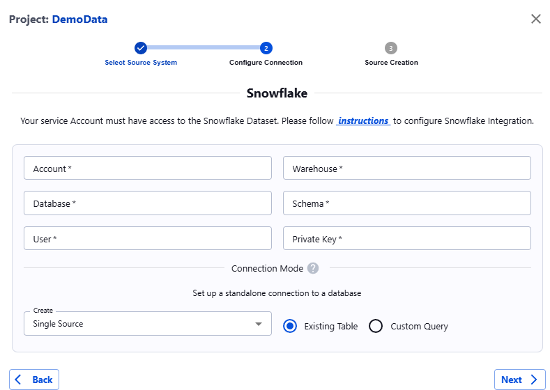

##### Snowflake

###### Introduction

Snowflake is a multi-cloud data warehouse optimized for analytics workloads, requiring minimal maintenance.

Actian Data Observability integrates with Snowflake to monitor data, identifying anomalies such as outliers and drifts while processing data outside of your data warehouse (DW) architecture to reduce the monitoring load on your Snowflake DW.

This guide outlines the steps for integrating Actian Data Observability with Snowflake.

###### Authentication Options

Snowflake offers following authentication options ([Snowflake Authentication](https://docs.snowflake.com/en/guides-overview-secure/))

1. Basic authentication using username and passcode
2. Key pair authentication
3. Multi-Factor Authentication (MFA)
4. Federated Authentication and Single Sign-On (SSO)

Actian Data Observability supports **key pair-based connectivity** to Snowflake, offering enhanced security compared to basic authentication. Below are the detailed steps to integrate Snowflake with Actian Data Observability using this method.

###### Setting up Authentication

1. **Role and User Creation**: If you have an existing user with the necessary permissions to access the database, schema, table, or view, skip to Step 2. However, the best practice is to create a separate role and user specifically for Actian Data Observability.
    * **Role**: Actian Data Observability requires permissions for database connections, schema and table listings, metadata retrieval, and data selection in tables and views. These are managed through `SELECT`, `USAGE`, and `MONITOR` privileges in Snowflake.<br/>
     For references on creating roles and assigning appropriate privileges, please refer to [1](https://docs.snowflake.com/en/sql-reference/sql/create-role/), [2](https://docs.snowflake.com/en/sql-reference/sql/grant-privilege/), and [3](https://docs.snowflake.com/en/user-guide/security-access-control-privileges/)
    * **User**: Create a user account for Actian Data Observability to access Snowflake. Assign the user to the role created above. Detailed steps for creating a user can be found [here](https://docs.snowflake.com/en/user-guide/key-pair-auth/).
2. Generate an unencrypted key pair and assign it to the user following the instructions [here](https://docs.snowflake.com/en/user-guide/key-pair-auth/)
3. Assign the default role and warehouse for the user as described [here](https://docs.snowflake.com/en/sql-reference/sql/alter-user/)
4. Once the role, user, and key pair are configured, enter the following parameters in the Actian Data Observability Connection Wizard:
    * Snowflake Account
    * Snowflake Warehouse
    * Snowflake Database
    * Snowflake Schema
    * Snowflake Username
    * Snowflake Private Key


**Snowflake Configuration Template Script** To simplify configuration, you can use an Actian Data Observability Template Script, enter your parameters, and execute in the Snowflake console.

**1** Generate key pair as described [here](https://docs.snowflake.com/en/user-guide/key-pair-auth/) 

**2** Once the key is generated, format it to create a single-line Base64 string for usage. If your public key file is rsa\_key`.pem`, use the commands below to produce a single-line string.&#x20;
  ```bash
  // For mac OS
  grep -v "PUBLIC KEY" rsa_key.pub | tr -d '\n' > rsa_public_key_base64.txt
  grep -v "PRIVATE KEY" rsa_key.p8 | tr -d '\n' > rsa_private_key_base64.txt
  ```
  ```powershell
  // For Windows
  (Get-Content rsa_key.pub | Where-Object {$_ -notmatch 'PUBLIC KEY'}) -join '' |
      Set-Content -NoNewline rsa_public_key_base64.txt
  (Get-Content rsa_key.p8 | Where-Object {$_ -notmatch 'PRIVATE KEY'}) -join '' |
      Set-Content -NoNewline rsa_private_key_base64.txt
  ```
**3** Create role for Data Observability to read the data. 
   The script below lists the commands to be run. Fill in the right values for the fields which are marked.

```sql
-- Create variables for user / password / role / warehouse / database (needs to be uppercase for objects)
-- The following part also needs to be found and changed in script to include your generated public key: "set rsa_public_key = 'MI...'"
set role_name = 'ACTIAN_ROLE';
set user_name = 'ACTIAN_USER';
set user_password = 'P@SSw0rd'; -- Change this password
set warehouse_name = 'COMPUTE_WH'; -- Change to your warehouse name
set database_name = 'TESTDB'; -- Change this database name to your database
set db_schema_name = 'TESTSCHEMA'; -- Change this schema name to your schema
set db_table_name = 'SUPPLIER'; -- Change this table name to your table

-- Change role for user / role steps
use role accountadmin;

-- Create role for Actian
create role if not exists identifier($role_name);

-- Create a user for Actian
create user if not exists identifier($user_name)
  password = $user_password
  default_role = $role_name
  default_warehouse = $warehouse_name;

-- Set public key for user
alter user identifier($user_name) set rsa_public_key = 'MI...';

grant role identifier($role_name) to user identifier($user_name);

-- Grant Actian role access to warehouse
grant USAGE on warehouse identifier($warehouse_name) to role identifier($role_name);
grant USAGE on database identifier($database_name) to role identifier($role_name);
grant USAGE on schema identifier($db_schema_name) to role identifier($role_name);
grant SELECT on table identifier($db_table_name) to role identifier($role_name);

-- The following statement if all schema tables need to be accessible from Actian
grant SELECT on ALL TABLES in schema identifier($db_schema_name) to role identifier($role_name);

```

**4** Run the updated script in your Snowflake console.


###### Allow listing Actian Data Observability IP’s

In some cases, Snowflake's security requires allow listing the IPs from which connection to the database is allowed. For this purpose, Actian Data Observability provides a list of static IPs from which connections can be made. Please refer to [Actian Data Observability IP list](../../api-misc/data-observe-ip-list.md).

Please make sure you are allow listing those IP addresses. These IPs are for the SaaS version of the product, which is running in the US West. They will be provided separately upon request for the private cloud or deployment in other regions.

Snowflake instances are open to every IP address by default, so no action is required. However, if you have set up network policies to restrict the IP addresses communicating with the Snowflake instance, you'll need to modify these policies to allow the Actian Data Observability IP address. There are two types of network policies:

* [Account level](https://docs.snowflake.com/en/user-guide/network-policies#modify-an-account-level-network-policy/): Apply to all users unless overridden by a user-level policy.
* [User level](https://docs.snowflake.com/en/user-guide/network-policies#modify-a-user-level-network-policy/): Apply only to specific users and override account-level policies.

Please refer to the Snowflake documentation for more information on modifying network policies.
