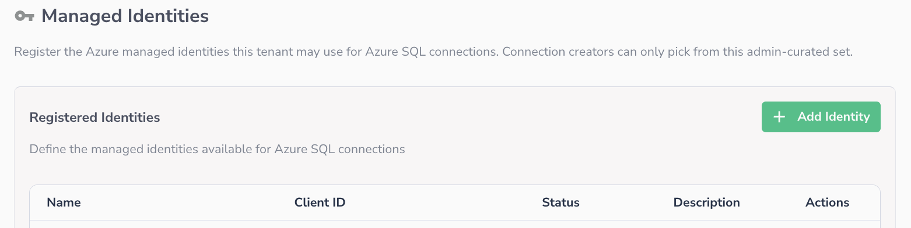
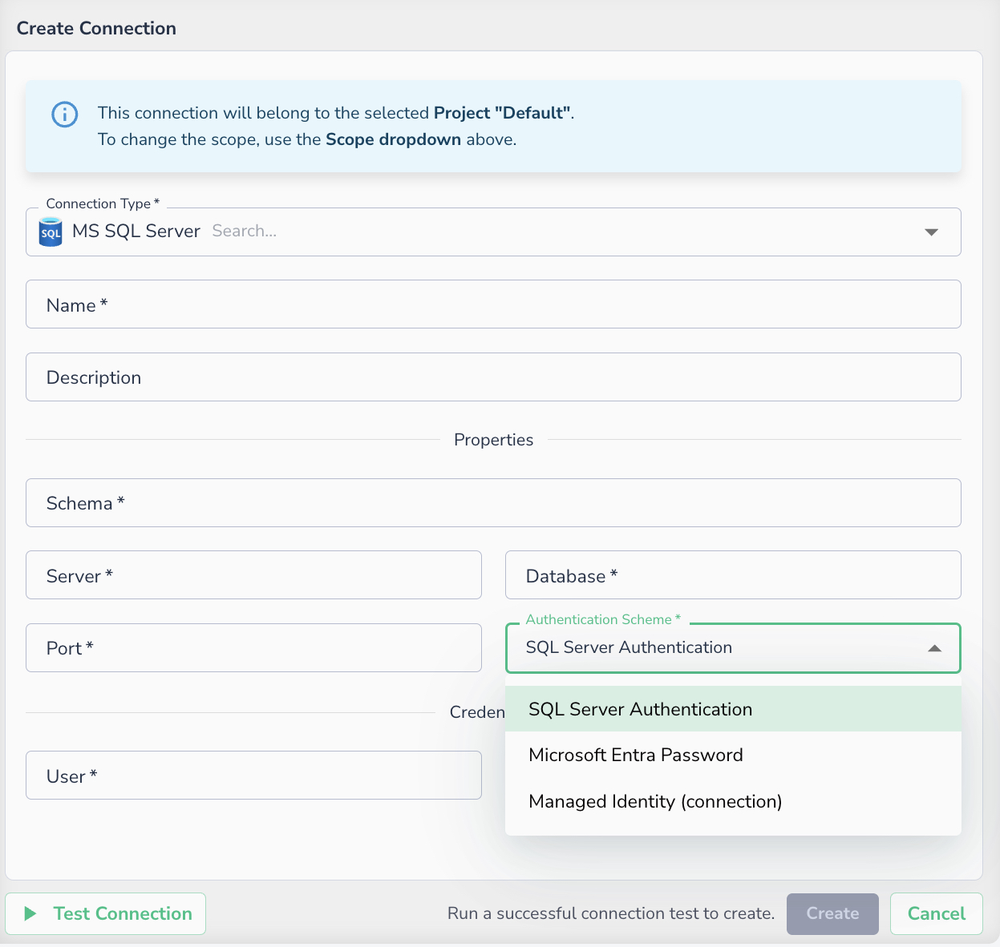
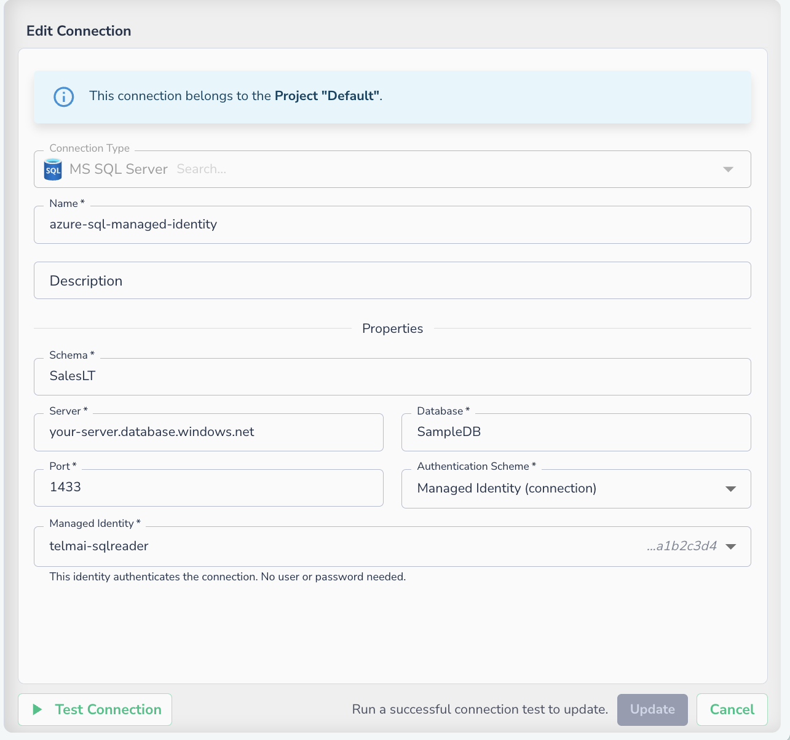

# Azure SQL Server: Managed Identity Authentication

_Authenticate to Azure SQL Database using a Microsoft Entra managed identity, with no stored password or secret._

Actian Data Observability can authenticate to your Azure SQL Database using a Microsoft Entra **managed identity** that you provide and register, so **no password or secret is ever stored**. Each connection authenticates as a **specific identity you choose** — for example, one identity per database, each with only the access it needs.

This guide walks through the one-time setup for **each** managed identity you want Actian Data Observability to use.

For username and password (SQL Authentication) setup, see [SQL Server](sql-server.md).

!!! warning
    **Azure deployments only.** Managed identity authentication requires Actian Data Observability to be deployed on Azure. It is not available on AWS or GCP deployments — on those, use SQL Authentication or Microsoft Entra Password instead. This is a property of where **Actian Data Observability** runs, not of where your database runs.

## How it works

Actian Data Observability's pods run under an Azure Kubernetes workload identity. That workload identity only **obtains tokens** — it is never itself used to read your data. For each managed identity you register, you allow Actian Data Observability's pods to obtain that identity's token; each connection then authenticates as the identity you selected for it. When a scan runs, Actian Data Observability requests a short-lived Microsoft Entra token for that identity and connects with it.

There is **no shared or default identity** for data access — every connection uses one of the identities you set up and registered.

!!! note
    **Two identifiers you will use.** Creating a managed identity gives you two different ids, and each is used in exactly one place. Keep them straight:

       * **Client ID** → used when the identity is **registered in Actian Data Observability** (Step 4).
       * **Object ID** (also shown as _Principal ID_ / _Object (principal) ID_) → used in the **SQL grant** (Step 2).

## Before you begin

* Your Actian Data Observability instance is deployed on Azure (see the warning above).
* The Azure administrator can create identities and federated credentials (the `az` CLI examples below, or the Azure portal).
* The Azure SQL **server already has a Microsoft Entra admin** configured. The grant in Step 2 must be run as that admin (a SQL-authenticated login cannot create Entra users).
* Actian Data Observability will provide three values for the federation in Step 3: the **ServiceAccount name**, its **namespace**, and the cluster **OIDC issuer URL**.

!!! warning
    **Same Entra tenant required.** The managed identity and the target SQL Database must be in the **same Microsoft Entra tenant (directory)**. Subscription and resource group do not matter — only the directory. Reaching a SQL server in a different directory is not supported with a managed identity.

### Who does what

This setup spans up to three roles, which may be different people in your organization:

| Step | Task | Owner |
| ---- | ---- | ----- |
| 1 | Create the managed identity | Azure administrator |
| 2 | Grant the identity read access on the database | Database administrator |
| 3 | Federate the identity to Actian Data Observability's ServiceAccount | Azure administrator |
| 4 | Register the identity in Actian Data Observability | Actian Data Observability administrator |
| 5 | Create the connection and select the identity | Actian Data Observability user |
| 6 | Verify the connection | Actian Data Observability user |

## Step 1: Create the managed identity

The Azure administrator creates a user-assigned managed identity (UAMI). Do this in the **Managed Identities** blade of the portal, or with the CLI:

```bash
az identity create --resource-group <resource-group> --name <identity-name> --location <location>
```

Then read the two identifiers needed later:

```bash
az identity show --resource-group <resource-group> --name <identity-name> \
  --query "{clientId:clientId, objectId:principalId}" -o table
```

!!! note
    Note both values now:

    * **Client ID** — used in Actian Data Observability in Step 4.
    * **Object ID** (the CLI calls it `principalId`) — used in the SQL grant in Step 2.

## Step 2: Grant access on the SQL Database

The Database administrator creates a database user mapped to the managed identity and grants it read access, in the **target database**. Run this via a SQL client (SSMS, Azure Data Studio, or the portal Query editor), connected with **Microsoft Entra authentication** as the server's **Entra admin** (or a `db_owner`).

```sql
CREATE USER [<identity-name>] FROM EXTERNAL PROVIDER WITH OBJECT_ID = '<object-id>';
ALTER ROLE db_datareader ADD MEMBER [<identity-name>];
```

* `<identity-name>` is the name given to the identity in Step 1.
* `<object-id>` is the **Object ID** from Step 1 (not the Client ID).

!!! note
    Read access (`db_datareader`) is all a data-quality scan needs. Grant each identity only what its databases require — registering a separate identity per database keeps permissions least-privilege.

!!! warning
    If the statement returns _"Principal … could not be resolved"_, the identity is not visible in this server's directory — confirm the identity and the SQL server are in the **same Entra tenant** (see [Before you begin](#before-you-begin)).

## Step 3: Allow Actian Data Observability's pods to use the identity (federation)

The Azure administrator adds a **federated credential** on the identity that trusts Actian Data Observability's Kubernetes ServiceAccount. Actian Data Observability provides the ServiceAccount name, namespace, and OIDC issuer URL.

```bash
az identity federated-credential create \
  --name federated-<identity-name> \
  --identity-name <identity-name> --resource-group <resource-group> \
  --issuer <cluster-oidc-issuer-url> \
  --subject system:serviceaccount:<namespace>:<serviceaccount-name> \
  --audience api://AzureADTokenExchange
```

!!! note
    The federated-credential **name** (`federated-<identity-name>` above) is only a label — any name works. What establishes trust is the combination of **issuer**, **subject**, and **audience**. No ServiceAccount setting is changed; each identity simply adds its own federated credential trusting the same ServiceAccount.

## Step 4: Register the identity in Actian Data Observability

The Actian Data Observability administrator adds the identity so it can be selected on connections.

1. Go to **Administration → Managed Identities**.
2. Select **Add Identity**.
3. Enter a **Name** (how it appears when creating a connection), the identity's **Client ID** (from Step 1), and optionally a **Description**.
4. Save.


_Administration → Managed Identities. Use the **Client ID** here, not the Object ID._

!!! note
    At least one identity must be registered before a managed-identity connection can be created. Registered identities appear as **Active**; you can **Revoke** an identity to stop it being used (reversible) or **Remove** it entirely.

## Step 5: Create the connection

The Actian Data Observability user creates (or edits) an **MS SQL Server** connection and chooses the registered managed identity.

1. **Connection Type** — MS SQL Server.
2. **Name** — a name for the connection.
3. **Schema** — the schema to connect to, for example `SalesLT`.
4. **Server** — your Azure SQL server, e.g. `your-server.database.windows.net`.
5. **Database** — the target database.
6. **Port** — `1433`.
7. **Authentication Scheme** — select **Managed Identity (connection)**.
8. **Managed Identity** — pick one of the registered identities from the list.

The **Authentication Scheme** list offers three options:

| Scheme | What it uses |
| ------ | ------------ |
| SQL Server Authentication | A SQL Server username and password, stored on the connection |
| Microsoft Entra Password | A Microsoft Entra username and password, stored on the connection |
| Managed Identity (connection) | A managed identity registered in Step 4 — no user or password is stored |

Select **Managed Identity (connection)**. The form then replaces the **User** and **Password** fields with the **Managed Identity** picker.



_The three authentication schemes available on an MS SQL Server connection._

Once the scheme is set, choose the identity to authenticate as:


_With **Managed Identity (connection)** selected, no user or password is required_

!!! note
    Only identities registered for your tenant (Step 4) can be chosen — there is no free-text entry, so a connection can never point at an unregistered identity. The list shows each identity's name alongside the tail of its client id so you can confirm which one you are selecting.

## Step 6: Verify

Select **Test Connection**. A successful test confirms the identity was granted on the database and the federation is in place. You can then create assets from this connection as usual.

!!! tip
    No password or secret is stored at any point. Actian Data Observability requests a short-lived Entra token for the selected identity each time the connection runs.
