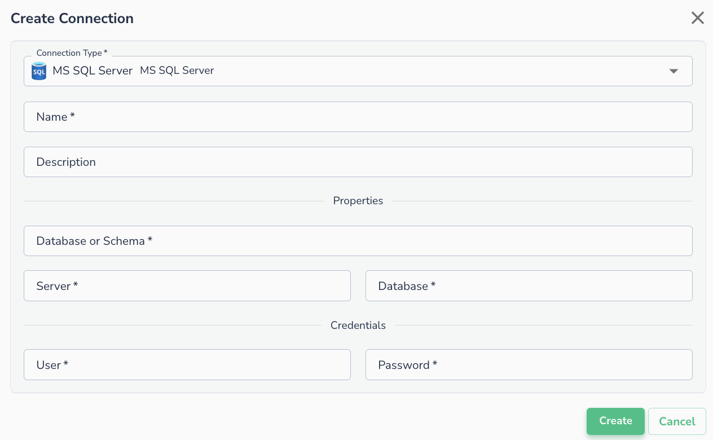
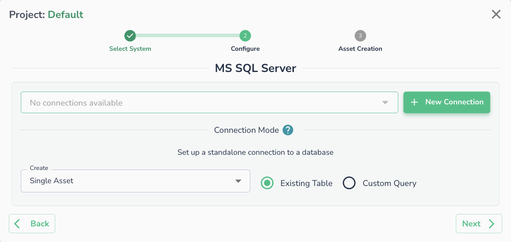

# SQL Server

SQL Server can be hosted on prem or run in Azure, GCP or AWS.

## Creating a Connection

To connect to SQL Server, you'll need to provide the below details:

!!! note
    Fill in following details in the form. We use Azure SQL service as an example here:

1. **Server**: The server name. It can be found in Azure Portal: _SQL Server -> Server Name -> Overview -> Server Name_
2. **Database**: The database name. This can be found in the Azure Portal at the following location: _SQL Server -> Server Name -> Overview -> Available Resources -> (x) databases_.&#x20;
3. **Database or Schema**: The schema to connect to&#x20;
4. **User**: The username
5. **Password** : The password

!!! note
    * The User and Password above are for the SQL Authentication.
    * In order to connect to a privately hosted instance, the customer will need to whitelist the IPs from Actian Data Observability. Please reach out to Actian Data Observability support for the updated list of IP’s for whitelisting.

## Connecting an Asset

Once a connection is defined, you can start using it to create assets. To create assets, you will need to select existing table, or run a custom SQL query.

!!! warning
    JSON data type is not supported for SQL Server connections out of the box. Please reach out to Actian Data Observability support if it needs to be enabled

!!! note
    Please ensure that your environment has whitelisted [Actian Data Observability IP list](../../../api-reference/data-observe-ip-list.md).
