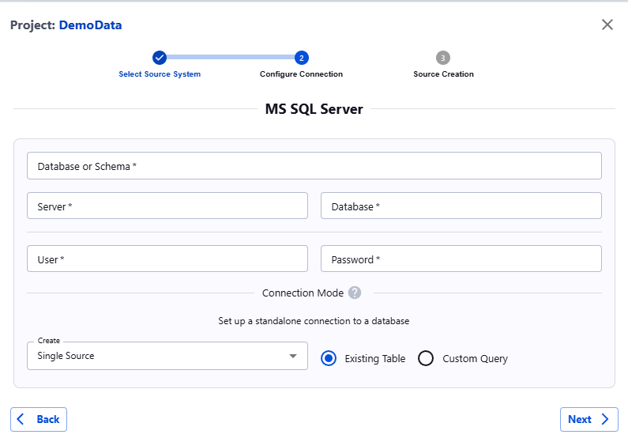

##### SQL Server

SQL Server can be hosted on prem or run in Azure, GCP or AWS.

To connect to SQL Server, chose it's icon from the list of available connections which will open the following dialog

Fill in following details in the form. We use Azure SQL service as an example here:

1. **Server**: The server name. It can be found in Azure Portal: _SQL Server -> Server Name -> Overview -> Server Name_
2. **Database**: The database name. This can be found in the Azure Portal at the following location: _SQL Server -> Server Name -> Overview -> Available Resources -> (x) databases_. Pls choose the appropriate database to connect to from this list
3. **Database or Schema**: The schema to connect to
4. **User**: The username
5. **Password** : The password

!!! note
    1. The User and Password above are for the SQL Authentication.
    2. In order to connect to a privately hosted instance, the customer will need to allow list the IPs from Actian Data Observability. Please reach out to Actian Support for the updated list of IP’s for allow listing.

**Data Types Supported:**

JSON data type is not supported for SQL Server connections out of the box. Please reach out to Actian Support if it needs to be enabled

!!! note
    Please ensure that your environment has allow listed [Actian Data Observability IP list](../../api-reference/telmai-ip-list.md).
