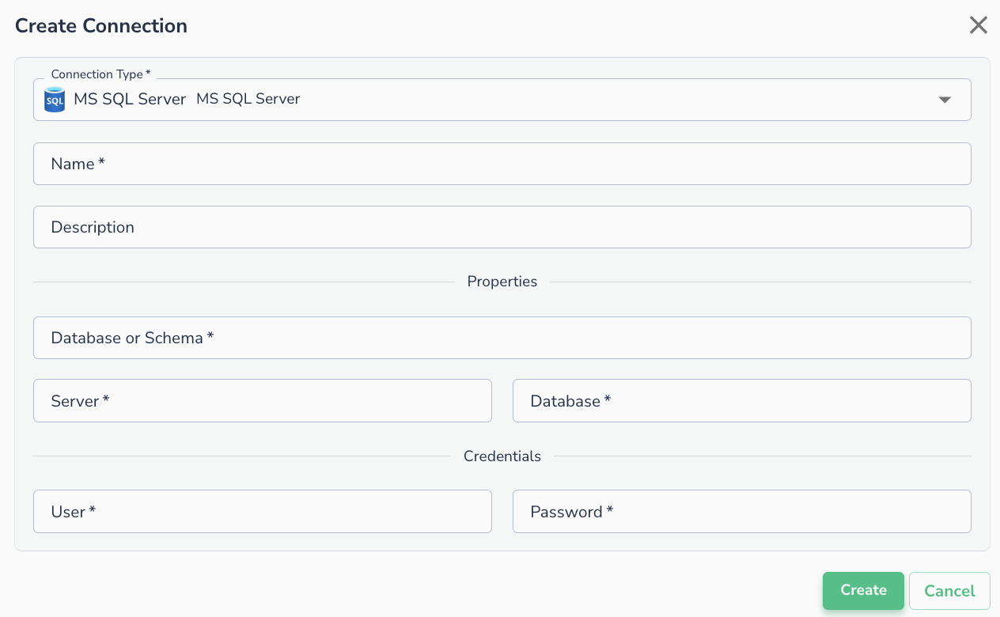
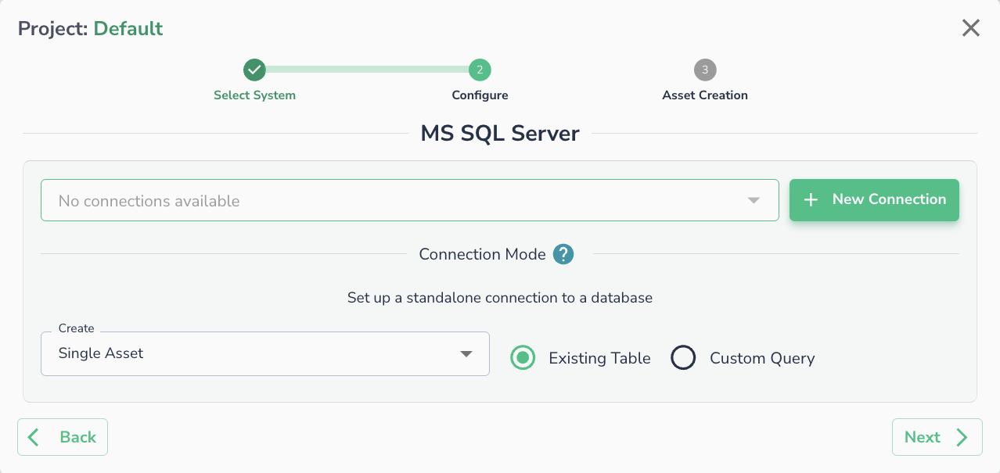

# SQL Server

SQL Server can be hosted on prem or run in Azure, GCP or AWS.

## Creating a Connection

To connect to SQL Server, you'll need to provide the below details:

!!! note
    Fill in following details in the form. We use Azure SQL service as an example here:

1. **Connection Type**: MS SQL Server
2. **Name**: A name for the connection
3. **Description**: An optional description
4. **Schema**: The schema to connect to
5. **Server**: The server name. It can be found in Azure Portal: _SQL Server -> Server Name -> Overview -> Server Name_
6. **Database**: The database name. This can be found in the Azure Portal at the following location: _SQL Server -> Server Name -> Overview -> Available Resources -> (x) databases_.&#x20;
7. **Port**: The server port, typically `1433`
8. **Authentication Scheme**: How Actian Data Observability authenticates to the server — see [Authentication schemes](#authentication-schemes) below
9. **User** and **Password**: The credentials, when the selected scheme requires them

_Creating an MS SQL Server connection, with the Authentication Scheme list open._

Select **Test Connection** to validate the details. The connection can only be created once a test succeeds.

### Authentication Schemes

| Scheme | What it uses |
| ------ | ------------ |
| SQL Server Authentication | A SQL Server username and password, stored on the connection |
| Microsoft Entra Password | A Microsoft Entra username and password, stored on the connection |
| Managed Identity (connection) | A managed identity registered by a Actian Data Observability administrator — no user or password is stored.  Available on Azure-based Actian Data Observability deployments only; see [Azure SQL Server: Managed Identity Authentication](./sql-server-managed-identity.md) |

!!! note
    * The **User** and **Password** fields apply to the SQL Server Authentication and Microsoft Entra Password schemes. Managed Identity (connection) replaces them with an identity picker and stores no password at all.
    
    * In order to connect to a privately hosted instance, the customer will need to whitelist the IPs from Actian Data Observability. Please reach out to Actian Data Observability support for the updated list of IP’s for whitelisting.

## Connecting an Asset

Once a connection is defined, you can start using it to create assets. To create assets, you will need to select existing table, or run a custom SQL query.

!!! warning
    JSON data type is not supported for SQL Server connections out of the box. Please reach out to Actian Data Observability support if it needs to be enabled.

!!! note
    Please ensure that your environment has whitelisted [Actian Data Observability IP list](../../../api-reference/data-observe-ip-list.md).
