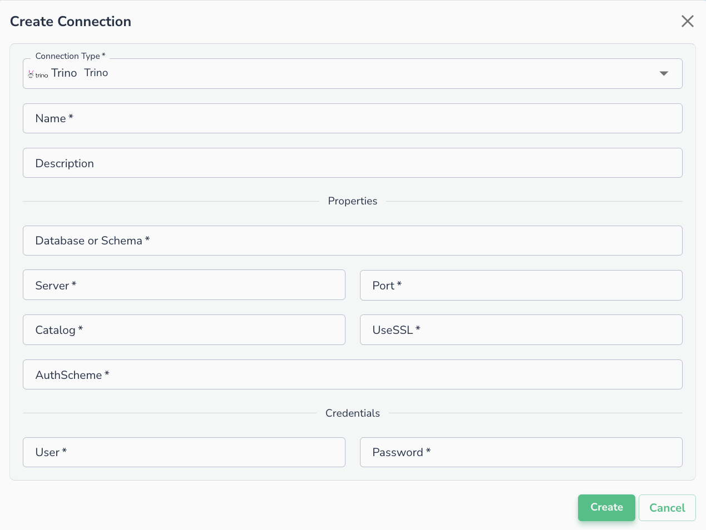
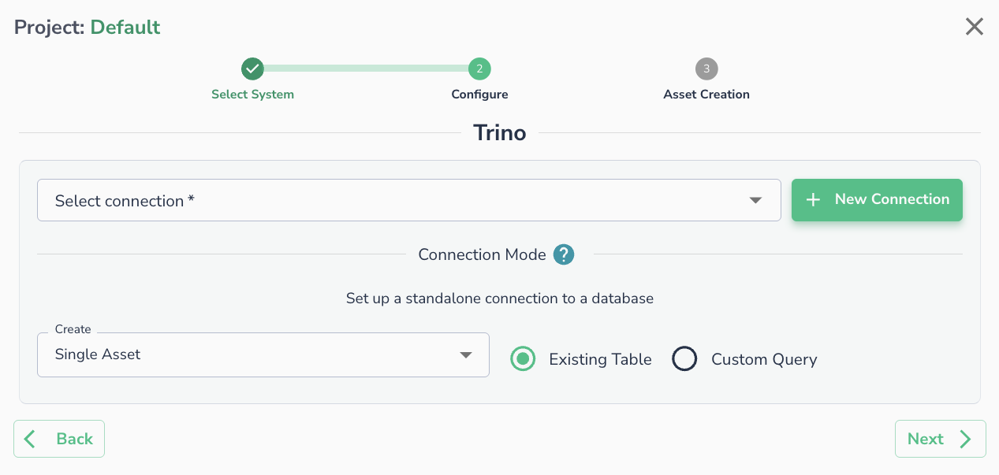

# Trino

## Creating a Connection

To create a connection to Trino server, please enter the required fields in the form below:

* Database
* Server
* Port
* Catalog
* UseSSL (true/false)
* AuthScheme (true/false)
* Authentication: User and password

## Connecting an Asset

Once a connection is defined, you can start using it to create assets. To create assets, you will need to select existing table, or run a custom SQL query.

