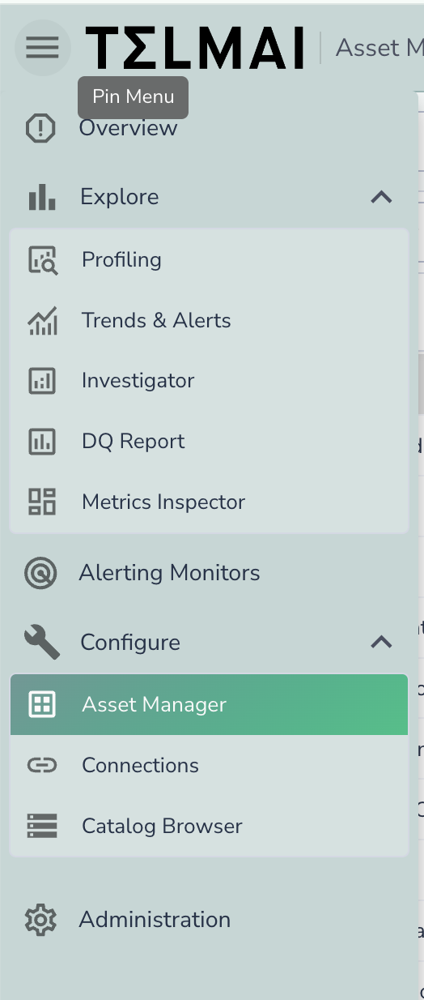
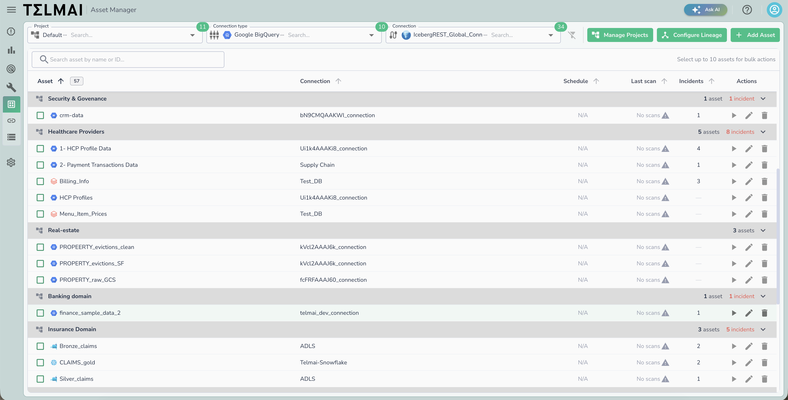
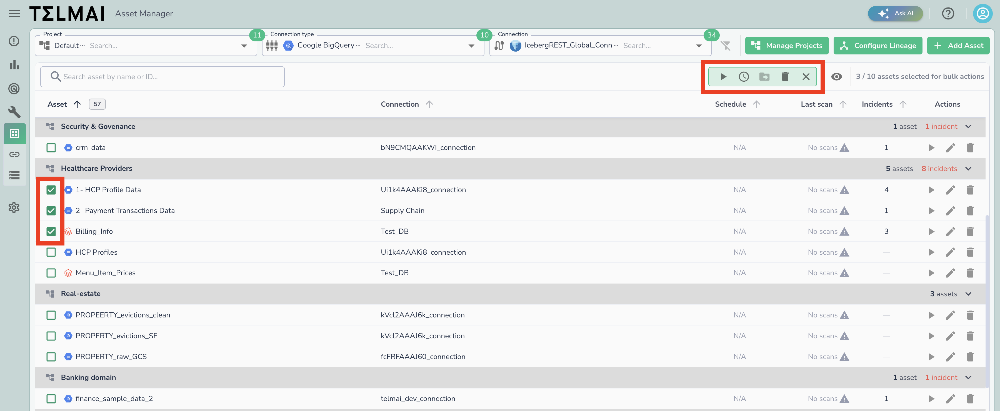
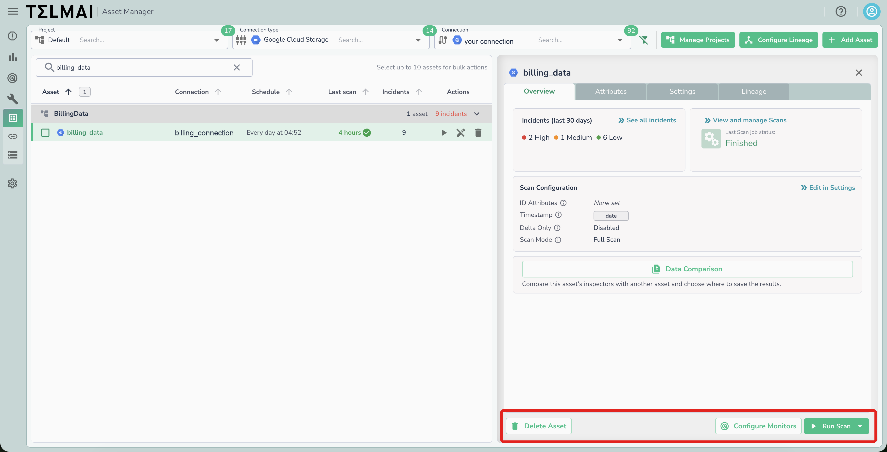

# Managing Assets

The **Asset Manager** is the central place to view, filter, and manage all of your assets. From here you can search for individual assets, run or schedule scans, move assets between projects, configure monitors, and inspect each asset's scan configuration and lineage.

!!! note
    Navigate to the **Asset Manager** page using the left-side menu.

    As of v26.3.2, the Asset Manager is enabled by default and the legacy assets page is disabled.

_Open the Asset Manager from the left-side menu._

## Finding Assets

Use the filters at the top of the page to narrow down the asset list:

* **Project** — filter assets by the project they belong to.
* **Connection type** — filter by connection type (for example, Redshift, Athena, Azure).
* **Connection** — filter by a specific connection.
* **Search** — use the **Search asset by name or ID** box to find a specific asset.

_The Asset Manager page, with assets grouped by project._

Assets are grouped by project, and each project group shows a summary of how many assets and open incidents each asset contains. The asset table includes the following columns:

| Column     | Description                                                                                                                                                                                       |
| ---------- | ------------------------------------------------------------------------------------------------------------------------------------------------------------------------------------------------- |
| Asset      | The asset name and its source type icon.                                                                                                                                                          |
| Connection | The connection the asset belongs to.                                                                                                                                                              |
| Schedule   | The asset's scan schedule, or `N/A` if no schedule is set.                                                                                                                                        |
| Last scan  | When the asset was last scanned. A green check indicates a successful scan; a red indicator marks a failed scan or one with incidents; a warning icon indicates the asset has never been scanned. |
| Incidents  | The number of open incidents for the asset.                                                                                                                                                       |
| Actions    | Per-asset actions: run a scan, edit the asset, or delete it.                                                                                                                                      |

## Adding and Managing Assets

* **Add Asset** — add a new asset to the selected connection.
* **Manage Projects** — create and organize the projects used to group assets.
* **Configure Lineage** — set up lineage relationships between assets.

## Bulk Actions

Select assets using the checkboxes in the asset list to perform actions on multiple assets at once. You can select up to **10 assets** for bulk actions. Once one or more assets are selected, a bulk action toolbar appears above the list with the following options:

* **Start scan** — trigger a scan for all selected assets.
* **Schedule** — set or update a scan schedule for all selected assets.
* **Move project** — move all selected assets to a different project.
* **Delete** — delete all selected assets.

_The bulk action toolbar appears above the list once assets are selected._

## Asset Details

Selecting an asset opens a details panel with the following tabs:

* **Overview** — shows incidents from the last 30 days, the status of the most recent scan job, and the asset's scan configuration (ID Attributes, Timestamp, Delta Only, and Scan Mode). You can also start a **Data Comparison** to compare this asset's inspectors with another asset.
* **Attributes** — view the asset's attributes.
* **Settings** — edit the asset's scan configuration and other settings.
* **Lineage** — view the asset's lineage relationships.

From the bottom of the panel you can **Delete Asset**, **Configure Monitors**, or **Run Scan**.

_The asset details panel, showing the Overview tab._
