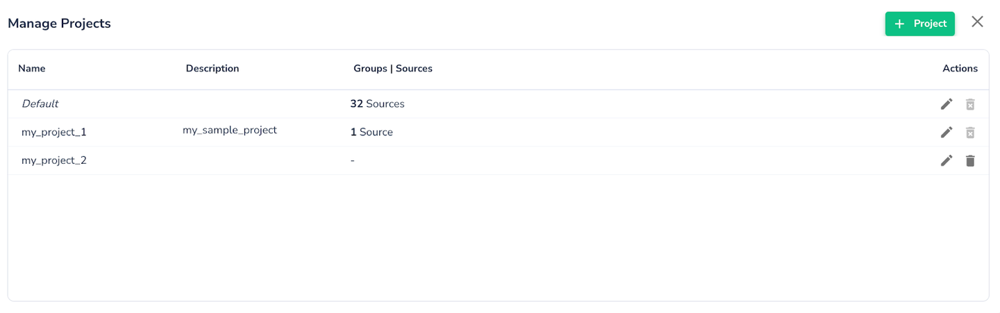
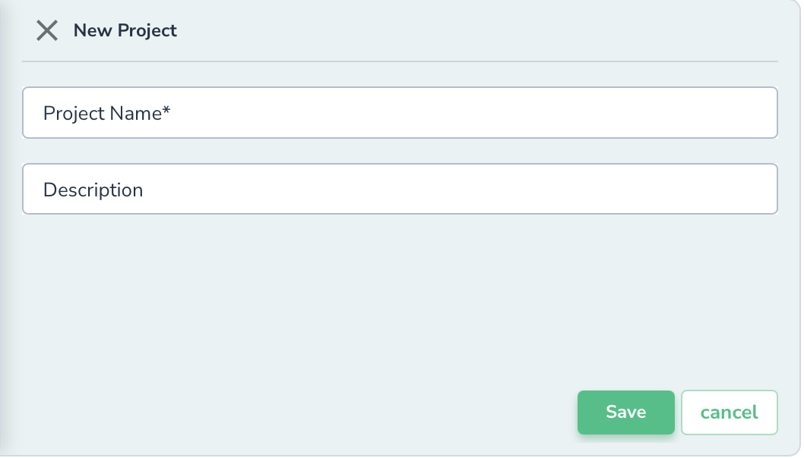
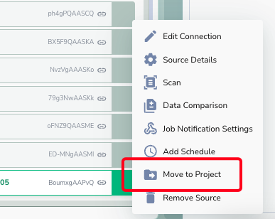

# Projects

A **Project** in Actian Data Observability is a way to organize your data sources or groups of sources, helping you manage your workspace or tenant efficiently.

To create a new project, you need to:

1. Click on the **Manage Projects** button. This will open a menu where you can create, modify, or delete projects, as shown in the image below.
  
1. Click on the **+Project** button.
2. Enter a **Project Name** and an optional **Description** when prompted.
3. Click **Save** to finalize the creation of your project.
  

You can modify the project description anytime by clicking the **Edit** button. Projects can only be deleted if they contain no sources, using the **Delete** button.

Access Permissions can be set at any time for the project. Please refer to the [RBAC support section](https://docs.google.com/document/d/122HgJJN970V83f-i6rNIO0hhw9_obVw3-ZEE4RPo7xQ/edit#heading=h.oh32ign419hp).

### Move Source Across Projects

Once a source is created, it can be moved to a different project with few easy clicks:

1. Select the source you like to move, and click the 3-dot menu
2. Click "Move to Project" option
   * You will see list of projects you have access to
  

1. Select the desired project, and click "Move to Project"

!!! note
    All rules & policies will move with the project except for rules using templates.
