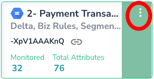
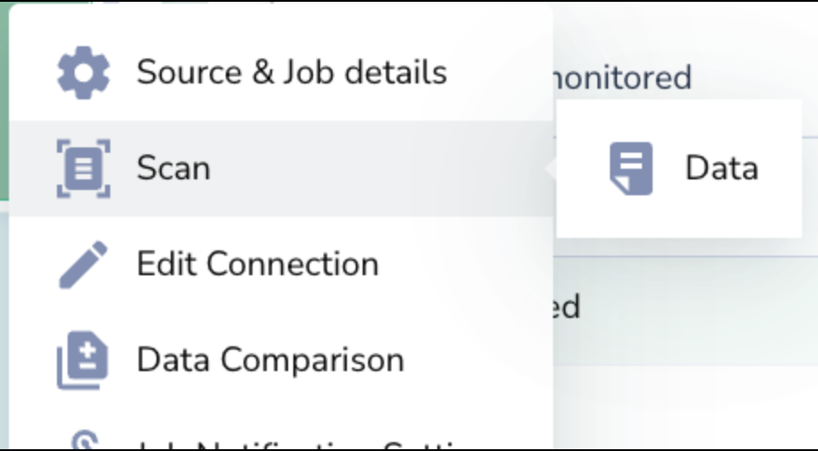
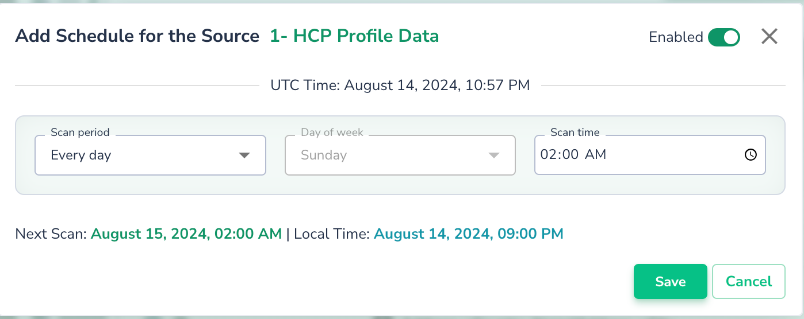
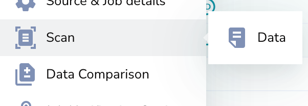

# Triggering Scans

## Trigger job using Actian Data Observability UI

1. Navigate to configuration page
2. Click the 3 dot options tab for the corresponding data source
3. A window will be prompted, navigate to **Scan > Data**

    
    

## Trigger job using Actian Data Observability API

Please refer to the documentation here: [Trigger Data Scan API](../../api-misc/upload-data-api.md)

## Scheduling Scans

To schedule a scan, click on the **“Add Schedule”** option in the context menu and complete the form. Once created, the scan will automatically run at the specified time.

Scans can be scheduled or run on demand. You can trigger a scan at any time using the UI or API.

