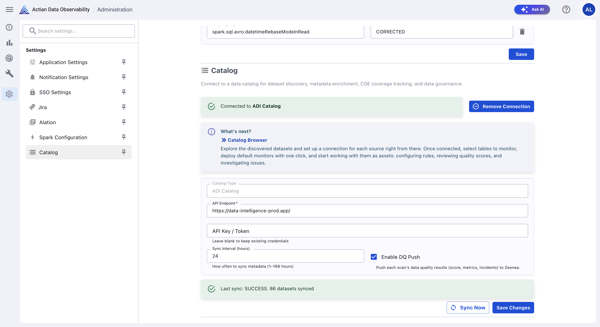
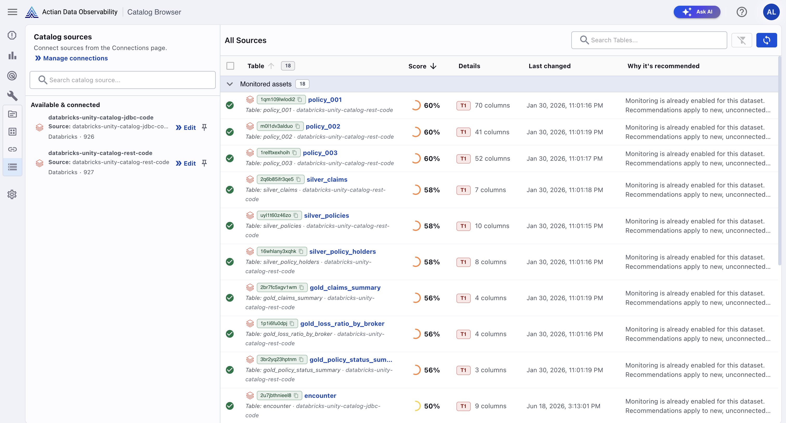
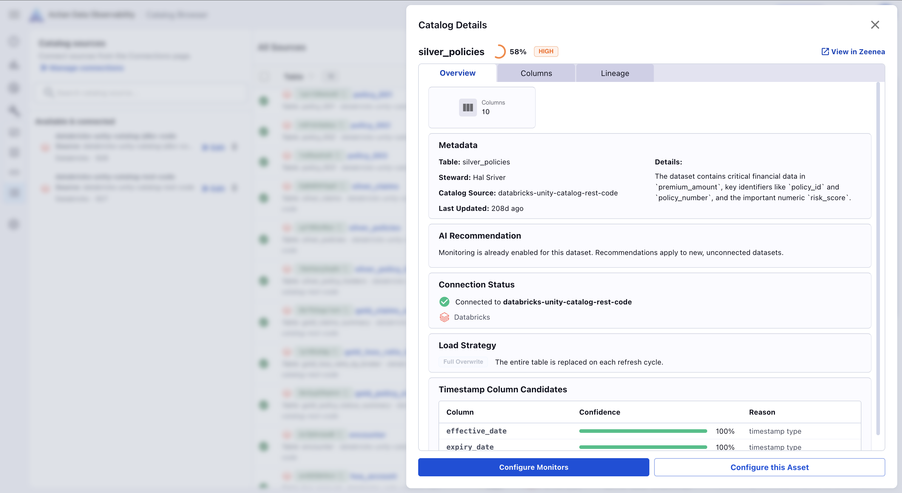
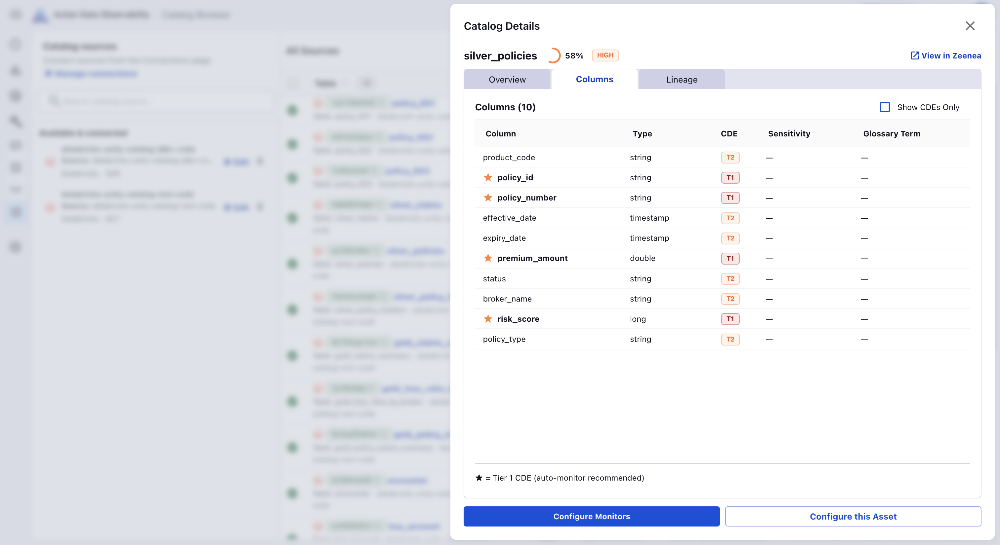
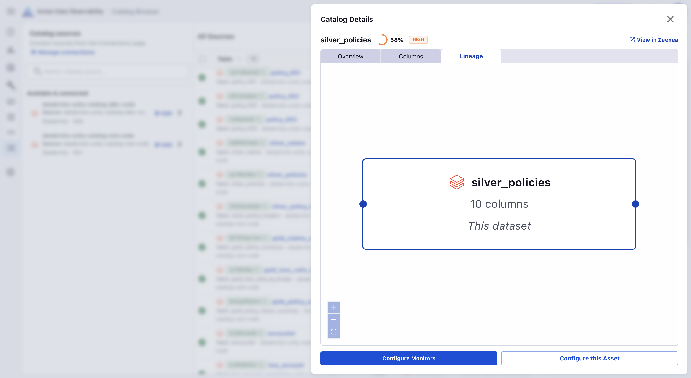

# Actian Data Intelligence Platform Integration

Actian Data Observability integrates with [Actian Data Intelligence Platform](https://zeenea.com/) to connect data quality monitoring with your data catalog. Actian Data Intelligence catalog metadata enriches Actian Data Observability's monitoring configuration and AI-powered recommendations, helping your team discover, prioritize, and monitor critical datasets faster.

## Overview

Data Observability pulls the following metadata from Actian Data Intelligence Platform:

| Metadata type               | How Data Observability uses it                                    |
| --------------------------- | ----------------------------------------------------------------- |
| Business glossary terms     | Informs AI-generated monitoring rules with business definitions   |
| Lineage data                | Powers asset prioritization and lineage visualization             |
| Sensitivity classifications | Surfaces sensitivity context alongside monitors                 |
| Stewardship information     | Identifies the data steward responsible for each asset          |

## Supported Data Sources

Data Observability currently supports datasets from the following data sources:

* BigQuery
* Databricks
* Microsoft Fabric (OneLake)
* Snowflake

## Prerequisites

### Create an API Key

Data Observability authenticates with Actian Data Intelligence Platform by using an API key.

Create an API key with one of the following permissions in Actian Data Intelligence Platform:

* Manage Documentation
* Admin

For instructions, see [Managing API Keys](https://docs.actian.com/data-intelligence-platform/features-applications/administration/zeenea-managing-api-keys.html#create-an-api-key).

### Connect to Actian Data Intelligence Platform

To configure the integration:

1. In Data Observability, go to **Administration > Catalog**.

2. Provide the following information:
   
     * **Catalog Type**: ADI Catalog (preconfigured for Actian Data Intelligence Platform)
     * **API Endpoint**: Enter the URL of your Actian Data Intelligence Platform instance (for example, `https://your-org.zeenea.app/`).
     * **API Key / Token**: Enter the API key created previously. Leave this field blank when updating other settings to keep the existing credentials.
     * **Enable DQ Push**: Select this option to push data quality results from each scan to Actian Data Intelligence Platform. 
     * **Sync Interval (hours)**: Specify how frequently metadata is synchronized between Actian Data Intelligence Platform and Data Observability. Enter a value between 1 and 168 hours.

3. Select **Save changes**. 
   
After the connection is established, Data Observability displays **Connected to ADI Catalog** and the following actions become available:

* **Sync Now**: Triggers an immediate metadata synchronization.
* **Remove Connection**: Disconnects Data Observability from the Actian Data Intelligence Platform.

!!! note
    After connecting, go to Catalog Browser to explore discovered datasets and link them to your Data Observability data connections.

## Catalog Browser

**Catalog Browser** is available in the sidebar under **Configure**. It is the central location for browsing catalog-discovered datasets and managing which tables are connected for monitoring in Data Observability.

### Catalog Sources

The left panel lists your Data Observability data connections and their catalog connection status:

* **Available & Connected**: Lists data sources that are connected to Data Observability and available for monitoring.
* **Discovered from catalog**: Lists data sources that are discovered in the Actian Data Intelligence Platform catalog but are not yet connected to Data Observability. To connect these data sources, select the **Connect** icon.

### All Sources

The right panel lists all tables discovered from the catalog. Tables are grouped into the following sections:

* **Monitored assets**: Tables that have one or more data quality monitors configured in Data Observability.
* **Not monitored assets**: Tables that do not currently have any data quality monitors configured. To create a monitor, select the tables and then select **Create and monitor assets**.

!!! note
    If the table comes from a source source that is not connected to Data Observability, you must connect the source before configuring monitors.

### Monitoring Recommendations

Data Observability uses catalog metadata to determine which tables should be prioritized for monitoring. Each table displays the following information:

* **Catalog Dataset Priority Score**: A recommendation score that helps prioritize datasets for monitoring. It is calculated based on multiple inputs from Data Observability and the Actian Data Intelligence Platform. Scores range from 0 to 100, with higher scores indicating a higher monitoring priority.

     | Score	| Recommendation |
     |---|---|
     | 75-100 | **Critical:** Monitor as soon as possible. |
     | 50-74 | **High:** Prioritize for monitoring. |
     | 25-49 | **Medium:** Monitor as your monitoring coverage expands. |
     | 0-24 | **Low:** Monitoring is a lower priority. |

    !!! note
        The score is a prioritization signal and is not a measure of data quality.

* **Details**: Tier classification and column count.
* **Last changed**: The date and time the table was last updated in the catalog.
* **Why is this recommended?**: An AI-generated explanation of why Data Observability recommends monitoring the table. This column provides the reasoning behind each recommendation, based on factors such as:

     * Tier classification (for example, Tier 1 critical data elements)
     * Presence of sensitive or PII data
     * Financial or business-critical context from the catalog
     * Stewardship completeness

## Catalog Details

For monitored assets, select an asset in the **Catalog Browser** to open its **Catalog Details**.

**Catalog Details** includes the following tabs: 

* **Overview**
* **Columns**
* **Lineage**

You can also select **View in Zeenea** to open the asset directly in Actian Data Intelligence Platform.

### Overview

The **Overview** tab provides general information about the selected dataset, including metadata, AI-generated recommendations with its reasoning and priority, and connection status.

### Columns Tab

The **Columns** tab displays schema information for the selected dataset, including column names, data types, Critical Data Element (CDE) classifications, sensitivity classifications, and associated business glossary terms.

### Lineage Tab

The **Lineage** tab displays upstream and downstream data dependencies retrieved from the Actian Data Intelligence Platform. This information helps you understand how data quality issues can propagate through your data pipelines.

## Business-Aware Rule Generation

When suggesting monitoring rules, Data Observability uses the business definitions from the Actian Data Intelligence Platform glossary in addition to technical column names. This helps produce recommendations that are easier to evaluate and apply.
