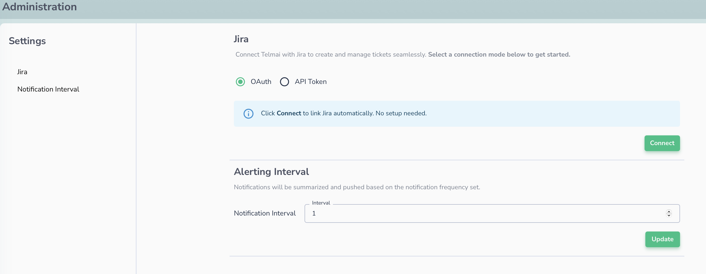

# Jira Integration

You can now integrate your Jira instance with Data Observability to simplify issue creation and tracking. This integration allows you to create and manage Jira tickets directly from generated alerts in Data Observability.

## Connect to Jira

To integrate your Jira instance:

1. Navigate to the "**Administration**" page. (Admin access is required)
2. Choose connection Mode (OAuth or API Token).
3. Click **Connect.** You’ll be redirected to Jira for authentication.
4. You have now connected to your Jira instance.
5. You can also update the Notification Interval. Default value is 1 minute.

## Create Jira Tickets

To create Jira tickets:

1. Navigate to the **Trends & Alerts** page.
2. Choose a scan with alerts.
3. Click the **Create Issue** button. A modal will appear to request additional details. 
4. Specify the **project** and **issue type**. Data Observability will auto-fill the **summary** and **description**, but you can edit them if needed.
5. Click **Create** to generate the Jira ticket.

## View & Manage Created Ticket

After creating Jira tickets, you can view and manage them directly from Data Observability:

1. Go to the **Trends & Alerts** page.
2. Click the **See Issues** button.
3. Data Observability displays a list of open tickets created through the platform.
4. Options:
    * Click the ticket to navigate to your Jira instance
    * Unlink the ticket from Actian Data Observability
    * View ticket status
