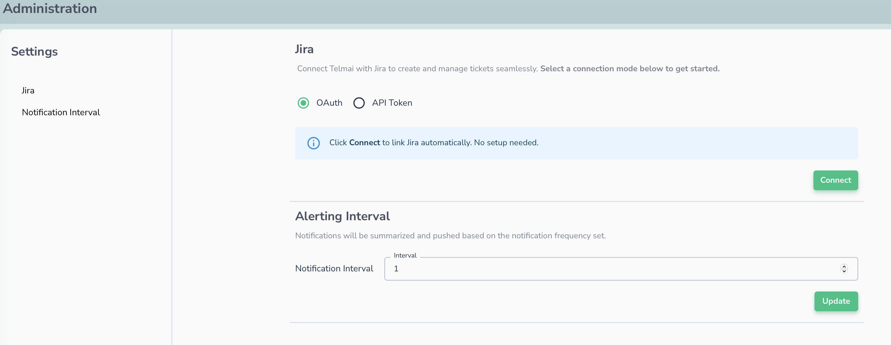
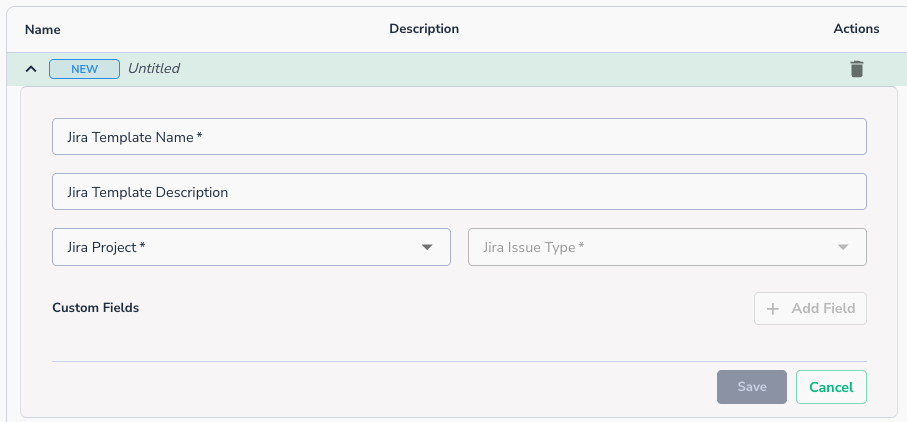
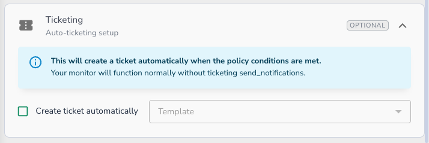
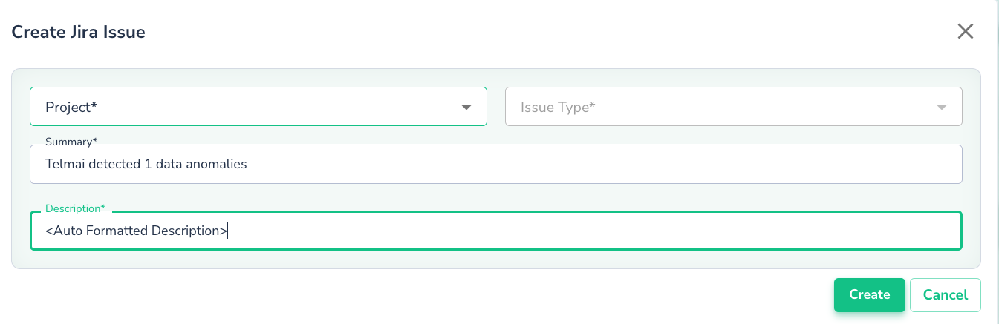

# Jira Integration

You can now integrate your Jira instance with Data Observability to simplify issue creation and tracking. This integration allows you to create and manage Jira tickets directly from generated alerts in Data Observability.

Tickets can be created manually or dynamically with incidents.

## Configuring Jira Integration

Only tenant administrators are able to configure Jira integration.

### Connect to Jira

To integrate your Jira instance:

1. Navigate to the "**Administration**" page.
2. Choose connection Mode (OAuth or API Token).
3. Click **Connect.** You’ll be redirected to Jira for authentication.
4. You have now connected to your Jira instance.

    

### Create Ticket Templates

Templates can be used for defining what fields to be used when creating a new ticket. This can be helpful when your Jira instance requires specific parameters or you want to automate the ticket creation process.

To define the templates:

1. Navigate to the "**Administration**" page.
2. Click "+Add Template" button
3. The below dropdown menu will appear 

    

4. Fill the required details (Template name & Description)
5. Specify the target **Jira Project** and **Issue Type**
6. New fields will show that are required based on the Issue Type requirement
7. You can add more fields using the "**+Add Field**" button
8. Once done, click "**Save**" button, and the new template will show up under list of templates

## Create Jira Tickets

Users have the option of creating tickets dynamically when incidents are opened or manually for existing incidents or alerts.

!!! note
    Data Observability only creates Jira tickets and links them to existing incidents or alerts within the Data Observability application. Data Observability does not automatically resolve the tickets.

### Dynamically Create Tickets

To allow for auto-ticket creation, user needs to specify which [template](jira-integration.md#create-ticket-templates) to be used at a monitor level. This means a Jira ticket will be created once an incident is observed.

To setup dynamic ticket creation:

1. Navigate to "**Alerting Monitors**" page and select target asset
2. Click on the target monitor to see the monitor configuration
3.  Scroll to the bottom of the configuration to see the "**Ticketing**" section like below 

    

4. Select "Create ticket automatically" and choose the desired template
5. Save the new configuration

### Manually Create Tickets

Users can also create tickets manually on existing alerts, or incidents.

#### Incident scoped tickets

To create a ticket associated to a given incident:

1. Navigate to the **“Overview”** page to see the [incidents table](../monitoring-data/incident-portal.md)
2. The Ticket column will have "**Create**" button if the incident is applicable for ticket creation

!!! note
    You can only create a ticket at incident level if no ticket already exists.

    Tickets can only be created for open incidents.

#### Alert scoped tickets

To create a ticket associated to a given alert:

1. Navigate to the **“Trends & Alerts”** page.
2. Choose a scan with alerts.
3. Click the **Create Issue** button.
4.  A modal will appear to request additional details: 

    

5. Specify the **project** and **issue type**.
6. Data Observability will auto-fill the **summary** and **description**, but you can edit them if needed.
7. Click **Create** to generate the Jira ticket.

After creating alert-scoped tickets, you can view and manage them directly by clicking **See Issues** button on the same page. This option will allow you to:

1. Click the ticket to navigate to your Jira instance
2. Unlink the ticket from Data Observability
3. View ticket status

## Related Documentation

* [User-defined Monitors](../monitoring-data/user-defined-monitors/)
* [Monitors Management](../monitoring-data/monitors-management/)
* [Ticket Integration API](../../api-reference/ticket-integration-api.md)
