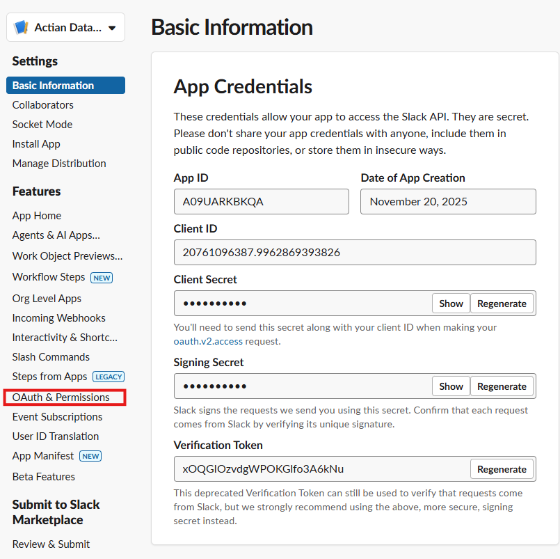
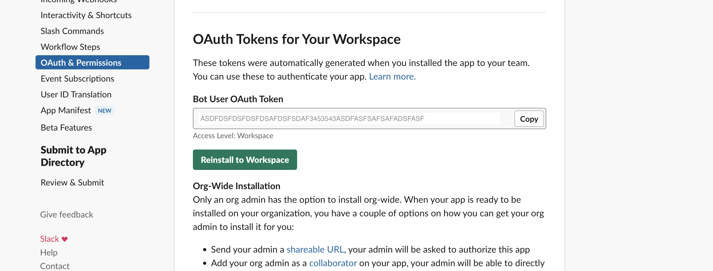
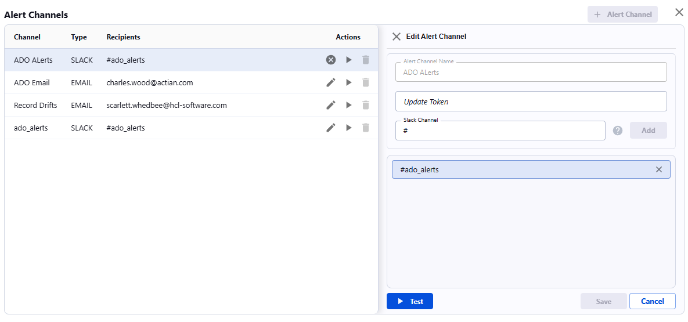

# Slack Integration

You can integrate Slack for receiving alert notifications from the Actian Data Observability Platform.

## Instructions 

To send notifications to a Slack channel:

* Create a new Slack app with sufficient privileges to post messages to a public Slack channel
* Create a new alert channel for slack communications in Data Observability

## Create a new Slack app

1. Navigate to [Slack API apps](https://api.slack.com/apps). The page opens in a new tab
2. Sign in or create an account
3. Select **Create an App**
4. Set **App Name** to "**Actian Data Observability Notifier**”
5. Select the **Development Slack Workspace** where you'd like the Slack Bot to post messages, and then click **Create App**.
6.  In the navigation panel, select **OAuth & Permissions**.
    
7. Navigate to the **Scopes**/**Bot Token Scopes**, click **Add an OAuth Scope** then select **chat:write** and **chat:write.public**.
8. Scroll to the top of the **OAuth & Permissions** page and click **Install App to Workspace**.
9. In the confirmation dialog, click **Allow** (save the **Bot User OAuth Access Token** for use in the Actian Data Observability channel).
    

## Create a Slack alert channel in the Data Observability Platform

1.  Click on **Alerting Policies** in the left hand menu
2.  Click on **Manage Alert Channels**
3.  Click on **+ Alert Channel**
4. Select **Slack** in Alert Channel Type drop down
5. Enter Channel Name
6. Enter token from **Bot User OAuth Access Token**
7.  Enter the slack channel you want to receive alerts. (You can add multiple channels by clicking on **Add**)
       
8. Click on **Test**. The Data Observability Platform will send a test message to the provided channels
9. If everything looks good, click on **Save**

    **Note** Select this channel in alert settings so it can be is used for notifications.
