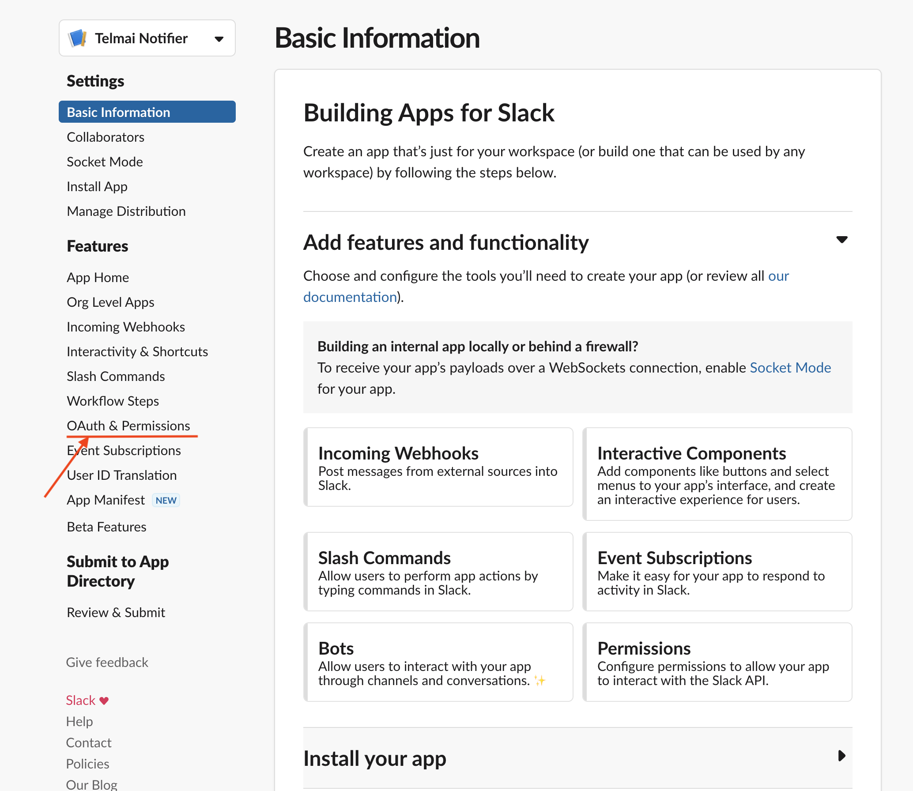
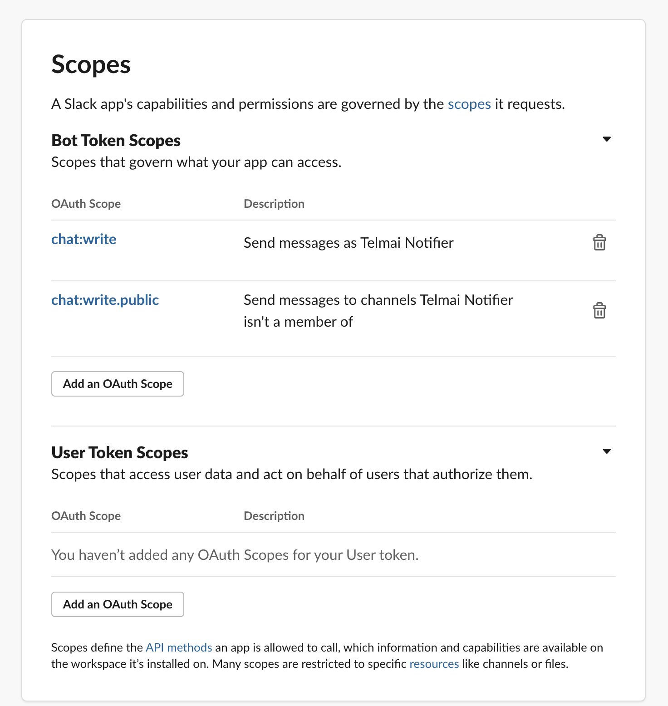
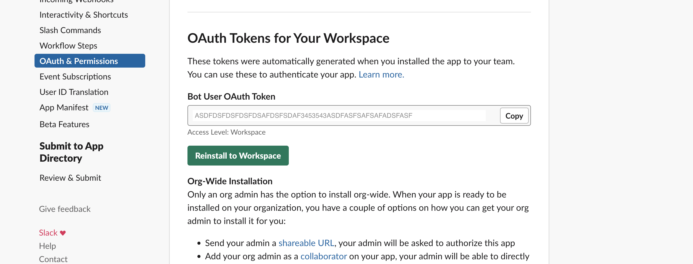

# Slack Integration

This article explains how to integrate Slack for receiving alert notifications from Actian Data Observability.

## Overview

Setting up Slack notifications requires two steps:

1. Create a Slack app and obtain a Bot OAuth token
2. Add a Slack notification channel in Data Observability and assign it to an alert policy

## Step 1: Create a Slack App

1. Navigate to [Slack API apps](https://api.slack.com/apps)
2. Sign in and click **Create an App**
3. Set **App Name** to `Actian Data Observability Notifier`
4. Select the Slack workspace where the bot should post messages, then click **Create App**
5.  In the left navigation, select **OAuth & Permissions**

    
    
6.  Scroll to the **Scopes** section. Under **Bot Token Scopes**, click **Add an OAuth Scope** and add:

    * `chat:write`
    * `chat:write.public`

    
7. Scroll back to the top of the **OAuth & Permissions** page and click **Install App to Workspace**
8. In the confirmation dialog, click **Allow**
9. Navigate to Interactivity & Shortcuts in the left sidebar
10. Toggle Interactivity to On
11. Set a Request URL: `https://data-observability.actian.com/api/backend/slack/interactions` (replace host with proper one in case of private cloud deployment)
12. Copy the **Bot User OAuth Access Token** — you will need it in the next step

    

## Step 2: Add a Slack Notification Channel in Data Observability

Use the token from Step 1 to create a Slack notification channel in Data Observability, then assign it to an alert policy.

See [Configuring Notifications](../monitoring-data/monitors-management/configuring-notifications.md) for the full walkthrough.
