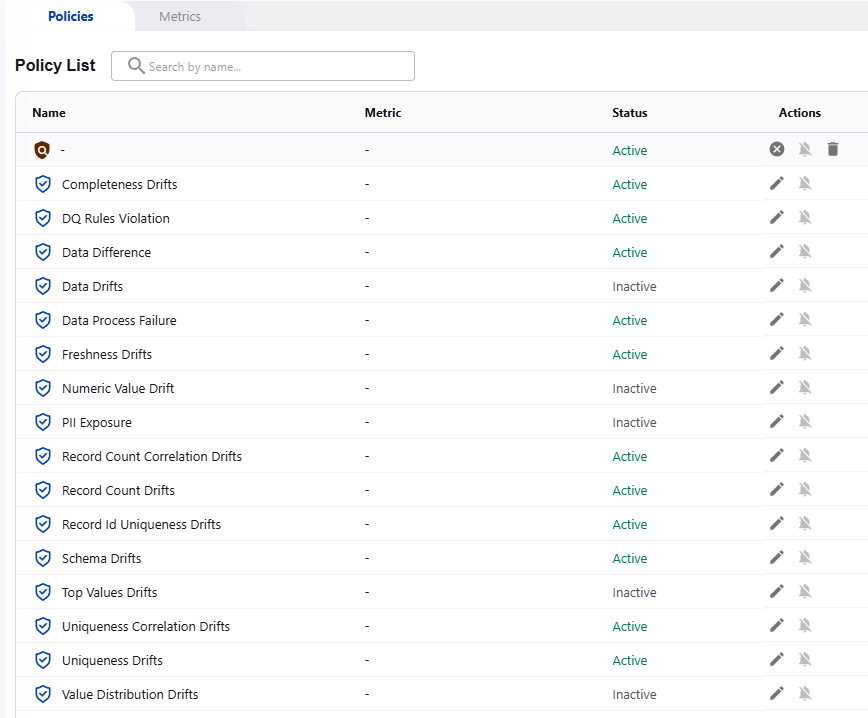
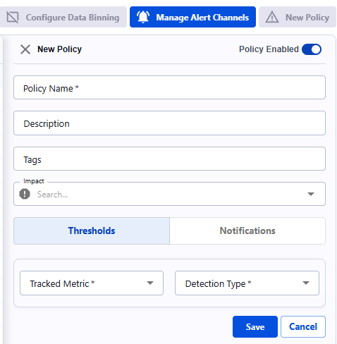

# Alert Policies

Actian Data Observability provides a set of out-of-the-box policies that are automatically created when a new dataset is added. Users also have the flexibility to create their own custom policies

## Out-of-box Policies

Below is the list of pre-defined policies

| **Policy**                        | **What is Monitored?**   |
| --------------------------------- | ------------------------ |
| _Completeness Drifts_             | Changes in percentage of empty records   |
| _DQ Rules Violation_              | Detection for any rule violation  |
| _Data Difference_                 | Addition/Removal of different records across tables.  **Note:** [Data diff](../profiling-data/data-diff.md) must be enabled first |
| _Data Drifts_                     | Changes in various value formats (length, special characters, number of tokens, etc.)  |
| _Data Process Faillures_          | Detection of any scan failure |
| _Freshness Drifts_                | Table and record level freshness drifts **Note:** For this policy to take effect, timestamp attribute must be identified |
| _Numeric Value Drifts_            | Changes in averages of numeric values for an attribute  |
| _PII Exposure_                    | Presence of PII data in your dataset (email, IP, etc). **Note:** This policy is disabled by default   |
| _Record Count Correlation Drifts_ | Changes in data volume across correlated tables with defined lineage. **Note:** For this policy to take effect, you need to define the tables lineage |
| _Record Count Drifts_             | Changes in the number of scanned rows  |
| _Record Id Uniqueness Drifts_     | Changes in data uniqueness of record Id **Note:** For this policy to take effect, you need to enable table Id   |
| _Schema Drifts_                   | Changes in schema; example: column added or removed  |
| Top Values Drifts                 | This feature monitors the changes for the top 10 values. An alert is generated if new values are added or removed  |
| _Uniqueness Correlation Drifts_   | Changes in data uniqueness across tables with defined lineage **Note:** For this policy to take effect, you need to define the tables lineage  |
| Uniqueness Drifts                 | Changes in data uniqueness across attributes  |
| _Value Distribution Drifts_       | Changes in the distribution of the top 20 most frequent categorical values  |
| ~~_Correctness Drifts_~~          | ~~Changes in the percentage of correct records based on defined expectations~~ |

## Modifying/Reviewing Existing Policies

You can view, modify, or disable existing policies anytime by navigating to the **“Alerting Policies”** page and selecting the relevant dataset. The policies are displayed in a table with the following properties:

* **Name**: Policy name (User-defined policies are marked in yellow; Actian Data Observability out-of-the-box policies are marked in green)
* **Metric**: The monitored metric
* **Tags:** A list of text tags. These tags are user defined, and can be used for tracking purposes
* **Impact:** User defined property for impact reporting. Value can be `LOW`, `MED` or `HIGH`
* **Status**: Indicates whether the policy is enabled or disabled
* **Create ticket automatically:** Optional to auto create ticket when incidents are created
  * If checked, user will need to specify a [ticket template](../api-reference/ticket-integration-api.md)
  * Ticketing integration must be setup for this feature to be visible (ex: [Jira](../integrations/jira-integration.md))
* **Actions**:
  * **Edit**: Modify policy properties or scope.
  * **Notifications**: Toggle notifications on or off
  * **Delete**: Remove the policy (Available only for custom policies)

## User Defined Policy

Users can create custom policies to monitor any of the calculated metrics. These metrics are tracked by specifying a threshold that triggers an alert when violated. The supported thresholds include:

### Supported Threshold

* **Actian Data Observability-ML**
  Actian Data Observability’s built-in anomaly detection using machine learning
* **Relative Drift**
  Percentage change in data compared to previous scans or the average of scans
* **Acceptable Range**
  Check if a metric falls within a specified range

### Steps to Create a Custom Policy

1. Navigate to “Alerting Policies” page & chose the “Policies” Tab
2. Click the "New Policy" tab to start defining your policy.
3. A side menu will appear similar to this image
  
4. Select desired “Tracked Metric” from the list of
   * User-defined metrics, or
   * Health metric calculated by Actian Data Observability
5. Based on Metric selection, the user may need to select tracked attributes (ex: correctness, the user will need to specify associated attributes)
6. Select **Detection Type**. In case of Relative and Range detections, the user can specify how to handle the metric when not available (replace by zero or average).]
7. Add [Notification Channels](notification-channels.md) by clicking "Notifications" button
   1. Click +Add Channel
   2. Select a value from the list of defined channels.
   3. Repeat above for all desired channels
8. Click Save.

