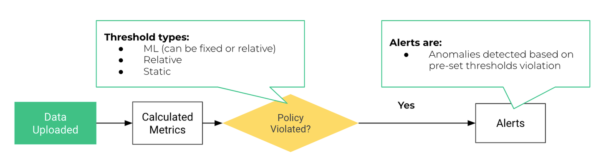
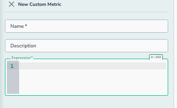

# Data Quality Metrics


Actian Data Observability enables users to monitor a wide range of data quality metrics and receive alerts when anomalies or issues are detected. Alerts serve as warnings that something may not be as expected. Some alerts can be configured to trigger notifications, while others are displayed in the Actian Data Observability UI for informational purposes. Additionally, some alerts may initiate remediation actions, such as segregating good data from bad, triggering a circuit breaker for the pipeline, and more.

_**What is monitored?**_

1. **Out-of-the-Box Metrics**: Actian Data Observability automatically monitors a variety of pre-defined metrics related to table metadata and Health KPIs(mentioned in [Data Health KPIs](https://docs.google.com/document/d/122HgJJN970V83f-i6rNIO0hhw9_obVw3-ZEE4RPo7xQ/edit#heading=h.6hl1iwf25toq))
2. **Custom Metrics**: Users can define their own metrics to monitor specific data quality concerns.

Each monitored metric is validated against a set of policies, which define thresholds, scope, notification settings, and more. If a metric violates a policy, an alert is generated. The flow diagram below illustrates how alerts are created.


## Out-of-The-Box Metrics

* **Record Level Freshness**: Percentage of outdated records in the scan, based on defined freshness criteria
* **Table Level Freshness**: Time elapsed since the last change in the monitored table at the time of the scan
* **Record Count**: Number of records being scanned
* **Total Table Records Count**: Total number of records in the monitored table. This may be larger than the record count if the scan involves only a subset of data, such as when delta detection is configured
* **Correctness**: Percentage of records that meet defined data quality rules
* **Completeness**: Percentage of records with non-null/non-empty values
* **Record ID Uniqueness**: Percentage of unique records based on the configured ID attribute.
* **Uniqueness**: Percentage of unique values within an attribute

## User Defined Metrics

Users can create custom metrics to track specific anomalies. To add a new custom metric:

1. **Select the Dataset**: Choose the dataset you want to monitor
2. **Navigate to “Alerting Policies”**: Go to the “Metrics” tab
3.  **Add a Custom Metric**:
    * Click the **“+ Custom Metric”** button
    * A new window will open, allowing you to define the metric
      

4. **Define the Metric**:
   * **Name**: Enter a name for the metric
   * **Description**: Provide a brief explanation of the metric
   * **Expression:** SQL syntax for aggregation:
     * Attribute names must be wrapped in backticks `` ` ``
     * Maximum number of group by dimension is 4
     * Example: `` SUM(`sales`) group by `region`, `country` ``
     * See more examples
   * Click **Validate and Save** to save the metric

Actian Data Observability will start monitoring this metric in future scans

!!! important
    Defining a metric here makes it available for tracking and alerting. However, no alerts will be generated until a policy is created using this metric.

### Supported aggregations

Below is the list of supported functions

```
min
max
count
avg
sum
distinct
variance
median
stddev
```

### Aggregation Examples

```
// Count distinct age for different cities
count(distinct(`Age`)) group by `City`

// Sum of salaries over total count
sum(`salaries`)/count(*)

// Average age for each school and district
avg(`age`) group by `school`, `district`
```
