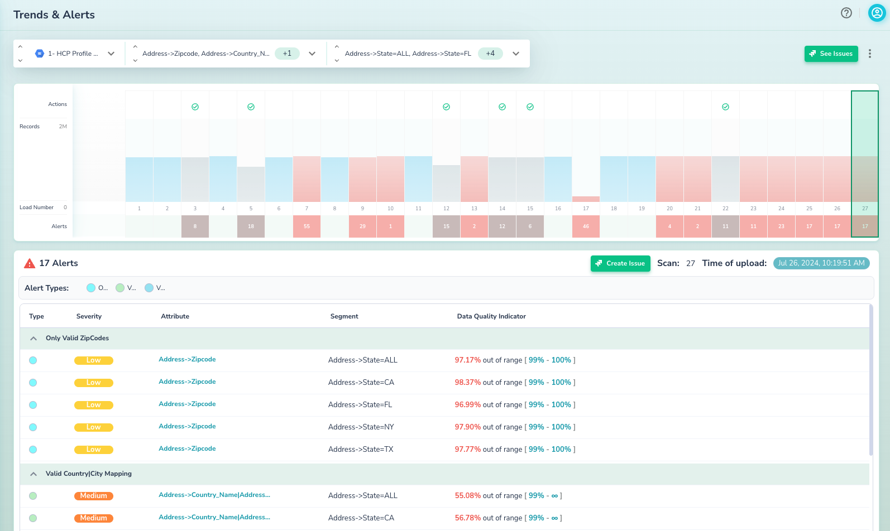
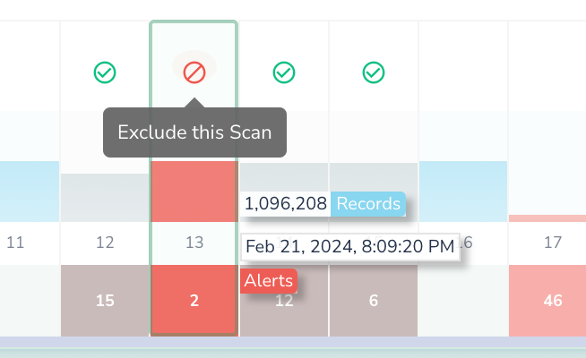

# Data Trends and Alerts

This page allows you to explore detections (alerts) within a given dataset:

This page has the following sections:

* **Data Scan & Alert Type Selector**
  * This selector allows you to pick
    * Dataset to be checked
    * Filter on alert types (if exists)
    * Filter on segments (if exists)
* **Data Scans Stats Graph**
  * This graph allows you to:
    * See record count per scan
    * Number of alerts per scan
    * Exclude scan from analysis to not be used in Actian Data Observability’s learning about your dataset
  * Each bar is clickable to look at graphs within the corresponding scan
* **Alerts**
  * List of alerts within the corresponding scan
  * If applicable, each alert will have a clickable component that visualizes the detection

## Feedback Loop

Actian Data Observability offers both ways of managing thresholds for alerts: automatic, using ML, or manual. 
In the case of automatic thresholds, it’s crucial to provide the system feedback when anomalous data was scanned and when it should not be used for model fine-tuning for future detections. This can be done by hovering over a particular scan and marking it to be ignored:
