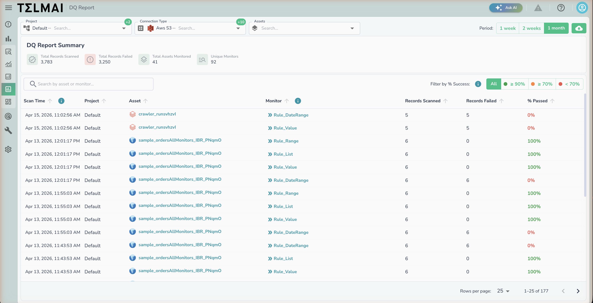

# DQ Report Summary

_DQ Report Summary — cross-asset view of monitor scan results with pass rate indicators._

The DQ Report Summary page provides a cross-asset view of monitor scan results over a selected time period. It is accessible from the **Explore** section of the Data Observability navigation.

Use this page to quickly identify which assets and monitors are producing failures, track overall data quality health, and drill into specific scan runs.

!!! note
    DQ Report Summary only shows results from [Record Validation Rules](./user-defined-monitors/record-validation-rules.md) and [SQL-based Rules](./user-defined-monitors/sql-based-rules.md)

!!! note
    This report can be published to external storage using the [DQ Reporting APIs](../../api-reference/dq-reporting-apis.md)

!!! warning
    If asset has metadata scans enabled & SQL-based rules, results will not show in DQ report — Future versions of Data Observability will show results

### Filters

The following filters appear at the top of the page and apply to all summary statistics and table rows simultaneously.

| Filter              | Description                                                                    |
| ------------------- | ------------------------------------------------------------------------------ |
| **Project**         | Filter results to one or more projects. Defaults to all projects.              |
| **Connection Type** | Filter by the data source connection type (e.g., AWS S3, Snowflake, BigQuery). |
| **Assets**          | Filter to specific assets within the selected project and connection.          |
| **Period**          | Time window for scan results. Options: **1 week**, **2 weeks**, **1 month**.   |

### Summary Statistics

Four aggregate metrics are displayed at the top of the results view, reflecting all records matching the active filters.

| Metric                     | Description                                                                       |
| -------------------------- | --------------------------------------------------------------------------------- |
| **Total Records Scanned**  | Total number of records evaluated across all monitor scans in the period.         |
| **Total Records Failed**   | Total number of records that failed validation (`is_valid = 0`) across all scans. |
| **Total Assets Monitored** | Count of distinct assets with at least one scan result in the period.             |
| **Unique Monitors**        | Count of distinct monitors that produced scan results in the period.              |

### Results Table

Each row represents a single monitor scan run against an asset. Rows are sorted by **Scan Time** descending by default.

| Column              | Description                                                              |
| ------------------- | ------------------------------------------------------------------------ |
| **Scan Time**       | Timestamp of when the monitor scan completed.                            |
| **Project**         | The project the scanned asset belongs to.                                |
| **Asset**           | The name of the scanned asset.                                           |
| **Monitor**         | The name of the monitor that ran.                                        |
| **Records Scanned** | Number of records evaluated in that scan run.                            |
| **Records Failed**  | Number of records that did not pass validation.                          |
| **% Passed**        | Percentage of records that passed. Color-coded by threshold (see below). |

#### % Passed Color Coding

Pass rate is color-coded with fixed thresholds to give an at-a-glance health signal:

| Color     | Threshold       | Meaning         |
| --------- | --------------- | --------------- |
| 🟢 Green  | ≥ 90%           | Healthy         |
| 🟠 Orange | ≥ 70% and < 90% | Needs attention |
| 🔴 Red    | < 70%           | Critical        |

You can filter the table to a specific health band using the **Filter by % Success** toggle in the top-right of the results section (**All** / **≥ 90%** / **≥ 70%** / **< 70%**).

### Prerequisites

This page requires [Record Validation Rules ](./user-defined-monitors/record-validation-rules)or [SQL Based Rules](./user-defined-monitors/sql-based-rules.md) to be setup, and scans to run for results to show on this page.
