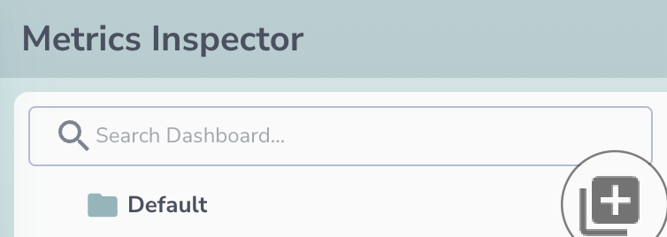
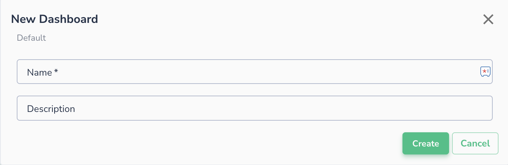
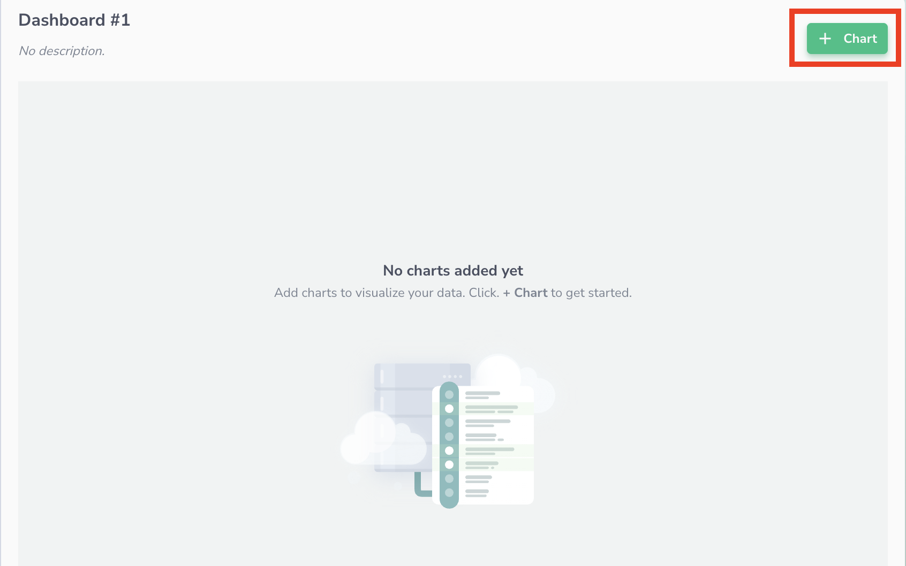
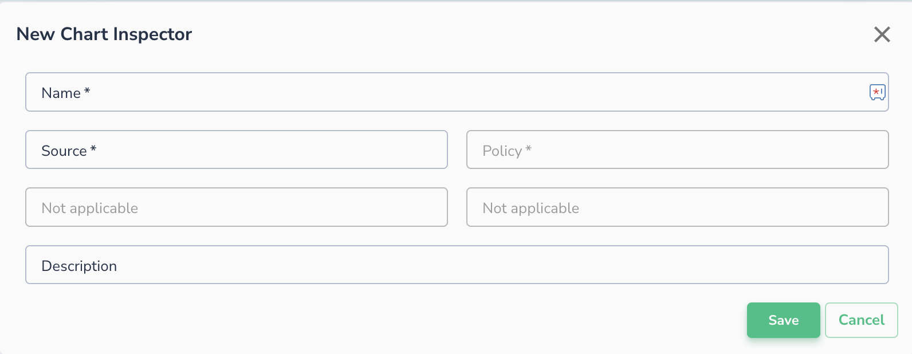
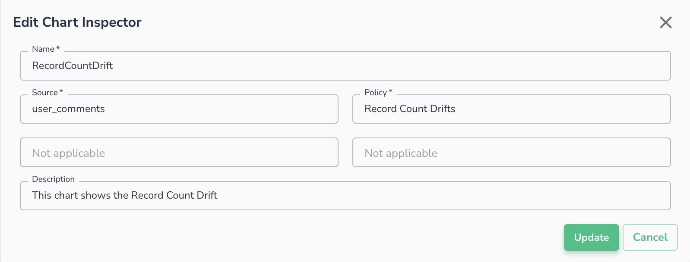
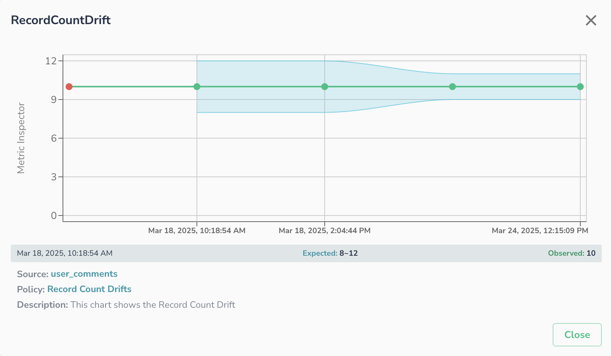
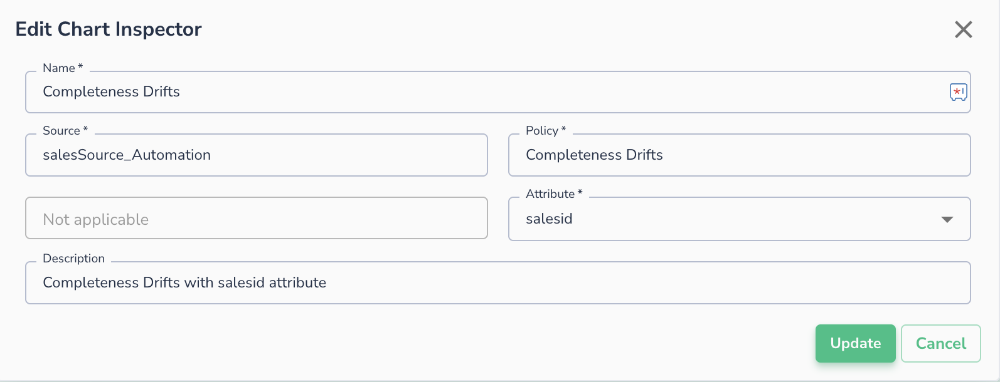
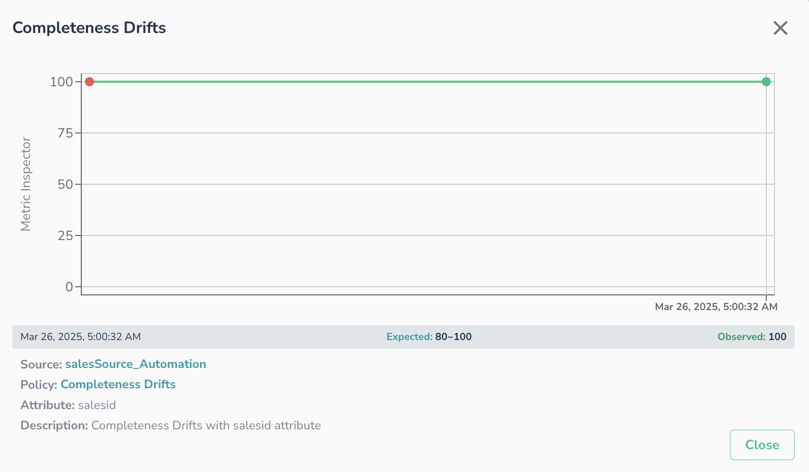
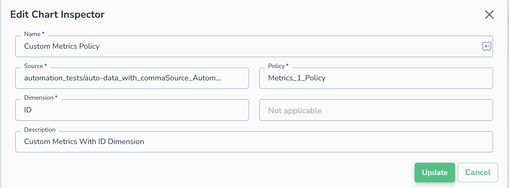
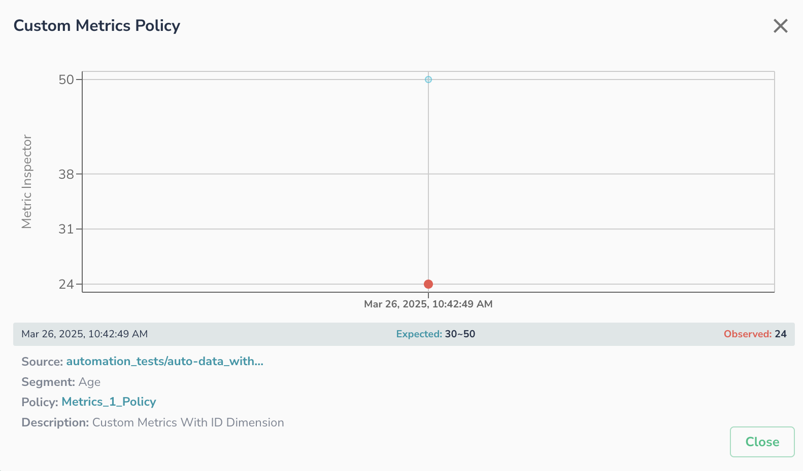

# Metrics Inspector

This Document provides guidance on how to create and manage dashboards with multiple charts in Metrics Inspector, ensuring better data visualization and analysis.

!!! note
    Feature is only available in SaaS environment.

## 1. Creating a Dashboard

### Steps:

1. Navigate to the **Metrics Inspector** page.
2. Click on the **+ (Add Dashboard)** button.
   
3. Enter a name for the new dashboard.
4. Optionally, add a description.
5. Click **Create** to create the dashboard.
   

!!! note
    You can create multiple dashboards within a project, allowing you to organize data efficiently.

## 2. Adding Charts to a Dashboard

### Steps:

1. Select the dashboard where you want to add charts.
2. Click on the **+ Chart** button.
   
3. The "New Chart Inspector" form will appear.
   
4. Configure the data source and parameters:
    * **Name**: Provide a unique name for the chart.
    * **Source**: Select the data source for the chart.
    * **Policy**: Select policy for the chart. Based on the policy choose Dimensions/Segment/Group-By and attributes as needed.
        * Dimensions - Represent the value of \<Group-By> column name, while creating business metrics
    * **Description** (optional): Add a brief description of the chart.
    * Click **Save** to add the chart to the dashboard.

### Example 1:

### Example 2:

### Example 3:

!!! note
    You can add multiple charts within a single dashboard to provide a comprehensive view of your data.

## 3. Managing Dashboards and Charts

### Editing  or Deleting a Dashboard

1. Select the dashboard from the list.
2. Click the **Edit (Pencil Icon)** button.
    1. Modify the name or description, and Save.
3. To delete a dashboard, Click the **Delete (Trash Icon)** button, and confirm the deletion.

### Editing or Deleting Charts

1. Select the dashboard containing the chart.
2. Locate the chart and click on the **Edit (Pencil Icon)** button to modify.
3. To delete a chart, click the **Delete (Trash Icon)** button next to it.

