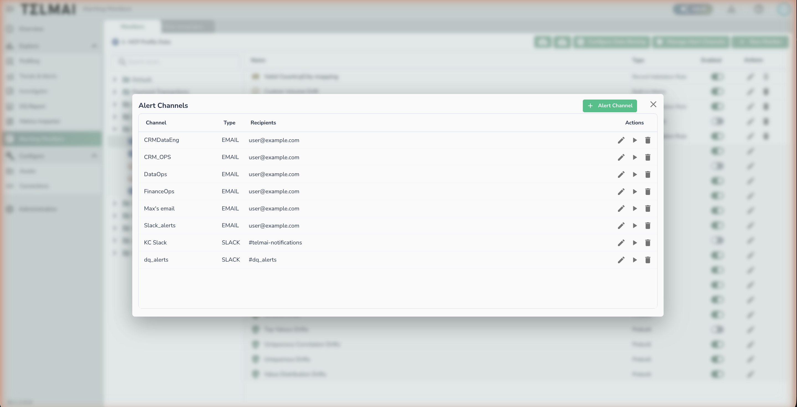

# Configuring Notifications

Data Observability notifications are used to notify users about new or ongoing alerts. Data Observability supports different notification channel types.

## Supported Notification Types

* Microsoft Teams
* Slack
* Webhooks
* Emails

## Notification Modes

Notifications can be set at tenant level based on 3 modes:

* **Priority summary:** In this setting, detections are summarized by count and priority before being sent to the specified channel(s). The notification interval acts as a grace period, during which all alerts are grouped into a single notification.
* **Monitors overview:** In this setting, detections from configured monitors are consolidated into one notification. Only the most significant detections are included.
* **Monitors insights**: In this setting, each detection triggers an individual notification. If applicable, historical charts are included in the notification.

To select the notification mode, tenant admins can select it from the "Administration" page

## Add or Modify Notification Channels

_Alert Channels — manage email and Slack notification destinations._

Notification channels are the destinations that can be used for alerting. To create a notification channel, navigate to the **Alerting Monitors** page and follow these steps:

1. Click **Manage Alert Channels**
2. Click **+ Alert Channel**
3. Select the channel type and enter a channel name
4. Fill in the required details for the selected type (see below)
5. Click **Validate** — Data Observability will send a test message to confirm the connection
6. Click **Save**

### Slack Channel Setup

When adding a Slack channel, you will need:

- **Channel Name** — a label used to identify this channel within Data Observability
- **Bot User OAuth Access Token** — the token generated from your Slack app (see [Slack Integration](../../integrations/slack.md))
- **Slack Channel(s)** — the Slack channel(s) where alerts will be posted (e.g. `#data-alerts`). Click **Add** to include multiple channels.

## Related Documentation

* [Creating a Monitor](creating-a-monitor.md)
* [Managing Existing Monitors](managing-existing-monitors.md)
