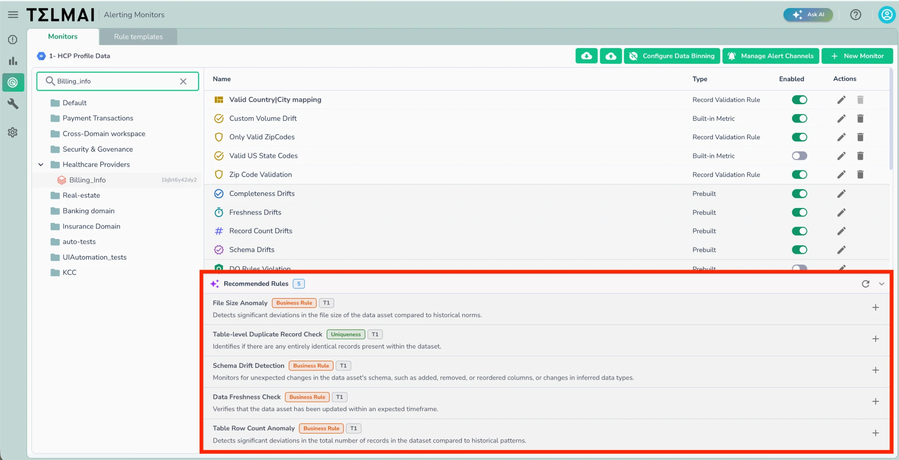

# Monitor Recommendations

!!! note
    Monitor Recommendations requires the Data Observability AI Agent to be installed and enabled for your tenant. If the AI Agent is not installed, the **Recommended Rules** panel will not appear on the asset's monitor list.

Monitor Recommendations uses the Data Observability AI Agent to automatically suggest monitors for a connected asset, removing the need to manually decide which rules and metrics to configure. After the AI Agent profiles an asset's initial scan and learning cycle, it analyzes the data's structure, content, and patterns to propose relevant rules and built-in metrics tailored to that asset.

_The **Recommended Rules** panel appears below the asset's monitor list, showing AI Agent–suggested rules with type tags and a **+** button to add each one._

## How It Works

1. **Automatic Generation**: Once an asset completes its initial scan and the AI Agent finishes learning its data patterns, recommendations are generated automatically and appear in the **Recommended Rules** panel below the asset's monitor list.
2. **Refresh Recommendations**: Click the refresh icon in the panel header to re-run the AI Agent's analysis and regenerate suggestions, for example after the data or schema has changed.
3. **Review Suggestions**: Each recommended rule displays a name, a short description of what it detects, and a type tag (such as **Business Rule**, **Range**, or **Uniqueness**) indicating what kind of monitor is being proposed.
4. **Add a Recommendation**: Click the **+** button next to a recommended rule to open the monitor configuration dialog, pre-filled with the AI Agent's suggested settings. Review and adjust the configuration as needed, then save to create the monitor.

## What Can Be Recommended

The AI Agent can recommend both:

* **Record validation rules** — business rules that check individual records against expected patterns, ranges, or uniqueness constraints
* **Built-in metrics and monitors** — out-of-the-box monitor types relevant to the asset's data characteristics

## Related Documentation

* [Monitors Management](README.md)
* [Creating a Monitor](creating-a-monitor.md)
* [Out-of-box Monitors](../out-of-box-monitors.md)
* [User-defined Monitors](../user-defined-monitors/)
