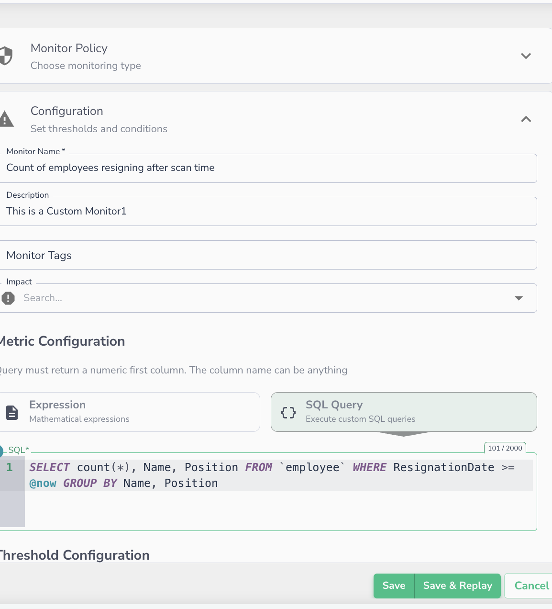

# Replay Scan

_The monitor editor — use **Save & Replay** to retroactively run the monitor against historical scans._

The **Replay** feature allows you to retroactively run SQL-based monitors against historical data scans. This enables you to validate new monitor logic against past data and backfill results to identify historical anomalies without waiting for new data to arrive.

!!! note
    **Why use Replay?** If you create a new Data Quality rule today, Replay lets you see how that rule would have performed over previous scans, providing immediate historical context.

## Prerequisites & Availability

To ensure data consistency during historical runs, the Replay feature has specific requirements:

* **Scope:** Available for **SQL-based monitors** only.
* **Required Parameter:** The monitor's SQL query **must** contain the `@now` parameter. This ensures the logic anchors correctly to the specific timestamp of the historical scan.

## Triggering a Replay

The Replay flow is initiated exclusively from the **Monitor Editor** page.

1. **Save & Replay:** When saving changes to a monitor, you are presented with two options:
   * **Save:** Saves the monitor configuration without a backfill.
   * **Save & Replay:** Saves the configuration and opens the replay range selection.
2. **Configuration:** Select the historical depth.
   * **Maximum Depth:** Up to **20** previous scans.
   * **Actual Limit:** Calculated as `min(available_scans, 20)`.

## Validation & Error States

| Condition               | UI Behavior                                                     |
| ----------------------- | --------------------------------------------------------------- |
| **@now not in query**   | Replay disabled; tooltip shows "Replay requires @now parameter" |
| **No historical scans** | Replay disabled; indicator shows "No data to replay"            |
| **Replay in progress**  | Progress indicator shown; re-triggering is disabled             |

### API Reference

Please refer to [Replay Monitor Scan ](../../../api-reference/trigger-scan/replay-monitor-scan.md) page for API references.
