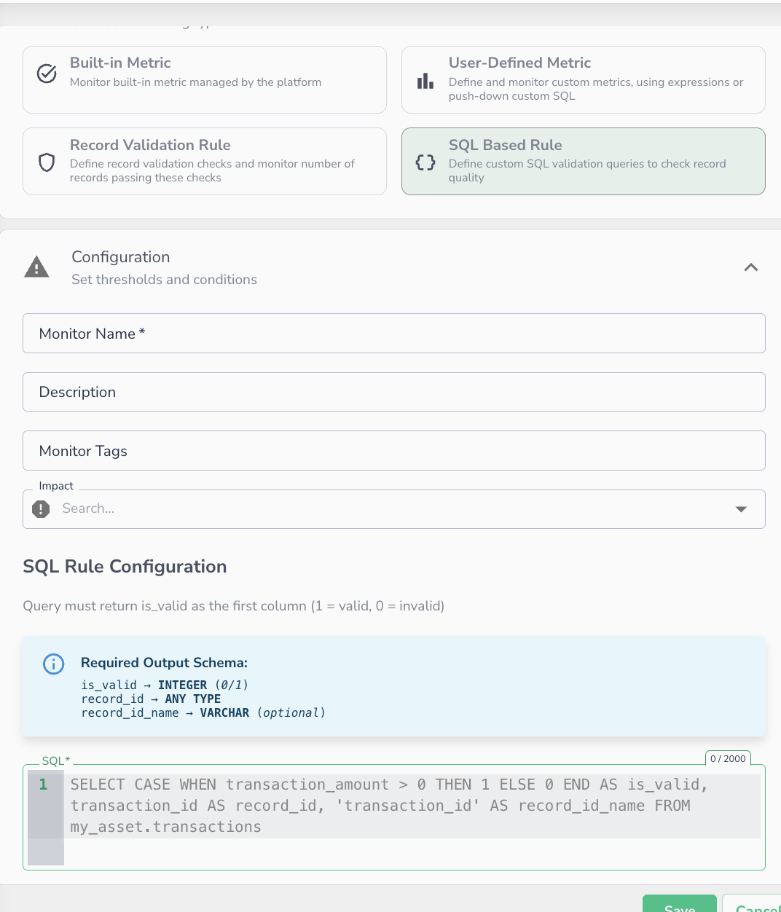

# SQL Based Rules


_Creating an SQL-based rule monitor — write a pushdown SQL query to define record-level validation logic._

SQL-Based Validation Rules give you full SQL pushdown for record-level data quality checks. Instead of [Data Observability's rule expression builder,](record-validation-rules.md) you write a standard SQL query directly against your data source. Data Observability executes it natively on the compute engine (Snowflake, BigQuery, Databricks, etc.) and ingests the results.

This is ideal when:

* Your validation logic is complex and already expressed in SQL
* You need to join across multiple tables or use warehouse-specific functions
* You want to reuse existing SQL-based data quality checks without rewriting them in DSL

!!! note
    SQL-Based Validation Rules follow the same **Correctness** metric model as [Record Validation Rules](record-validation-rules.md). The key difference is execution: Expression rules run inside Data Observability's Spark engine, while SQL-Based rules are pushed down and executed natively on your connected data source


### How It Works

You provide a SQL query (`Q`) that Data Observability executes against your data source. The query must return a specific output schema. Data Observability reads the results and computes the **Correctness** metric as the percentage of records where `is_valid = 1`.

For example, for a table with 1M rows: if 50,000 records return `is_valid = 0`, the Correctness score is **95%**.


### Query Structure

Your SQL query must return columns in the following exact order:

| Column           | Type              | Required | Description                                                                        |
| ---------------- | ----------------- | -------- | ---------------------------------------------------------------------------------- |
| `is_valid`       | Integer           | Yes      | Validation result. `1` = valid, `0` = invalid.                                     |
| `record_id`      | String or Integer | No       | The unique identifier for the record. Used to surface failing records in the UI.   |
| `record_id_name` | String            | No       | A static label for the identifier field. Used as metadata in incident drill-downs. |

!!! warning
    **Column order matters.** Data Observability reads output positionally. `is_valid` must always be the first column, followed by `record_id`, then `record_id_name`.


### Example Queries

#### Minimal — validation result only

```sql
SELECT
    CASE WHEN transaction_amount > 0 THEN 1 ELSE 0 END AS is_valid
FROM my_asset.transactions
```

#### With record identifier

```sql
SELECT
    CASE WHEN transaction_amount > 0 THEN 1 ELSE 0 END AS is_valid,
    transaction_id AS record_id
FROM my_asset.transactions
```

#### Full output — with metadata label

```sql
SELECT
    CASE WHEN transaction_amount > 0 THEN 1 ELSE 0 END AS is_valid,
    transaction_id AS record_id,
    'transaction_id' AS record_id_name
FROM my_asset.transactions
```

#### Cross-table join validation

```sql
SELECT
    CASE WHEN o.status = 'CLOSED' AND p.paid_at IS NOT NULL THEN 1 ELSE 0 END AS is_valid,
    o.order_id AS record_id,
    'order_id' AS record_id_name
FROM orders o
LEFT JOIN payments p ON o.order_id = p.order_id
```

#### Conditional logic with warehouse functions

```sql
SELECT
    CASE
        WHEN region = 'US' AND TRY_CAST(zip_code AS INT) IS NULL THEN 0
        WHEN region != 'US' AND zip_code IS NULL THEN 0
        ELSE 1
    END AS is_valid,
    customer_id AS record_id,
    'customer_id' AS record_id_name
FROM customers
```

### Creating a SQL-Based Rule

1. Navigate to **Alerting Monitors** and click **New Monitor**
2. Choose **SQL-Based Rule** as the monitor type
3. Enter a monitor name and optional description
4. Write your SQL query following the [required output schema](sql-based-rules.md#query-structure) above
5. Validate and save the rule


