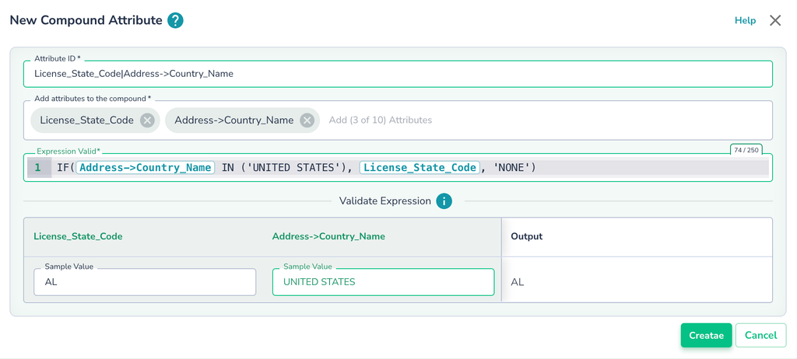

# Compound Attributes


Actian Data Observability offers a **Compound Attributes** feature, which allows you to define an SQL-like expression, validate it in real-time, and inspect outputs similar to single-attribute rules.

## Adding a Compound Attribute

1. Navigate to the **Configuration** page and select the corresponding dataset.
2. Click the "**Add Compound Attribute"** button
  
3. **Define the Attribute**:
   * **Attribute ID**: Name the compound attribute.
   * **Attributes to Compound**: List the attributes to be used.
   * **Expression**: Enter an SQL-like expression that defines the transformation.
4. Enter an expression. Please see below for additional information on supported functions and examples of expressions
  

You can validate the expression output by entering values for each corresponding attribute. When clicking on the edit field, Actian Data Observability will offer a few samples taken from the actual data to help

Once the attribute is created, you can add an expectation, as shown in the section above for the single attribute.

## Important Usage Notes

* As the user inputs an expression, an evaluation is done to ensure a valid SQL expression
* There are some cases where the validation will pass but will fail during executions due to casting-related errors. The values should be cast appropriately to the expected type to mitigate this. The expression output must always be a string type. In case it is not, users need to cast to a string explicitly. Example:
  *   If the expression has contains function; the output is boolean `contains( last_name , 'Smith')`

      The user needs to cast the value string `cast ( contains( last_name , 'Smith') as string)`
* All parameters are treated as strings. The user needs to cast the parameters to the corresponding function param type. Example:
  * If the user wants to use the date\_add function, which takes in number and a date (which is a string) The user will need to cast `my_number` first like this: `date_add('2016-07-30', cast (my_number as int))`

## Examples

### Example 1

```sql
LENGTH(CONCAT_WS(\",\", firstname, lastname)) > 100
```

The output expression is boolean, so it needs to be converted to string in order to become a value of a new compound attribute:

```
CAST(LENGTH(CONCAT_WS(\",\", firstname, lastname)) > 100 as STRING)
```

### Example 2

```
IF( DATEDIFF(current_timestamp(), orderdate) > 10 , true , false)
```

Convert boolean to string values:

```
IF( DATEDIFF(current_timestamp(), orderdate) > 10 , 'true' , 'false' )
```

### Example 3

```
IF( ISNOTNULL(country) and ISNOTNULL(city) and (price <= 100)), 'true', 'false')
```

price is an attribute, so it’s value comes as a string, so it needs to be first cast to double

```
IF( ISNOTNULL(country) and ISNOTNULL(city) and (CAST(price as DOUBLE) <= 100)),'true', 'false')
```
